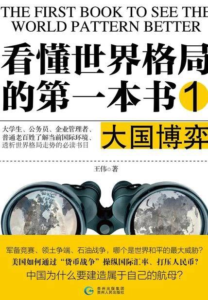

# 《看懂世界格局的第一本书1：大国博弈》

作者：王伟

## 【文摘 & 笔记】

### 中国航母

不考虑政治的经济是找死的经济，不考虑地缘的政治是愚蠢的政治。军事既然是政治的延伸，那么同样的，不考虑地缘的军事就是愚蠢的军事。

在做任何与地缘战略有关的谋划时，我们的头脑里始终要明晰一点，影响中国周边的核心问题是美国，中国处理与周边国家关系时，放在第一位考虑的应是它与美国关系的好坏，其次才是与中国关系的好坏。

### 币缘战争

1945年成立了“国际货币基金组织(IMF)”和“国际复兴开发银行”，这也就是通常所说的“世界银行”。

### “海”“陆”双重思维

回过头来看中国：首先，面对美国，特别是不时出现在我国周边的美国海军我们该怎么办？这个问题就相当于是秦汉和隋唐时代面对草原游牧部族一样，光是依靠修长城和用大量的步兵去对抗这个是做不到的。唐朝打败突厥，西汉打败匈奴都是在国力鼎盛时期搞出了自己的骑兵部队，把匈奴阻挡在了漠北，把突厥打到了西边。说到底，扩展战略纵深，把战场推到对方家里去才是解决威胁的最合适的办法。现在的中国同样如此，为了避免来自海上的威胁，首先中国海军的一大任务就是要给中国制造出足够的海洋战略纵深，通过海军远洋化，使得东部沿海地区从战略前沿变成新的战略大后方。

### 两次世界大战后的格局

正是解放战争，真正确立了中国在“二战”后新格局中的战胜国地位。（【评】*没有这么大的国土资源，难有今日的中国发展*）

### 美国的金融霸权与双赤字经济

有些时候，当我们为了一件事情逐次投入越来越多，高成本而又不见收益时，一些人很可能就会非理性地继续追加投入，因为他们认为只要再坚持一下，事情就会向有利于自己的方向发展，此时他们往往会忽视“性价比”的问题。（【评】*赌徒心理*）

财政贸易双赤字经济

### 从战略对话到战略性接近

冷战后对世界体系影响最深远的是什么？是伊拉克战争，还是现在的伊朗核危机？它们的分量都不够，这些更像是历史改变的标志，而非动因，真正的变化应该始于欧元的诞生和中国经济的崛起，这不只是一时的棋局变化，而是棋手的改变。