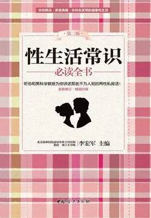

# 《性生活常识必读全书（第二版）》

作者：李宏军主编

## 【文摘 & 笔记】

### 健康的生殖器官是什么样的

女性的生殖器官包括外生殖器官和内生殖器官两部分。外生殖器主要是指阴阜、大阴唇、小阴唇、阴蒂、阴道前庭、尿道口、阴道口、处女膜、前庭大腺和前庭球，而内生殖器则包括阴道、子宫、输卵管和卵巢。

前庭球又称为“球海绵体”，是一对海绵体组织，位于阴道口两侧，能勃起。

### 射精和精液的主要成分

一般情况下，一位男性每次排出的精液为2毫升～6毫升，每毫升含成活的精子为6千万～1.5亿个左右。精液是由精子和精浆组成，精浆又包括前列腺液、精囊液和尿道球腺液等成分，其中前列腺液约占1/3，精囊液约占2/3。精浆负责输送精子，并为精子提供能量和营养物质。精浆中主要成分是水，此外还有糖类、电解质、酶类、维生素等物质，这些营养物质是保证精子生存与活动的物质基础。

### 避孕药为什么能避孕

常用的有口服避孕药1号、18-甲基炔诺酮及复方避孕针等，各种针对女性的短效、长效避孕药及避孕针。

各种避孕栓剂、药膜、外用避孕药都是用来杀灭精子的；口服避孕药或针剂，如探亲避孕药则是让宫颈黏液变稠，阻塞子宫颈口，使精子不能进入宫腔与卵子相遇。

临床上常用的宫内节育器、阴道避孕环和速效避孕药等，就是利用上述原理而达到避孕目的的

### 如何选择最佳避孕方法

新婚夫妇选用男用避孕套、女性服短效口服避孕药最佳。

### 什么是安全期避孕法

女性的排卵日大概在两次月经的中间。不过，一些女性的月经周期并不准确，所以排卵日的推算也很难准确。

### 如何使用避孕药

口服避孕药的种类很多，但主要成分有两种，一种是合并式的，即含动情激素和黄体素；另外一种是单纯的黄体素。

### 什么是短效口服避孕药

短效口服避孕药是当前女性用避孕药中使用最广泛的，由孕激素和雌激素合成的复合型口服避孕药，剂型有糖衣片、纸型片和滴丸。

从月经来潮的第5天开始服药，每晚1片，连服22天，不得间断。如果漏服，应在12小时内补服1片，以避免可能发生的不规则阴道流血或避孕失败。

### 什么是长效口服避孕药

长效避孕药含人工合成的孕激素和长效雌激素。药物进入人体后，能缓慢释放出储存于脂肪组织内的炔雌醇，对“性腺轴”起抑制作用，抑制排卵，起到长效避孕作用。

如哺乳期服药，乳儿可发生可逆性乳房增大，女婴可同时出现白带增多，因此哺乳期应忌服此类避孕药。

如欲停药，应在下一经期第5天开始服短效避孕药，连续3个周期作为过渡，以免出现月经不调。

### 什么是探亲避孕药

“速效避孕药”。它不受经期限制，主要作用于宫颈黏膜、子宫内膜、输卵管，以防止受孕。目前多采用炔诺酮、甲地孕酮或18-甲基炔诺酮。在探亲当日开始服用，每日一次，至探亲结束。

### 什么是注射用长效避孕药

常用的注射用长效避孕药为复方己酸孕酮注射液（避孕针1号），每支含己酸孕酮250毫克、戊酸雌酮5毫克。

### 怎样保存避孕药

正确保存避孕药的方法是：1．注意药瓶的密封将避孕药放在瓶子里封好，置于阴凉干燥处，与其他药品分开，以防错服；服药时最好用勺子取，避免手直接接触；平时要经常检查瓶盖，不要让细菌、昆虫等污染药品。

### 什么是皮下埋植避孕法

皮下埋植避孕法适用范围很广，40岁以下需要长期避孕的女性，只要身体健康，均可采用皮下埋植避孕法避孕，尤其适用于节育环容易失败的、不能按时服用避孕药的，以及对做绝育手术有顾虑的女性。

### 轻松避孕：“事”后冲洗阴道可以吗

服药是简单、方便的，在性交后120小时内服用1片米非司酮，也可以在性交后72小时内口服1片毓婷（12小时后重服1片）均是可靠的避孕措施。

### 有效的事后避孕方法有哪些

因为精子与卵子结合后，大约要在3天之后才进入子宫，6天后才进行着床。

目前临床上常将堕胎药RU486作为防止房事后意外怀孕的手段

### 什么是人工流产

人工流产即在妊娠24周以前，用人工方法把已经发育但还未成熟的胚胎从子宫里取出来，达到终止妊娠的目的，适用于育龄女性因身体患有某些严重疾病（如活动性肺结核、严重的心脏病等）而不适宜继续妊娠，或出现妊娠合并症，也是意外妊娠的补救措施。

人工流产按妊娠时间长短可分为“早期人工流产”和“中期引产”。妊娠12周之前做人工流产称为“早期人工流产”；妊娠12～27周做人工流产称为“中期引产”。

### 女性更年期综合征会让男人扫“性”吗

激素替代治疗（Hormone Replacement Therapy, HRT）是缓解和治疗女性更年期后激素缺乏的最佳方法。

### 女人的“性”感地带

“G”点，位于阴道前壁距离阴道口4厘米～5厘米处的一个区域，大小类似小的钱币