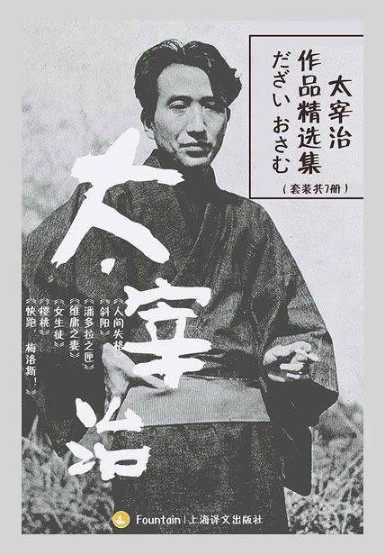

# 《太宰治作品精选集》

作者：太宰治

## 【文摘 & 笔记】

### 人间失格

### 女生徒

早晨是灰色的，每天每天都是这样，是人最空虚的时候。早上，我躺在床上，总是陷入厌世之感。我厌倦生活，种种丑陋不堪的悔恨会一齐拥堵到胸口，让我喘不上气来。

每天早上，我总是没有自信。穿着睡衣坐在梳妆台前，不戴眼镜照镜子时，看不太清自己的脸，朦朦胧胧的，显得很恬静。我最讨厌自己脸上的眼镜，但是眼镜也有别人不知道的优点。我喜欢摘掉眼镜，眺望远处，看到的风景都朦朦胧胧，如梦如幻，犹如万花筒里看到的那般美好，看不到任何污浊的东西。映入眼帘的只有庞大的物体，只有鲜明强烈的色彩和光线。我也喜欢摘掉眼镜看人，这样一来，人们的脸看上去都笑得那么温和、那么甜美。而且摘掉眼镜的时候，我一点不想跟人吵架，也不想说别人的坏话，只是默默无语地发呆。一想到此时的我，给别人的感觉一定很友善，就越发觉得心安，想要撒娇，心情也变得格外温柔起来。

就拿读书这事来说吧，没有这类经验我多半会发愁吧！我就是这般依赖书上写的东西。只要阅读一本书，我就会沉迷其中，信赖、同化、共鸣，甚至将它与生活连接起来。再阅读其他书时，我又立刻变得若无其事。将他人的东西偷来，改造成自己的东西，这种狡猾的才能是我唯一的特长。我已经厌倦了这种狡诈和欺骗。每天不断地重复失败，蒙受耻辱的话，也许可以使自己变得稳重些。不过，就连对于这种失败，我也可能会强词夺理，牵强附会地编造出一套所谓的逻辑，非常自如地表演一出苦情戏的。（这句话好像在哪本书上读过）。

我盼望着时代风气尽早改变，因为这样一来，我就不会这样没有自我地卑屈地为了别人的看法，每天战战兢兢地生活了。（【评】*自己不愿去改变，那社会风气如何才能改变？*）

晚霞的天空好美，暮霭是粉红色的。也许是夕阳的光芒溶化、渗透于暮霭之中，暮霭才会变成这般柔和的粉红色吧！那粉红色暮霭缓缓浮动着，一会儿钻进树林中，一会儿走在小路上，一会儿抚摸草原，这样温柔地包裹住我的身体。粉红色的光芒，微微照耀在我的一根根发丝上，轻柔地抚摸着我的发丝。不过，还是天空最美丽。我生平第一次想对这美丽的天空致敬。我现在相信有神明的存在。此时天空的颜色该叫做什么色呢？蔷薇色？火红色？彩虹色？天使之翼色？大伽蓝色？不对，都不是，那色彩比它们都更为庄严。

过去了的岁月，都是那么令人怀念。亲人，真是不可思议的纽带。如果是他人的话，会随着距离拉开而逐渐淡忘，但是对于亲人，却更加怀念那些美好的日子。

哪怕一天也好，我要努力以妈妈为中心过日子，好好地感受生存的价值。虽然我心里很关心妈妈，想做个好女儿，但在行动上、言语上，我却一直是个任性的孩子。

哪怕一天也好，我要努力以妈妈为中心过日子，好好地感受生存的价值。（【评】*配角*）

明天，还会是同样的一天吧。幸福，这一生都将不会来吧！我知道会这样。不过，还是相信它一定会来，明天就会来，还是怀着这个信念睡觉吧。

幸福迟来了一夜
### 金钟儿

### 波斯菊

纵然浮世如朝露，亦然不枉活此生。

对我来说，这正是所谓的“今日的新发明”。对于这些人而言，作者是谁根本不重要。因为他们觉得是大家齐心协力共同创作出来的。然后，大家能够一起欢乐一整天，就足够了。艺术与民众的关系，原本不就是这样吗？诸如“只有贝多芬最棒”“李斯特是二流的”云云，当这些所谓的“行家们”吐沫飞溅地大发议论时，民众早已抛开这些议论，去倾听、享受各自喜爱的节目了。他们根本不把作者当回事。不管是一茶作的，还是都都逸作的，还是麻儿作的，只要那个句子没有意思，他们就不感兴趣。他们绝不会为了社交上的礼仪或是提高情趣之类的目的，而勉强“学习”艺术。他们只是以自己的方式记住那些能打动自己的作品，仅此而已。对于艺术与民众的关系，我仿佛刚刚被灌输了一种全新的理念。

### 考验

### 竹姑娘

### 斜阳

#### 二

去年，没有发生什么事。前年，没有发生什么事。大前年，也没有发生什么事。

#### 七

不知为什么，白吃白喝别人的，总会使我惧怕。尤其是对方用凭自己的本事赚来的钱请我吃喝时，更叫我痛苦万分。

## 【想法】

除开《人间失格》，《樱桃》外，其他读起来还好吧。这两本书的主角，要多讨厌有多讨厌，实在读不下去可以跳过！ 感觉书中的主角大多自我意识过剩，又消极厌世。这些人能算是“理想主义者”吗？