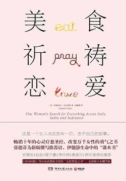

# 《美食，祈祷，恋爱》

作者：伊丽莎白·吉尔伯特

## 【文摘】

我独自一人，孤孤单单，孤独无偶。  

毕竟婚姻中总是存在两个人——两张票，两个意见，两种相互矛盾的决定、欲求与限制。  

 而后它们对我搜身。它们掏空我装在口袋里的喜悦。“抑郁”甚至扣押了我的身份，但它向来如此。而后“寂寞”开始盘问我，实在让我不寒而栗，因为它总是持续好几个小时问个不停。它虽有礼貌，却很无情，最后总让我不得不流露真情。  

永远别忘记很久以前，在一个没有防备的时刻，你曾把自己看成朋友。  

奥古斯都庙告诫我，切勿死守我是什么人、我代表什么、我属于谁，或我曾想让自己有什么表现的固执想法。昨天我对某人来说或许是壮丽的古迹，但明天我可能就会成为烟火仓库。即使在这座“永恒之城”中，沉默的奥古斯都庙告诉我，一个人始终必须为动荡骚乱的变化做好准备。  
 
 与配偶成立一个家庭是一个人在美国（或任何）社会找到延续和意义的最基本方式之一。  

古印度瑜伽文献《薄伽梵歌》说，承认你自己不完美的命运，好过模仿他人过完美的人生 。
  
巴尔齐尼说，因此意大利可以忍受庸碌无能的将军、总统、暴君、教授、官僚、记者和工业大亨，却永远无法忍受无能的歌剧演唱家、指挥家、芭蕾舞者、交际花、演员、电影导演、厨师、裁缝……在一个混乱失序、灾祸连连、充满诈骗的世界，有时只能信赖美。唯有卓越的才艺不会腐败。快乐无法降价求售。有时一顿饭就是唯一真实的货币。  
### 第五章 印度『恭喜认识你』 三十六则追求信仰的故事

“诃陀瑜伽（又称哈他瑜伽）  

数个世纪以来，各家思想学派曾为人类固有的缺陷找到不同的解释。道家说失调，佛教说无知，伊斯兰教将我们的苦难归咎于违抗神，犹太基督教传统上将我们的受苦归因于原罪。弗洛伊德派说痛苦是我们的本能与文明需求之间发生冲突所造成的必然结果。  

瑜伽士却说，人类的不满很简单，只是因为身份认知错误。我们之所以痛苦，是因为我们只不过是区区个人，有恐惧、缺陷、愤恨与难逃一死。我们错以为有限的小小自我构成我们的整个天性。我们未能看出自己内心深处的神性。我们不知道，每个人的内心某处都存在一种永久平和的至高自我。至高的自我是我们的真实身份，完整而神圣。瑜伽士说，在明白此一事实之前，你将永远感到绝望，斯多亚派的希腊哲学家爱比克泰德说过一句话，精确地表达了此种想法：“你这可怜的人，心中怀抱着神，却不认识他。”  

所谓伟大的瑜伽士是达到开明常定之人。导师则是将此种常定传递给他人的伟大瑜伽士。导师（Guru）是由梵语的两个音节所组成，第一个音节是“黑暗”之意，第二个则是“光明”，即走出黑暗，迎向光明。导师传给弟子所谓的“mantravirya”（智慧的强度），你去找自己的导师并非为了上课，而是体验导师感召。  

就像所有的类人动物，我为佛家所谓的“猿猴心”所苦——荡来荡去的思考，停下来的时候只为搔痒、吐口水、嚎叫。  

 从遥远的过去到未知的未来，我的心自始至终任意摆荡，每分钟涉及数十个想法，有如脱缰之马，漫无目的。这本身不见得造成问题，但问题在于，随着思考而来的眷恋之情。快乐的思维使我快乐，可是不一会儿，我又突然进入过分的忧虑，搞糟心情；之后又进入愤怒的时刻，于是我又重新发起怒来；而后我的心灵决定应该开始自怜，于是寂寞立即接踵而来。毕竟，你的思维是什么，你就是什么样的人。你的感情是思维的奴隶，你则是感情的奴隶。这种动荡不安的思维藤蔓所存在的另一个问题，就是你永远不活在此刻所处的地方。你永远在挖掘过去或拨动未来，却极少停歇于此刻。  

大家以为精神伴侣是天作之合，每个人都想要。可是真正的精神伴侣是一面镜子，他使你看到让你退缩的东西，他使你注意到自己，让你能改变自己的生活。真正的精神伴侣可能是你遇上的最重要的人，因为他们卸下你的防备，把你给打醒。但是跟精神伴侣一辈子住在一起？不，太痛苦了。精神伴侣之所以走进你的生命，只是为了向你展现你的另一面，而后离你而去，让你感谢神。  

我有个朋友的祖母经常告诉她：“世界上没有什么严重麻烦是不能靠洗个热水澡、喝杯威士忌、读公祷书而痊愈的。”  
 
 我遇到过一位年近百岁的老太太，她告诉我：“有史以来，只有两个问题使人类大动干戈。‘你爱我有多深？'‘谁做主？'”而其他的事情则多少都能控制。唯有这两个爱与支配的问题扰乱了每个人，使我们犯错，导致战争、悲伤和苦难。  
 
世上的虔诚信徒履行他们的例行公事，却不保证从中得到任何好处。当然，许多经文著作、许多神职人员都许诺你的善行将取得何种报偿（或威胁你背离正道将受到何种惩罚），但去相信这一切也是一种信仰实践，因为我们也没见过最终的结局。虔诚是一种没有保证的勤奋之举。“是的，信仰的另一种说法是：我先行接受宇宙的条件，我事先接受目前无法了解的事情。”因此我们会说“跨越信念”。因为决定认可神的概念，等于从理性跨向未知，不管哪种宗教的学者如何卖力地用他们的一堆堆经文著作向你证明其信仰合乎理性，而事实却不然。信仰若合乎理性，就不称之为定义上的信仰。信仰是去相信你看不见、证明不了、摸不着的东西。信仰是勇往直前冲向黑暗。假如我们真能事先知道生命的意义、神的本质、灵魂的命运这些问题的答案，我们的信仰就不是跨越信念，也不是勇敢的人类行为，而只是……审慎的保险条款。  

 祷告是一种关系，我负有一半责任。我如想转变，却懒得表达自己确切想要的东西，那将如何发生？祷告有一半的好处是在于请求本身，在于提供一个姿态清晰、思虑成熟的意向。若不具备这些，你的请求和欲望都将软弱无力。其只会在阴冷的雾中在你脚边打转，永远无法升空。因此我现在每天早晨都抽空找寻自己真正想请求的特定东西。  

命运，我认为也是一种关系——神恩与自我努力之间所进行的竞赛。有一半不在你的掌控，有一半绝对取决于你，你的行动让你看见可评量的结果。人不完全是诸神的傀儡，也不完全是自身命运的掌舵者，而是两者皆有。我们在人生道路上奔驰而过，犹如马戏团演员在并排奔跑的两匹马之间保持平衡——一脚踩着名叫“天命”的马，一脚踩着名叫“自由意志”的马。你每天必须问自己：哪匹马是哪匹？我得停止为哪匹马烦恼，因为其不是由我来控制的，而哪匹马则需要我集中心力驾驭？  

### 第六章 印度尼西亚『就连内裤里头也觉得不同』 三十六则追求平衡的故事

我一直记得我的导师对快乐的教诲。她说人们普遍以为快乐全凭运气，运气好的话，快乐就像好天气般降临在你身上。但这不是快乐的运作方式，快乐是个人努力的结果。你去争取，追求，坚持，有时甚至周游世界找寻它。你必须积极参与自己的各种福气，一旦达到快乐境界，你永远不得懈怠，你得坚守它，永远朝这快乐努力游去，浮在快乐顶端，否则你将漏失内在的满足。患难时祈祷并不难，但危机结束时继续祈祷则是一种封存过程，帮助灵魂紧紧抓住自己的成就。  

## 【想法】

[读书·《美食，祈祷，恋爱》](https://mp.weixin.qq.com/s/n9G0rP2laUpV73mL4PzYsw)