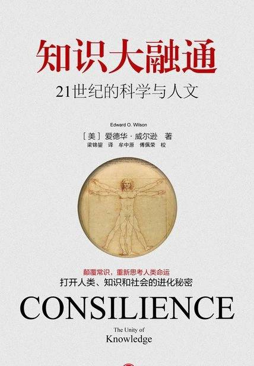

# 《知识大融通》

作者：爱德华·威尔逊

## 【文摘 & 笔记】
### 第一章 爱奥尼亚式迷情

我相信这就是爱奥尼亚式迷情的源头：追求客观的真实性，而非神的显现，这是另一种满足宗教的饥渴的方法；它的中心思想，正像爱因斯坦所了解的，是知识的统一。一旦某些知识统一到一定的程度，我们就可以了解我们是谁，以及我们为什么会在这里。

#### 我的“启蒙时代”

最上层有六个“界”：植物界、动物界、真菌界、原生生物界、原核生物界和古生菌界（archaea）。

#### 爱因斯坦的愿景

我体验到了“爱奥尼亚式迷情”（Ionian Enchantment）。这个新用词是我从物理学家兼历史学家霍尔顿（Gerald Holton，1922—）那里借来的，指的是一种相信科学具有统一性的信仰——这是一种比单单只有操作的命题更加深入、虔敬的信仰，它宣称世界是有规律的，同时可以用少数自然定律加以解释。

#### 伊卡洛斯精神

### 第二章 学术的主要分支

#### 融通的意义

休厄尔在1840年所写的《归纳科学的哲学观》（The Philosophy of the Inductive Sciences）一书中，第一次采用“融通”这个词，字面上的意义是：经由综合跨学科的事实和以事实为基础的理论，创造一个共同的解释基础，以便使知识融会在一起。他说：“当我们从一组事实归纳出的结果与从另一组不同事实归纳出的结果相符合时，归纳法才算达到了融通的阶段。这个‘融通’的现象是一种测试理论真实性的方法。”

### 第三章 启蒙时代
#### 进步是不可避免的

#### 启蒙运动的精神

我们还没有忘记这一群有理想的人物。其中最顶尖的人物只有不成比例的寥寥数个，是一小群以姓氏闻名于世的科学家和哲学家：英国的培根、霍布斯、休谟、洛克和牛顿，法国的笛卡儿和18世纪的围绕在伏尔泰身边的启蒙哲学家，德国的康德和莱布尼茨，荷兰的格劳秀斯和意大利的伽利略。（霍布斯（Thomas Hobbes，1588—1679），英国政治哲学家。休谟（David Hume，1711—1776），苏格兰哲学家、无神论者，著有《自然宗教对话录》。牛顿（Issac Newton，1642—1727），英国物理学家、数学家，对近代重力学、力学、光学、微积分等科学均有极重要的贡献。笛卡儿（René Descartes，1596—1650），法国哲学家及数学家，是西方世界中最重要的以及最有影响力的哲学思想家之一，被称为现代哲学及科学方法之父。创立解析几何。最著名的言论是：“我思故我在。”（I think, therefore I am.）其中的“我”是“思想”，因此他认为思想可以延伸，即死后还能存在，可以说是站在唯心论这一边。著有《方法论》、《沉思录》、《渴望灵魂》。格劳秀斯（Hugo Grotius，1583—1645），荷兰法学家和诗人，曾任荷兰省检察长，出使英王詹姆斯一世宫廷，著有《战争与和平法》，并确立国际法标准。伽利略（Galileo Galilei，1564—1642），意大利天文物理学家及数学家，现代力学和实验物理学创始人，最早用自制望远镜观察天体，证明地球绕太阳旋转，否定地球中心说，因而遭到罗马教廷宗教法庭审判。——译注）

#### 知识是没有基础的结构？

在学术上，培根质疑古典“细致”学习（classi-cal“delicate”learning）的可信度，中世纪的这种学习形式根植于古代文献和逻辑解释中。培根嘲讽并反对依赖经院哲学（scholastic philosophy），呼吁不要参考预定架构，要根据自然和人类特有的状况来研究自然和人类。

#### 笛卡儿坐标

642年是思想史上极特殊的一年：笛卡儿刚出版《第一哲学的沉思集》（Meditationes de Prima Philosophia），又即将推出《哲学原理》（Principia Philosophiae）；伽利略过世，牛顿诞生。

#### 牛顿建立了秩序

牛顿是一位不断追求新视野、极具机智和才气的人，他发明微积分比莱布尼茨早，不过莱布尼茨使用的数学符号比较清楚，成为我们目前所采用的版本。

微积分和相关的解析几何是物理学上最重要的两项数学工具，随后也被应用到化学、生物学和经济学上。

自然和自然律隐藏在黑夜里，上帝说：“让牛顿出现！”之后便到处是光。（Nature and Nature’s laws lay hid in night:God said, “Let Newton be!” and all was light.）

#### 浪漫主义大放异彩

浪漫主义在哲学上也大放异彩，它着重反叛性，强调随心所欲、强烈的情绪和英雄式的远见。

卢梭虽然常被归类于启蒙哲学家，但他其实是浪漫时期哲学运动的开创者，并且极具远见。

对他而言，学问和社会秩序是人类的敌人。

他在著作中，包括1749年所写的《论科学与艺术》（Discourse on the Sciences and the Arts）以及1762年的《爱弥儿》（Émile），极力赞扬“睡着的理性”（sleep of reason）。他的乌托邦是一个极简化的国度，其中的人们抛弃书本以及其他与学识相关的物品，进而培养感官与健康方面的乐趣。卢梭说，人类本是存在于和平的大自然中的高贵野蛮物种，后来受到文明和学识的影响而变得腐败。宗教、婚姻、法律和政府是那些权威人士为了维护个人的利益而虚构出来的，一般的普通老百姓则为了这个高层次的卑鄙行为，付出邪恶和令人不快的代价。

当卢梭发展出这套极不正确的人类学架构时，由歌德、黑格尔、赫德和谢林带领的德国浪漫主义哲学家，正开始重新将形而上学引入科学和哲学的领域，产生了所谓的自然哲学（Naturphilosophie）。这是由感觉、神秘主义和“半科学假设”（quasi-scientific hypothesis）混合而成的哲学。

#### 浪漫主义与先验主义之对抗

在美国，德国的哲学浪漫主义有新英格兰地区的先验主义（transcendentalism）与之相互辉映。其中最著名的哲学家是爱默生和梭罗。

### 第四章 自然科学

#### 唯科学得以窥探

可见光只占电磁辐射极小的部分，由波长介于400到700纳米（十亿分之一米）的光波组成

整个电磁波谱的范围是由γ波（gamma wave）到无线电波

人类视网膜只能接收400到700纳米波长的光波。

#### 量子电动力学

单一电子带有1.6×10-19库伦的负电荷，静止时的质量是9.1×10-28克。

由这些和其他一些可验证的数值，我们可以精确推导出电流、电磁波谱、光电效应和化学键结的性质。

统一这些基本现象的理论，是由图示和方程式所构成的量子电动力学（quantum electrodynamics，简称QED）。量子电动力学把每个电子的位置和动量，当成空间中的波函数或个别粒子来处理，还进一步假设电子能恣意发射和重新吸收光子（photon）。光子是不具质量却带有电磁力的独特粒子。

#### 纳米科技

扫描穿隧显微镜（scanning-tunneling microscope）和原子力显微镜（atomic force microscope）

#### 科学的特性

科学是一种有组织、系统化的产业，它收集和这个世界相关的知识，并且把这些知识凝聚成可以验证的定律和原理

我们可以利用科学的某些特性来区分科学和伪科学。第一是再现性（repeatability）：同样的现象接受其他独立方法的检测，则先前的解释如果不是得到支持，就是被新的分析和实验所推翻。第二是精简性（economy）：科学家企图将信息抽象化成最简单又最赏心悦目的形式，这两种特质合称为简洁（elegance）；同时，他们也希望以最小的力气产出最多的信息。第三是测量法（mensuration）：如果可以用举世皆准的量度恰当地测量事物，那么当我们对这些事物做广泛的推论时，就不会含糊不清。第四是启发性（heuristics）：最佳的科学研究能够刺激进一步的发现，而且往往是朝着一个不可预测的新方向；新知识也能对当初导致这个新发现的原理提供进一步的测试。第五，也是最后一点，为融通性（consilience）：在对各种不同现象所做的解释中，那些能够彼此关联而且证实为具有一致性看法的解释，最有可能存留下来。

#### 化约主义的运作

科学上最锐利的工具是化约主义，它会把自然现象拆解成自然的成分。

把聚合物敲成小碎块的背后有更深一层的含义，就是将某个组织层内的定律和原理，融入更普遍也更基本的层次内，这也称为化约主义。

#### 科学研究之路

一位理想的科学家在思考上要像诗人，做起事来要像簿记人员，同时我认为，他如果具有令人震撼的才华，在写作上也会像记者。

#### 在相互竞争的假设中抉择

“证实的可断言性”（warranted assertibility）

#### 逻辑实证主义

逻辑实证主义（logical positivism）

逻辑实证主义是一般实证主义稍加改变后的产物，尝试以逻辑方法和语言分析来定义科学陈述中的精髓。

#### 纯数学——科学的基础

结果证明，复数、线性变换（linear transformation）以及调和函数（harmonic function）是数学上最有趣也是科学上最有用的方法。

### 第五章 阿里阿德涅之线

#### 难以掌控的复杂性

当今最大的挑战，是能对复杂的系统提供一个精确完整的描述

#### 复杂理论

“复杂理论”是当中我认为最好的名称，可以定义为：找寻自然界用来展现众多组织层次共同特征的演算法。

复杂理论诞生于1970年代，在1980年代初期逐渐发展成熟，到了1990年代中期则为激烈的争论所笼罩。

#### 混沌理论

复杂理论中最常被人引用的典范之一是“混沌边缘”（edge of chaos）。

#### 大脑的发展

大脑约葡萄柚一般大小，体积通常在1到2夸脱（1夸脱约为1.238升）之间，平均重量是3磅（约1.36千克），比方说，爱因斯坦的大脑有2.75磅重（约1.24千克），是一个由白色和灰色组织构成的头盔状器官。它的表面像清洁用海绵那样满是褶皱，黏度像果冻，足够硬，所以不至于摊散在脑壳的内层表面上，也足够软，可以用汤匙舀取出来。

#### 心灵与认知的研究

这方面研究的前沿是认知神经科学（cognitive neuroscience），普遍又称为大脑科学。这个联盟的成员包括神经生物学家、认知心理学家，以及一群倾向于以经验为主的新派哲学家，这派哲学家有时又被称为神经哲学家（neurophilosopher）。

### 第六章 心灵
#### 大脑小宇宙

其中最重要的神经传导物质包括乙酰胆碱和数种胺类，如去甲肾上腺素、血清张力素和多巴胺（dopamine）。另外还有氨基酸（gamma aminobutyric acid，GABA，γ-氨基丁酸），以及令人惊讶的基本气体——氧化氮。

#### 重要的发现

以下列出的是研究人员至今的一些最重要的发现。

◆从鱼类到哺乳类等脊椎动物的脑部，可以分成后脑、中脑和前脑；人类大脑也保有这三个原始的部位。后脑和中脑又合称为脑干，形成头部后方隆起的部位。这个部位之上则安置着巨型膨胀的前脑。

◆后脑又由脑桥、延脑和小脑组成。它们共同的功能是调节呼吸和心跳，并协调身体运动。中脑控制睡眠和清醒，也能调节部分的听觉反射和知觉。

◆前脑的主要部分是边缘系统（limbic system），这是调节情绪反应、整合并传递感觉信息的主要交通控制系统。其中主要的中心有类扁桃体（控制情绪）、海马体（hippocampus，有时称为嗅皮质，控制记忆，尤其是短期记忆）、下丘脑（控制记忆、体温、性欲和饥渴）以及丘脑（探测体温和除了嗅觉以外的所有感觉，对痛觉敏感，并且协调某些记忆程序）。

◆前脑同时包括大脑皮层，这个部分在进化过程中增长扩充，而覆盖了大脑其余的部位。它是大脑意识的基础，负责储存并整理来自感官的信息，同时指挥随意肌的活动，并且整合语言和动机等较高层次的功能。

◆后加中脑（hind-plus midbrain）、边缘系统以及大脑皮层，这三个连续部位的主要功能可以简单地依序总结如下：心跳、心情、心外（heartbeat，heartstrings，heartless）。

◆前脑的任何单一部位，都不是意识经验的所在。高层次的心理活动所涉及的线路，遍布在前脑的大部分区域上。以我们看到并说出颜色的过程为例，视觉信息会从视网膜的视椎和中间神经元穿过丘脑，传到脑后方的视觉皮质。这些信号通过神经元激发的模式，在每个步骤中转换成密码并重新整合，随后传到外侧皮质的语言中枢。结果，我们在看到红色后，就会说出“红色”。想想看，在这个现象中，模式与意义的关系不断增加，所以也会活化愈来愈多的脑部区域。模式和意义的关系愈是新奇复杂，活化的脑部范围也就愈广。能够借由这样的经验把关系学得愈好，这些关系就愈可能自动出现。之后，如果相同的刺激再度出现，脑部的活化程度就会降低，而其中涉及的线路也比较容易预测。于是这种程序就成了“习惯”。就上述的记忆形成途径而言，感觉信息是由大脑皮层传到类扁桃体和海马体，再传到丘脑，接着传到额前叶皮质（就在眉毛下方），之后传回原先的皮质感觉区储存。这一路下来，神经密码会根据大脑其他部位传来的信息，不断得到诠释和更改。

◆因为神经细胞极其微小，

一个很小的空间内就可以装入大量的线路。下丘脑位于大脑底部，是主要的转接站和控制中心，但大小仅如蚕豆。（动物的神经系统小得甚至更难以想象。蚊子和其他极其微小的昆虫，在脑部携带着一系列关于复杂本能行为的指令，包括飞行和交配，但整个脑部的大小，用肉眼几乎看不见。）

◆人脑内某些特殊的线路发生故障时，往往会产生怪异的结果。大脑的顶叶（parietal lobe）和枕叶（occipital lobe）分别包含皮质上部与后部，如果这两个脑叶在表面下的特定位置受到伤害，就会引发一种被称为“面容失认症”（prosopagnosia）的罕见症状。这种病患者不再能借由面貌来辨识他人，但仍然记得他们的声音。同样奇怪的是，除了面孔以外，他们仍然能够单用视觉来辨认其他物体。

◆大脑内部也许有些中心，特别热衷于建构与感知自由意志。其中之一显然位于或靠近前扣带脑沟（anterior cingulate sulcus），位于大脑皮层的一个皱褶内。这个区域如果受损，病人会丧失保护自身福利的动机和应有的关怀。在任何时刻，他们的注意力都不会专注于特定的事物上，但是在被迫的情况下，他们仍然能够做出合理的反应。

◆其他复杂的心理过程，尽管涉及广泛的大脑区域，仍然极容易受到局部骚扰的影响。颞叶（temporal lobe）、癫痫病患者经常会发展出超级的宗教狂热，倾向于赋予所有大大小小的事情宇宙级的重要性。他们也有过度书写症（hypergraphia）的倾向，强迫性地以无规律可循的诗篇、书信或故事来表达他们的看法。

◆将感官知觉加以整合的神经线路也极为特殊。如果受测者接受正电子发射断层成像术（PET，positron emission tomography imaging，这是一个能够显示神经元激发模式的方法），并说出图片中动物的名称，他们的视觉皮质发亮的模式，会与他们区分物体表面上的细微差别时的模式相同。但是，当他们以默念的方式在心中说出图片中的工具时，神经活动就会转移到与手部或相关动作的皮质部位，譬如“书写”之于“铅笔”。

#### 心灵密码

实际上，大脑内部同时存在着多种活动，其中有些会对意识思想有片刻贡献，随后逐渐消失。意识就是由这类互助线路交织成的巨型聚合物，心灵则是具有自我组织能力的群体情节，其中每一个情节都各自萌生、成长、进化和消失，偶尔也会稍加逗留，以产生更多的思绪和身体活动。

#### 记忆与回忆

短期记忆是有意识心灵的一种预备状态，由所有现况和记忆中的虚拟情节组成，只能同时处理大约7个文字或其他符号，大脑需要大约一秒钟，才能完全把这些符号扫描完，然而在30秒内，它就忘记了其中大半的资讯。长期记忆则需要经过较长的时间来获取，但是它具有几乎无穷的容量，而且大部分可以终生保有。

大脑由长期记忆库中召唤出的图像，若与之相关的事物很少，或根本没有，则这些图像只是记忆（memory）；图像如果具有相关事物，尤其是受到情绪线路的共振影响时，则是回忆（remembrance）。

#### 反射动作与伪装

在自动控制的状态之下，尤其是在自律神经系统内拮抗因子（antagonistic elements）之间的平衡作用下，眼睛的瞳孔会自动收缩或扩张，唾液会增多或减少，胃部会搅动或安静下来，心跳会加快或平静，所有的器官都会因此而经历交替的状态

反射作用是快速的自动反应，由脊髓和大脑底部的短距离神经线路所引起。其中最复杂的是惊吓反应，身体会因而准备接受立刻的打击或碰撞。

#### 意识刺激生理反应

情绪是什么？它是对神经活动的一种修饰作用，能使心理活动专注并且活跃起来。

#### 初级情绪与次级情绪

初级情绪（primary emotion），通常由天生或本能的反应所组成。

次级情绪（secondary emotion）则由生活上的私人事件所引起。

### 第七章 由基因到文化

#### 基因-文化协同进化

文化由人类集体的心灵产生，其中的每一个心灵，又来自基因所架构的人类大脑。因此基因和文化是不可分割的，但是它们之间的关联具有某种弹性，而且大半还未被评估。这个关联相当曲折：基因采取了外遗传法则（epigenetic rule），也就是神经元在认知发展过程中所遵行的途径和规则，个别的心灵就是借此而自我组合的。人类的心灵由生到死，都是靠着吸收既有文化中可获取的成分而成长，同时借由个人大脑天生固有的外遗传法则来进行选择。

#### 人类独有语言与文字能力

美国人类学家克鲁伯（Alfred Kroeber，1876—1960）和克拉克洪（Clyde Kluckhohn，1905—1960）在1952年，把所有与文化相关的164种定义，融合成下述的单一定义：“文化是一种产物，具有历史性，包括观念、模式和价值，具有选择性，是学习而得的，以符号为基础，是行为和行为产物的抽象化。”

#### 寻找文化单位

情节记忆是通过时间，唤回我们对人和其他具体事物的直接“感知”（perception），就像在电影中看到的图像。

语意记忆则是通过一组物体、观念与另一组物体、观念之间的关联，来唤回其中的“含义”（meaning），这个过程可以直接利用情节记忆中的图像，或利用代表这些图像的符号来达成。

当然，语意记忆源自情节，而且几乎必然会促使大脑唤回其他的情节。

#### 基因与环境造成的变异

估计变异现象有多少是来自基因（遗传率），主要方法是比较同卵和异卵双胞胎。

#### 与遗传率共存

遗传率的另一个重要特性，是它的弹性。只要改变环境，遗传所引起的变异百分比就会上升或下降。

#### 找出基因图谱

后天派传统上强调环境对行为的影响，先天派则强调基因的重要性。

#### 一个基因，一种疾病

“一个基因，一种疾病”（One Gene，One Disease）。

#### 初级外遗传法则

新生儿天生能区分噪音和乐音；4个月大的婴儿较喜爱和谐的音调，有时会对走调的音做出厌恶的表情，好像是舌头上被滴了一滴柠檬汁那样。

新生儿对巨大声响的反应又称为莫罗反射（Moro reflex）：如果声响由婴儿背后发出，婴儿首先会向前伸出双臂，像拥抱般慢慢将双臂拉拢，然后哭出声，之后才逐渐放松下来。出生4周到6周期间，莫罗反射就由惊吓反应所取代。

味觉上对化学物品的某些偏好，也是一出生或出生后不久就形成了。新生儿喜欢含糖的溶液胜过开水，而且具有特定的喜爱顺序：蔗糖、果糖、乳糖、葡萄糖。新生儿会排斥酸、咸或苦的物质，而且会以特殊的表情反应其中的每一种味觉。这些表情将持续终生。

#### 次级外遗传法则

两天之后，婴儿喜欢观望自己的母亲胜过其他不认识的女性。

婴儿在2到4个月大时，首度出现这种表情（笑容），而且通过这个表情，总能从关注的成人身上吸引到极多的关爱。

#### 外遗传法则的遗传基础

大多数特征都受到多基因的影响，甚至包括智力和认知的最简单元素在内，而多基因是由散布在染色体不同部位的多个基因组成，会共同发挥效应。

#### 人类行为遗传学将大放异彩

基因多效性（pleiotropy），这是指单一的基因可以导致多种效应。

#### 非文字信号

基因指定了外遗传法则，也就是感觉和心理发展的规律，也是产生文化的动力和渠道。文化有助于决定哪一些基因能够存活并且世代繁衍。新生的成功基因会改变族群中的外遗传法则。受到更改的外遗传法则会改变文化生成渠道的方向和有效程度。

#### 颜色词语因文化而异

大脑不停地在找寻意义，对于刺激感官与提供外界信息的物体和特质，也不断地在找寻其间的关联。

### 第八章 人性的适应能力

#### 近交衰退

如果一个男孩和一个女孩在一起，其中有一个还不到30个月大，后来又在亲近的家庭环境中成长，也就是所谓的使用同一个尿桶长大，那么他们后来就不会对彼此产生性兴趣，反而会对这种想法有种厌恶感。

“近交衰退”（inbreeding depression）

### 第九章 社会科学

人们期望社会科学，包括人类学、社会学、经济学和政治学，能够带来一种了解生活和控制未来的知识。

#### 文化相对主义

文化相对主义（cultural relativism）

1960年代和1970年代，这个科学信仰极力支持美国和其他西方社会在政治上实行多元文化主义（multiculturalism），也就是所谓的“身份政治”（identity politics）。

#### 人类学派的纷争

生物人类学家试图把文化解释为一种人类遗传史的产物，而个体在当代历史的影响下所做的决定，则会使文化在每一代都有所更新。

接传博厄斯衣钵的文化人类学家则持有对比鲜明的看法，认为文化是较高层次的现象，多半不受遗传史的影响，而一个社会与另一个社会之间的文化分歧也是永无止境的。

#### 标准社会科学模型

当今的社会学比起人类学来，距离自然科学更远。一般来说，社会学可以被定义成研究较复杂社会的人类学，尤其是指社会学家自身所属的那些社会；相反，人类学可以被定义成研究较简单、较偏远社会的社会学，也就是人类学家本身不属于的那些社会。

异化

#### 经济学观点

社会科学当中，经济学在形式和自信上最类似自然科学，也最适合当作桥梁，来跨越社会科学与自然科学间的间隔。

但是，它和“真实”科学之间的相似性经常只是表面的，并且是以极高的学识代价收买过来的。

#### 哈迪-温伯格原理

第一项特质是精简：能用愈少的单元和程序来解释现象愈好。

第二项特质是普遍性：一个模型能涵盖愈多的现象，就愈可能是真的。

下一项特质便是融通。一个学科中的单元和程序，如果能够和其他学科中已确认的知识相互验证，在理论上和应用上都会比较卓越。

最后，从上述所有的理论特质中推导出来的，是一个好理论必定要具备的另一个特质——预测性。那些持续存在的理论，能够准确预测许多现象，而这些预测又最容易通过观测和实验来验证。

#### 凭借经验法则的错误

“足够满意”是指，由短期中可以想到并可获得的机遇中，挑选出最令人满意的选择，而不是事先想出最佳的选择，然后再于其中寻找，直到找到为止。

#### 第十章 艺术和艺术的诠释

“艺术”在此所指的是艺术创作、个人产生的文学、视觉艺术、戏剧、音乐和舞蹈，其中的特质只能用真和美来形容，这已经是最好的用词了（而且也许永远不会有更好的用词）。

#### 历史性振荡的极端

后现代主义如果被应用到文学批评上，最极端的方式就是解构主义哲学。

解构主义者追寻的是矛盾和模棱两可。他们所思考和分析的，是作者所忽略不提的部分。

#### 创新是一种生物过程

◆在人类进化过程中，有足够长的时间容许天择塑造创新的过程。

◆在某种程度上，这其中的变异是具有遗传性的。

◆遗传进化的进行是不可避免的。

◆普遍性或几乎具有普遍性的现象，会在文化进化的过程中出现。

◆艺术创作会自然地聚焦于某些形式和主题，架构过程却是自由的。

#### 美感本能

艺术具有生物起源，这是一个可供验证的假设，与外遗传法则的真实性和由它而生的原型有关。

### 第十一章 伦理和宗教

我在下面用最简单的文字，总结伦理基础上的两个选择：我相信道德价值独立存在，不论是否由神所创造。我相信道德价值仅是人类所创造，至于神存不存在，则是另外一个问题。

他在《独立宣言》中以一个先验式的句子融合了世俗和宗教的假设，也因此巧妙地做到了面面俱到：“我们相信下面的真理是不言而喻的：人人生而平等，上天赋予每个人一些不可转让的权利，包括生存、自由和追求幸福的权利。”

#### 跨越各领域间的空白

我在前面几章提到的想法，多半可称之为“空白分析”（gap analysis），也就是画出知识空白区域的位置、同时描绘出学者在探讨空白时所做的努力。

#### 是冒险，也是机会

因此，唯有毫不困窘和毫不畏惧地探讨人类存在的基本问题，由上到下以平实的语言分析陈述，并且逐次把问题重组成不同的探讨领域，使每一个组织层次的领域都能最有效地结合科学和人文，那么大学文科才会有未来。

#### 意向决定进化

人类基因组解读计划（Human Genome Project）

#### 人类进化三阶段

稳定选择不停利用夭折的方式，把这类基因由族群中排除，使它们极少出现。

基因疗法（gene therapy）