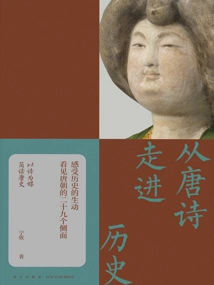

# 《从唐诗走进历史》

作者：宁欣

## 【文摘 & 笔记】

### 序

一首诗往往打动我们的只有一句，权称之为“诗眼”，也就是这首诗最出彩、最打动人心，而且流传最广的句子。

探赜索隐 tàn zé suǒ yǐn · 赜，幽深莫测；隐，隐秘难见。古人认为卜筮能够帮助人们探索幽深莫测、隐秘难见的征兆。后泛指探究深奥的义理或搜索隐秘的事迹。

### 壹

《乌衣巷》刘禹锡朱雀桥边野草花，乌衣巷口夕阳斜。旧时王谢堂前燕，飞入寻常百姓家。

#### 第一讲 乌衣巷的夕阳：中古时期社会阶层之大变动

刘禹锡的这首诗其实蕴含了中国古代社会阶层重组、变迁更新的重大历史信息。与此相关，有两条历史线索值得注意：一是门阀士族的衰落及新的官僚士族的兴起，二是士族位次的重新排定。

王家和谢家是魏晋南北朝时期著名世家大族的代表，尤其是在西晋末年的“永嘉之乱”以后更是走向巅峰。

据史载，魏晋南北朝时期最著名的世家大族有崔、卢、李、郑、王、谢、袁、萧、顾、陆、朱、张，共计十二家。隋唐时期最受推崇的五姓为崔、卢、李、郑、王，即清河崔氏、博陵崔氏、范阳卢氏、陇西李氏、荥阳郑氏和太原王氏。

东晋民间流传有“王与马，共天下”之说。所谓“王”，就是支持东晋政权建立的王氏家族，代表人物有王导、王敦，权倾朝内外；“马”就是司马氏，因为是借助大族的力量才在江东重建王朝，形势所迫，不得不与世家大族分享政权，形成世家大族联合执政的局面。

东晋之后，宋、齐、梁、陈四个王朝相继更迭，最高统治集团的社会阶级成分已经发生了重大改变。

东晋既是门阀士族的鼎盛时期，也是门阀士族开始走向衰落的时期。

《氏族志》又称《贞观氏族志》，是唐太宗李世民下令修撰的氏族之官修谱牒。贞观，是唐太宗在位时的年号，故有是称。

《姓氏录》是唐高宗李治和武则天时期重新修订的氏族谱牒。

《登科后》孟郊昔日龌龊不足夸，今朝放荡思无涯。春风得意马蹄疾，一日看尽长安花。

#### 第二讲 看不尽的长安花：科举制的前世今生

“一命之官，悉归吏部”——人才选拔制度的演变

先秦世卿世禄制、两汉察举制和魏晋南北朝九品中正制

先秦的世卿世禄制，主要是依靠与长辈——祖父和父亲的血缘关系，基于嫡长子继承制获得爵禄。

察举制是西汉武帝创设的一种选拔人才及官吏的制度，东汉沿用。中央设置有不同的科目，计有直言极谏、孝悌力田、贤良方正、贤良文学等，选人的主要标准是人的品行。

九品中正制是依靠血缘与地缘结合的门第决定做官的途径和上限的制度。

隋文帝杨坚(541—604)统一全国以后，选无清浊，废止了九品中正制，“一命之官，悉归吏部”（《通典·选举二》），将此前被地方门阀大族控制的选拔人才的权力收归中央。

唐继承隋制，科举制逐渐走向完善：由国家制订统一的选拔人才标准和考试的科目及内容，规定有资格参加考试的人选，举办全国性的统一考试。凡报考之人，先要获得地方州郡的推荐，除去受过刑罚之人和从事工商业者及其子弟之外，其他人原则上都可以自由报考。

明经科重点是考查考生对经典文献的熟悉程度，主要考查内容有三：一为帖经，即把一段经的两边盖上，只留一行，默写空出的部分，相对比较容易应付；二是经义，阐释儒家经典的义理；三是策论，即对策，或称时务策，考查对有关国计民生的重大问题的看法。

进士科考试内容前后有些变化，主要考查内容亦有三：一是帖经；二是对策，可彰文笔，以显见识，并能体现出处理政务的能力；三是杂文。最早的杂文并没有诗赋，只是铭、论、表等形式，唐玄宗天宝年间才加进了诗赋。

武则天时期还创立了武举，除了考兵法以外，还考武艺、技能，有马射、步射、平射、举重等。

除了科举制外，在选拔人才上，唐朝还有一个重要的制度，即铨选制。

科举考试是解决做官的资格问题，铨选考试是解决做什么官或者下一任能注拟什么官职的问题。

《近试上张籍水部》·朱庆馀 洞房昨夜停红烛，待晓堂前拜舅姑。妆罢低声问夫婿，画眉深浅入时无。

#### 第三讲 画眉如何识深浅：公平竞争背后的博弈

由于科举考试录取不易，为了能够引起舆论和主考官的重视，很多考生在考试之前，会把自己的诗、赋、文章等，或投献给与主考官关系密切的权贵，或奉于在社会上有影响、有地位、有声望的人，希望得到他们的赏识，从而能予以推荐，这就叫“行卷”或“温卷”。而且那些有名望、有地位的人确实也有推荐的资格，叫“通榜”。这就是朱庆馀《近试上张籍水部》这首诗的创作背景。

#### 第四讲 江州司马何以湿“青衫”：官员服色·流品·待遇

唐朝的官员，尤其是高官，一般具有四种身份，或称四种头衔，即职、散、勋、爵。

职，是指实际担任的官职，即职事官，也就是前文提到的分成流内和流外两大系统。

散，即散官，是一种身份，也有品级，分文散、武散。文散官最高为从一品开府仪同三司，最低为将仕郎从九品下，共二十九阶。武散官最高为从一品骠骑大将军，最低为陪戎副尉从九品下。

勋，主要用来酬劳立了军功的将士和对国家有功的大臣。勋官的等级计有十二转。十二转上柱国，视正二品，为最高品级；一转武骑尉，视从七品，为最低一级。

爵，分王、公、侯、伯、子、男六等。

俸禄是唐朝官员最主要的收入，一般俸禄由禄米、人力、职田、月杂给，以及常规实物待遇和特殊实物待遇这几部分组成。

《左迁至蓝关示侄孙湘》·韩愈 一封朝奏九重天，夕贬潮州路八千。欲为圣明除弊事，肯将衰朽惜残年。云横秦岭家何在，雪拥蓝关马不前。知汝远来应有意，好收吾骨瘴江边。

#### 第五讲 “夕贬潮州路八千”：贬官·考课·监察

所谓量移，就是根据情况适当挪动地方。一般是从边远的地区往距京师近的地区移动，官职也可能会有所提升。

“紫陌红尘拂面来，无人不道看花回。玄都观里桃千树，尽是刘郎去后栽。”（《元和十年自朗州至京戏赠看花诸君子》）

《再游玄都观》：“百亩庭中半是苔，桃花净尽菜花开。种桃道士归何处，前度刘郎今又来。”

唐朝对官吏的考核制度称为考课，即考核官吏的标准和具体规定。唐朝的考课制度简要归纳就是“四善二十七最”。

“四善”是对官德的基本要求，按照《唐六典》的记载，一曰德义有闻，二曰清慎名著，三曰公平可称，四曰恪勤匪懈。

唐朝的考课制度把官员分成了二十七类，各有独立的考核内容，也就是“二十七最”。

何谓“风闻弹事”

唐朝中央机构有“三省六部九寺五监一台”，“台”就是御史台，是最高监察机构，直属于皇帝，独立于三省六部之外。

御史台被赋予的权力很多，其中有一项是允许“风闻弹事”，或作“风闻奏事”，即御史风闻某些官吏有不法行为就可上奏弹劾，不需要证据。

### 贰
#### 第六讲 从规整的围棋局到“任民营造”：变换的都城格局

一　长安：围棋局与种菜畦

唐长安城为三重城。内城有两重，即靠北的宫城为第一重城，宫城南面的皇城为第二重城。最北边的外郭城就是外城。

二　洛阳：逐粮天子与私人名园

三　开封：政治中心东移后

#### 第七讲 一色楼台，孤山何在：越出城墙的都城

一　现实与梦境：从《长安志》到《东京梦华录》

《长安志》是中国现存最早的古都志，作者是北宋的宋敏求(1019—1079)，书中记述的主要是唐代的长安城。

《东京梦华录》是北宋的孟元老（生卒年待考）追述北宋东京开封的昔日时光。《长安志》将唐长安的城郭、宫室、坊市、街道、官邸等详情一一展现在读者面前，《东京梦华录》则倾向于描述北宋东京如梦如幻的城市景象。作者描述对象的侧重，恰恰体现了两座都城各自的发展特点。

唐长安城重心是中轴北靠，朱雀大街是南北向的中轴线，贯穿宫城的承天门、皇城的朱雀门和外郭城的明德门，北边是宫城、皇城。

二　开放与扩容：从坊市到街市

而随着统一局面的形成，各地物资交流频繁，北宋东京开封府犹如一个开放的大市场，临街设店成为其有别于长安的重要特征，这就是街市制。

三　“行在”临安的龙飞凤舞

临安也分为内外城。内城位于全城南部靠东，是大内所在

丽正门是内城的南门，和宁门是内城的北门。

四　中古城市发展三大趋势

《赠别》·杜牧  娉娉袅袅十三余，豆蔻梢头二月初。春风十里扬州路，卷上珠帘总不如。

#### 第八讲 春风十里与西湖歌舞：唐宋城市风貌变迁

由唐至宋都城城市布局的变化——从唐朝长安封闭式的坊市制，走向宋朝开封、临安相对开放的街市制。

扬州是唐中后期最大、最繁盛的商业城市，史书上有“扬一益二”之记载。所谓“扬一”，就是指扬州在城市发展程度上排名第一，“益二”是指益州排名第二，益州即今天的成都。

二　皇家寺院的“庙会”

三　“侵街”环境下的皇家仪仗队

所谓侵街，就是经营商业的店家的商业活动和相关设施逐渐往街道上扩展和移动，以扩大经营的空间，也方便招揽顾客。

宋人林升（生卒年不详）生平不显，仅一首诗存世，即《题临安邸》：“山外青山楼外楼，西湖歌舞几时休？暖风熏得游人醉，直把杭州作汴州。”

过华清宫（其一）杜牧  长安回望绣成堆，山顶千门次第开。一骑红尘妃子笑，无人知是荔枝来。

#### 第九讲 一骑红尘：唐朝的交通运输管理

二　边州入四夷

三　水陆交织的驿传制度

唐朝成网络体系的交通线，其实是有严格的制度做保证的，就是驿传制度。

唐朝继承隋制，官道的使用和管理都有专门的机构负责，据《唐六典》记载，当时是由兵部下属的驾部来掌管驿传。官道上设传驿以通使令，是为了使中央的政令可以迅速准确地到达地方，地方的信息也可以快速反馈到中央。

>噫吁嚱，危乎高哉！蜀道之难，难于上青天！蚕丛及鱼凫，开国何茫然！尔来四万八千岁，不与秦塞通人烟。西当太白有鸟道，可以横绝峨眉巅。地崩山摧壮士死，然后天梯石栈相钩连。上有六龙回日之高标，下有冲波逆折之回川。黄鹤之飞尚不得过，猿猱欲度愁攀援。青泥何盘盘，百步九折萦岩峦。扪参历井仰胁息，以手抚膺坐长叹。问君西游何时还？畏途巉岩不可攀。但见悲鸟号古木，雄飞雌从绕林间。又闻子规啼夜月，愁空山。蜀道之难，难于上青天，使人听此凋朱颜！连峰去天不盈尺，枯松倒挂倚绝壁。飞湍瀑流争喧豗，砯崖转石万壑雷。其险也如此，嗟尔远道之人胡为乎来哉！剑阁峥嵘而崔嵬，一夫当关，万夫莫开。所守或匪亲，化为狼与豺。朝避猛虎，夕避长蛇；磨牙吮血，杀人如麻。锦城虽云乐，不如早还家。蜀道之难，难于上青天，侧身西望长咨嗟！——蜀道难·李白

#### 第十讲 蜀道之难：秦蜀古道的南下与北上

一　“难于上青天”的北人南下之古道

在马嵬驿发生了马嵬驿之变

二　为何“南不识盩厔”

三　连陇蜀、控荆吴，沟通东西南北

五尺道

西南丝绸之路

长江水道

川盐古道

秦蜀古道

茶马古道

### 叁

行宫元稹寥落古行宫，宫花寂寞红。白头宫女在，闲坐说玄宗。

#### 第十一讲 “闲坐说玄宗”：“三郎天子”逸事摭拾

唐玄宗是唐朝的第七代皇帝，名李隆基，是睿宗李旦的第三子，故称“三郎天子”。

二　勤政楼之上

#### 第十二讲 “忆昔开元全盛日”：唐朝的黄金时期

一　广运潭盛会

二　四方丰稔，百姓乐业

三　“前有房杜，后有姚宋”

四　盛世改革

#### 第十三讲 “一度思卿一怆然”：宽松包容的政治和社会氛围

一　妇孺皆能吟诵：讽喻诗的命运

二　放妻书与放夫案

凡为夫妻之因，前世三生结缘，始配今生夫妇。若结怨不合，必是冤家，故来相对。既以二心不同，难归一意，快会及诸亲，各还本道。愿妻娘子相离之后，重梳蝉鬓，美扫蛾眉。巧逞窈窕之姿，选聘高官之主。解怨释结，更莫相憎。一别两宽，各生欢喜。

三　“直辞咏寄，略无避隐”成就的政治遗产

#### 第十四讲 “庙谟颠倒四海摇”：盛世之下的危机

一　何以“四海摇”：开拓与危机

二　帝位继承人问题

三　权臣·宦官·腐败

#### 第十五讲 “渔阳鼙鼓动地来”：东北亚格局的变迁

一　“禄山宫里养作儿”：东北御边与安禄山的崛起

　“九重城阙烟尘生”：爆发安史之乱原因的多重视角

### 肆
#### 第十六讲 “落花踏尽游何处”：胡人、胡风与胡化

《旧唐书·舆服志》载：开元以来，“太常乐尚胡曲，贵人御馔，尽供胡食，士女皆竟衣胡服”。可见胡风之炽盛。这一讲，我们就来了解唐朝的胡人、胡风和胡化。

一　谁是胡人：血统融合的时代

拓跋鲜卑有八大部落，实际是八大贵族，都改为汉姓，分别改为穆、刘、陆、贺、楼、于、嵇、尉氏。

二　日常：胡食与胡服

三　建筑与起居

现在我们所能看到的塔，主要有五种形式：窣堵坡式（冢形）、金刚宝座式、庭式、单层密檐式、楼阁式。

四　胡音、胡语对汉语的渗透

变文是唐朝兴起的一种说唱文学形式，也与佛教的传播及发展密切相关。变文中韵文和散文交错，说唱兼有，并配以图解（图像），属于通俗文学。

五　“胡风侵染竞纷泊”

>秦时明月汉时关，万里长征人未还。但使龙城飞将在，不教胡马度阴山。——出塞二首·其一王昌龄

#### 第十七讲 为何“不教胡马度阴山”：北方游牧民族的南下

一　阴山的历史地理意义

阴山是今内蒙古自治区中部的一条横亘东西方向的山脉，一直延伸到今河北省最北部，全长一千二百多公里。阴山也是一条天然的分界线，隔断了北部蒙古高原与广大的河套地区及中原地区。

组成阴山山脉的狼山、乌拉山、大青山等，山势并不高。

二　“断匈奴右臂”

有一首北朝民歌《敕勒歌》，传诵很广，歌词是：“敕勒川，阴山下。天似穹庐，笼盖四野。天苍苍，野茫茫，风吹草低见牛羊。”赞叹阴山下河套平原这样一片优良的牧场。

三　滚雪球与波浪式：胡马南下的浪潮

四　胡马南下后

凉州词·其一王之涣黄河远上白云间，一片孤城万仞山。羌笛何须怨杨柳，春风不度玉门关。

#### 第十八讲 春风是否不度玉门关：关之内外

王维的《渭城曲》：“渭城朝雨浥轻尘，客舍青青柳色新。劝君更尽一杯酒，西出阳关无故人。”

一　南北两关

阳关和玉门关位于今甘肃敦煌再往西，阳关在南，玉门关在北。

天山、阿尔泰山和昆仑山之间夹着两个盆地，北边是准噶尔盆地，南边是塔里木盆地。

黄河大拐弯下来以后以西的地区，形成一条狭长的走廊地带，因此被称作河西走廊。

河西走廊东起乌鞘岭，西至玉门关，是夹峙于南北两组山脉之间形成的走廊地带。

南边的一组山脉统称为祁连山、阿尔金山（古代也称作南山），北面是一组低矮的山脉即马鬃山、合黎山、龙首山等。

天山北麓最大的绿洲是今乌鲁木齐地区。

上述的河西走廊，位于今天的甘肃，在汉唐时期都设置有历史上著名的河西四郡：武威、张掖、酒泉、敦煌。

二　“九九八十一难”的背后

三　钟楼的昭示

《送元二使安西》·王维  渭城朝雨浥轻尘，客舍青青柳色新。劝君更尽一杯酒，西出阳关无故人。

#### 第十九讲 西出阳关：丝绸之路如何从陆路到海路

一　安史之乱后的西北

二　驼铃与船帆的转换：从陆路到海路

三　沟通文明的历史通道

#### 第二十讲 “缣去马来无了日”：备受诟病的唐回绢马贸易

一　唐与回鹘

二　“缣去马来”之溯源

### 伍

《江南春》·杜牧  千里莺啼绿映红，水村山郭酒旗风。南朝四百八十寺，多少楼台烟雨中。

#### 第二十一讲 烟雨中的楼台：走向人间的佛教（上）

一　佛教的中国缘

不管是与道教有关的五岳，即东岳泰山、西岳华山、北岳恒山、南岳衡山和中岳嵩山，还是佛教四大菩萨显灵说法地的四大名山，即五台山（文殊）、峨眉山（普贤）、九华山（地藏）和普陀山（观音），沿途进山，都会发现多种信仰痕迹并存。

二　离人越来越近的佛与菩萨

北朝流行的是中心塔柱窟，唐朝流行的主流形制可以称为覆斗顶窟或殿堂窟，到了晚唐和五代，流行的则是背屏窟。

我们可以先走进中心塔柱窟，窟顶分为前室和后室。前室窟顶又分为前披和后披。从前室再进去是后室，对应着的窟顶是平的。在后室与前室中间，凿有一长方形柱子。这根柱子象征顶天立地，实际上也象征着一座塔，所以叫塔柱窟。塔柱四面开龛，正面是主尊，即所供奉的主佛或菩萨，其他三面一般都是上下开龛，龛呈阙形或者圆券形，然后窟内的两侧壁上部又开有四个小龛。

唐朝敦煌的主流窟型是覆斗顶，顾名思义，就是窟顶类似一个倒扣的斗，正中间是方形的藻井，藻井延伸出四面坡，即四披。

我们走进这样的窟，会发现早期北朝流行的塔柱不见了，整个窟的内部类似一座大殿，正面开龛，所以这种形制也叫殿堂窟。

到晚唐、五代，窟型仍然是覆斗顶，但是正面墙壁已经不开龛了，而是在窟内中后部建起一个坛，尊像都会立在坛上，坛后面是一座背屏，这样的窟内布局就与我们现在进入寺庙大殿所见很相似了。

三　中西交融，人神互感

在中国著名的三大石窟群中，龙门石窟开凿于石灰岩山壁，云冈石窟的石质是花岗岩，两者所依建的石壁都比较坚固，可以直接进行石雕，造像生动。

敦煌石窟群则是开凿在砾岩之上，砾岩岩质松散，不宜直接进行石雕，这反倒使敦煌成为彩塑的宝库。彩塑的做法是，先做一个木料或石料的胎心，再敷上泥做好造型，涂上大白，然后进行彩绘。

#### 第二十二讲 “慈恩塔下题名处”：走向人间的佛教（下）

一　佛国与世俗并存

二　菩萨形象变化的背后

三　寺院的空间延伸

#### 第二十三讲 “经营天下遍，却到长安城”：唐朝的商人

一　商人何时“富可敌贵”

《太平广记》是宋人把截至宋初的历代笔记、小说汇集而成的一部大集子，共五百卷，

二　“以末致富”却未“以本守之”

三　商人与城市生活服务业

四　“商人重利轻别离”中的世家子弟

#### 第二十四讲 “金鞍白马谁家宿”：京都少年的沉浮

一　狂放不羁的五陵少年

五陵，是指渭河北岸咸阳原上分布着的五座汉帝陵墓，包括汉高祖的长陵、汉惠帝的安陵、汉景帝的阳陵、汉武帝的茂陵和汉昭帝的平陵，所以咸阳原又被称为五陵原。

二　挑战阴阳两界官府的市井恶少

三　城市化进程中的“潜流”

《别董大·其一》·高适  千里黄云白日曛，北风吹雁雪纷纷。莫愁前路无知己，天下谁人不识君。

#### 第二十五讲 “莫愁前路无知己”：走在路上的诗人

一　如此前路

第一个原因，是水陆交通的便利为诗人、文人的游历提供了基本条件。

第二个原因，是科举制使得应考的举子不得不来往于家乡和京城之间

第三个原因，是铨选制使得士人和官员来往于京城、家乡和赴任之地。

二　天下何人会识君？

第四个原因是觅举，使得士子四处奔波，丰富了游历。

科举竞争激烈，考生尽可能寻找一切机会去投奔有名望、有地位、有影响的人，这就是“觅举”。

第五个原因是入幕。

三　愁心伴明月

“杨花落尽子规啼，闻道龙标过五溪。我寄愁心与明月，随君直到夜郎西。”李白这首诗创作于唐玄宗天宝年间(742—756)

第六个原因，就是唐朝经常发生的非制度化的贬官。

四　“云横秦岭家何在”

战乱和避难，可以被列为第七个原因。

五　“万里写入胸怀间”

### 陆

#### 第二十六讲 “尽道隋亡为此河”：运河抚昔

一　东西与南北：水情与国情

作为世界上最古老、最长、规模最大的运河，2014年6月22日，包括隋唐大运河、京杭大运河、浙东运河在内的三大部分十段河道被列入世界文化遗产，成为中国第四十六个世界遗产项目。

二　唐运河——国之命脉所系

#### 第二十七讲 “黄衣使者白衫儿”：内廷走向市场的背后

一　宫市与内廷采买

唐朝的中央机构主干是三省六部九寺五监。三省是中书、门下、尚书省，中书省是决策机构，门下省是审核机构，尚书省和所领的六部即吏、户、礼、兵、刑、工，是行政执行机构。九寺是太常寺、光禄寺、卫尉寺、宗正寺、太仆寺、大理寺、鸿胪寺、司农寺、太府寺。五监是国子监、少府监、将作监、都水监、军器监。

二　内财政系统的形成与宦官专权

《兵车行》·杜甫  车辚辚，马萧萧，行人弓箭各在腰，爷娘妻子走相送，尘埃不见咸阳桥。牵衣顿足拦道哭，哭声直上干云霄。道旁过者问行人，行人但云点行频。或从十五北防河，便至四十西营田。去时里正与裹头，归来头白还戍边。边庭流血成海水，武皇开边意未已。君不闻，汉家山东二百州，千村万落生荆杞。纵有健妇把锄犁，禾生陇亩无东西。况复秦兵耐苦战，被驱不异犬与鸡。长者虽有问，役夫敢申恨？且如今年冬，未休关西卒。县官急索租，租税从何出。信知生男恶，反是生女好。生女犹得嫁比邻，生男埋没随百草。君不见，青海头，古来白骨无人收。新鬼烦冤旧鬼哭，天阴雨湿声啾啾。

#### 第二十八讲 “车辚辚，马萧萧”：百姓的赋役负担

一　均田制是否平均分配土地

二　租庸调制及其变化

赋役分为三个部分：“租”就是从土地所出粮食上征税；丁需要承担国家的正役，但可以纳纺织品来代役，这叫“庸”；“调”是对纺织品的征收，基本是按户。

三　防河与营田：役役不休

四　色役与正役

杂徭是正役的组成部分。

各级官吏除了俸禄以外，还会享有人力服务的待遇，为这些权贵做仆役就属于色役，并且名目众多，如亲事、帐内、执衣、仗身、白直等。

此诗与汉乐府《孔雀东南飞》和北朝乐府《木兰辞》并列“乐府三绝”

#### 第二十九讲 “天街踏尽公卿骨”：由黄巢起义说起

一　农民起义的原因

《赋菊》：“待到秋来九月八，我花开后百花杀。冲天香阵透长安，满城尽带黄金甲。”

二　“天下苦秦久矣”

三　农民起义为何此起彼伏

四　从“诛暴秦”到“均田免粮”

五　“水能载舟，亦能覆舟”