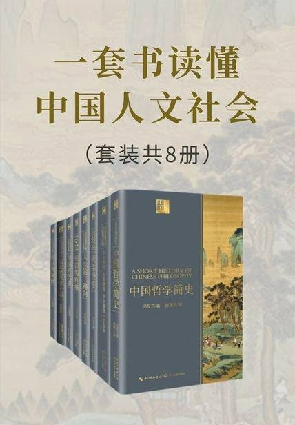

# 《一套书读懂中国人文社会（套装共8册）》

作者：冯友兰 费孝通 宗白华 梁漱溟等

## 【文摘 & 笔记】

### 中国哲学简史

#### 第一章 中国哲学的精神

中国传统哲学的主要精神，如果正确理解的话，不能把它称作完全是入世的，也不能把它称作完全是出世的。它既是入世的，又是出世的。有一位哲学家在谈到宋朝道学时说它“不离日用常行内，直到先天未画前”。这是中国哲学努力的方向。由于有这样的一种精神，中国哲学既是理想主义的，又是现实主义的；既讲求实际，又不肤浅。

#### 第二章 中国哲学的背景

商人则自私奸诈、计谋多、不顺服，他们的财产简单、易于转移，因此国家有难时，商人往往自己逃跑，不顾国家。

#### 第三章 诸子的由来

在《史记》最后一章，司马迁援引了他的父亲司马谈的一篇文章《论六家要旨》，其中，司马谈把在他之前几个世纪中的哲学家分为六家。

首先是阴阳家。

第二个学派是儒家。

第三个学派是墨家。

第四个学派是名家。

第五个学派是法家。

第六个学派是道德家或称道家。

汉代历史家班固（公元三二至九二年）便用《七略》作为《汉书·艺文志》的基础。从《艺文志》中可以看出，刘歆把诸子百家分为十类，其中六家同于司马谈所列出的六家。另四家为：纵横家，这是当时的外交家；以及杂家，这是当时不拘于一家之言的折中派；还有农家和小说家。

#### 第四章 孔子：第一位教师

君、臣、父、子，在社会里，各有责任和义务，任何人有其名，就应当完成其责任和义务。这便是孔子主张“正名”的意义。

《论语·颜渊》篇中记载：樊迟问仁，孔子回答说：“爱人。”一个人必须对别人存有仁爱之心，才能完成他的社会责任。

“忠恕之道”，孔子认为，这就是把仁付诸实践的途径，也就是孔子所说的“仁之方”。

后来，有的儒家把忠恕之道称为“絜矩之道”，意思是说，以自己作为尺度来规范自己的行为。

我们从事各种活动，其外表成功，都有赖于各种外部条件的配合。但是，外部条件是否配合，完全不是人力所能控制的。因此，人所能做的只是：竭尽己力，成败在所不计。这种人生态度就是“知命”。按照孔子的看法，“知命”是作为君子的一个重要条件，因此他说：“不知命，无以为君子也。”（《论语·尧曰》）

这就是说，要认识世界存在的必然性，这就是“知命”，就是个人对外在的成败利钝在所不计。

#### 第五章 墨子：孔子的第一位反对者

“其言必信，其行必果，已诺必诚，不爱其躯，赴士之厄困”（《游侠列传》）

他关于“天志”和“明鬼”的理论只是为了教人相信，实行兼爱，将得上天奖赏；如不实行兼爱，则将受上天惩罚。

#### 第七章 儒家的理想主义流派：孟子

《孟子·梁惠王章句上》第七节里记载，有一次齐宣王坐在堂上，有人牵牛经过堂下，齐宣王问：把牛牵到哪里去？仆人回答说：把牛牵去献祭。宣王说：把牛放了吧，我实在不忍看它颤栗害怕的样子，像是无罪而被处死。仆人问：那么，还要不要献祭呢？宣王说：祭祀怎么可以废除？换上一只羊去献祭吧。孟子听说此事，问齐宣王，是否确有其事。宣王回答，确有其事。孟子说，凭这种善心，推而广之，就可以实行王道了。（【评】*神奇的逻辑，这不就是当下爱狗人士的做法嘛，我爱狗，所以你不能吃狗肉，我们一起去吃猪肉吧😅*）

#### 第八章 名家

#### 第九章 道家的第二阶段：老子

名家的思想家们揭示出“超乎形象之外”或说“形而上”的存在。大多数人只思考“形而下”的存在，即现实世界。

“形而下”

形而上

天地万物都是可以赋予名字的，故此，称天为天，称地为地，万物各从其类，各有其名。有天地万物，就有天地万物之名。因此老子说：“始制有名。”“道”是无从命名的，而万物之名又都是由道而来，这便是老子所说：“无名，天地之始；有名，万物之母。”

这些是左右事物变化的法则，老子称之为“常”。

《道德经》第十六章说：“知常曰明。”接下去说：“知常容，容乃公，公乃王，王乃天，天乃道，道乃久，没身不殆。”

所有这些都可以从“反者道之动”的原理中引申出来。道家的“无为”，也同样可以从这个总原理中引申出来。道家主张无为，并不是叫人完全不动，或不做任何事情。它的用意是叫人不要以多为胜，“少”就是抓住要害；也意味着，行事为人不要矫揉造作，不要恣肆放荡。

在万物之中的“道”就是“德”，“德”的含义是“能力”或“品德”，它可以解释为万物本有的品质，也可以解释为在人伦关系中的德行。因此，“德”就是事物的本性。这就是《道德经》第五十一章所说的“万物莫不尊道而贵德”，“道”是万物的由来，“德”则是万物本性的依据。

“朴”是老子和道家的一个重要思想。道就是“朴”之最，因为它连名字也没有（《道德经》第三十七章称道是“无名之朴”）

《道德经》第五十七章里写道：“天下多忌讳，而民弥贫；民多利器，国家滋昏；人多伎巧，奇物滋起；法令滋彰，盗贼多有。”（【评】*似是而非的因果关系*）

“不尚贤，使民不争；不贵难得之货，使民不为盗；不见可欲，使民心不乱。是以圣人之治，虚其心，实其腹，弱其志，强其骨，常使民无知无欲。”（【评】*就如《过秦论》中所言:“于是废先王之道，焚百家之言，以愚黔首；隳名城，杀豪杰，收天下之兵，聚之咸阳，销锋镝，铸以为金人十二，以弱天下之民。”其实是一种愚民政策*）

“我无为，而民自化；我好静，而民自正；我无事，而民自富；我无欲，而民自朴。”（【评】*先让老子去辩人之初性本善还是性本恶！！！*）

道家认为，国君就应当以道为法，自己无为，而让大众各尽其能。

#### 第十章 道家的第三阶段：庄子

庄子与孟子同时，和名家的惠施是好朋友，但我们现在所知的《庄子》一书很可能是公元三世纪注释《庄子》的思想家郭象所编著。现在我们很难断定《庄子》书中，哪些篇章是庄周本人所著。事实上，《庄子》是一部道家思想汇编。

一切体制、政府、法律、道德，所求达到的便是强求一律和压制差异。这样强求一律的人，其动机或许是可敬的，但是，把自己认为好的东西强加给别人，其结果是适得其反。（【评】*体制、政府、法律、道德等等，和一个人的自由并不冲突，如果觉得这些限制了你，那么你多半是个自私自利的人吧*）

庄子则认为，人们的是非观念是根据他们的局限性观点建立起来的。所有这样的观点都是相对的，《齐物论》说：“方生方死，方死方生；方可方不可，方不可方可；因是因非，因非因是。”（【评】*
在读老子，庄子时也不要忘了这个关键点*）

#### 第十一章 后期的墨家

“辟”是比较法，用一物来解释另一物。“侔”是把两组命题平行地比较下来。“援”是类推法，“如果你是这样，我何以不能这样？”“推”，是从已知求未知、延伸而论的方法。

#### 第十二章 阴阳家和中国早期的宇宙发生论

《汉书·艺文志》根据刘歆《七略·术数略》，把方术分为六类。

六种术数

《洪范》所描述的五行

《月令》

邹衍

历史哲学

阴阳家认为，五行按照一定顺序，相生相克；还认为，一年四季也按五行相生的顺序嬗替。木盛于春，木生火；火盛于夏，火生土；土盛于中央，土生金；金盛于秋，金生水；水盛于冬，水又生木，木盛于春。

按司马迁《史记·秦始皇本纪》所载，秦始皇“推终始五德之传，以为周得火德，秦代周德，从所不胜。方今水德之始”，其色尚黑，其事则水，将黄河改名“德水”，“以为水德之始。刚毅戾深，事皆决于法，刻削毋仁恩和义，然后合五德之数。”

但直到一九一一年清朝覆灭之前的历代皇帝，都称自己是“奉天承运”，所指就是承受“五德”转移的时运。

“易传”中描述的阴阳原则

二世纪时，周文王演化出来的。六十四卦的每一卦象都有解释，称“卦辞”；每卦之中的每一横划也有解释，称“爻辞”。

在“易传”中，除阴阳的观念外，另一个重要的概念是“数”。

首先，他们把“阳”看为单数，把“阴”看为偶数。

乾，☰，为天，为圜，为君，为父。坤，☷，为地，为母。震，☳，为雷。巽，☴，为木，为风。坎，☵，为水，为月。离，☲，为火，为日。艮，☶，为山。兑，☱，为泽。

以乾`☰`的第一爻（由下端数起），与坤`☷`的第二、三爻结合，成为震`☳`，称为“长男”。以坤的第一爻，与乾的第二、三爻结合，成为巽`☴`，称为“长女”。以乾的第二爻，与坤的第一、三爻结合，成为坎`☵`，称为“中男”。以坤的第二爻，与乾的第一、三爻结合，成为离`☲`，称为“中女”。以乾的第三爻，与坤的第一、二爻结合，成为艮`☶`，称为“少男”。以坤的第三爻，与乾的第一、二爻结合，成为兑`☱`，称为“少女”。

#### 第十三章 儒家的现实主义流派：荀子

人的地位

荀子以主张“人性恶”而著名。这与孟子所主张的“人性本善”正好相反。

关于人性的学说

道德的根源

在儒家思想中，“礼”的含义十分广泛。它可以意味着仪式、礼节或社会行为准则。

关于礼乐的学说

关于逻辑的理论

论其他学派的谬误

#### 第十四章 韩非子与法家

西周封建社会的运转，所依靠的是两项权力原则：礼和刑。

法家的社会背景

法家的主张，用现代语言来说，乃是一套组织领导的理论和方法。

韩非子，法家的集大成者

韩非子是法家的集大成者。在他之前，法家分三派。一派以慎到为首，慎到和孟子是同时代人，他主张在政治和治国方术中，“势”，即权力与威势，最为重要。第二派以申不害（死于公元前三三七年）为首，强调“术”，即政治权术。第三派以商鞅（又称商君，死于公元前三三八年）为首，强调“法”，即法律和规章制度。

法家的历史哲学

治国之道

法家与道家

法家与儒家

#### 第十五章 儒家的形而上学

“易传”和《中庸》代表了先秦儒家形而上学发展的最后阶段。这一时期儒家对形而上学的兴趣如此浓厚，以至公元三四世纪的新道家把《易经》和《道德经》、《庄子》三部书列为“三玄”。

事物之“理”

道家所说的“道”是宇宙万物及其变化所由产生的那个“一”；“易传”中的道则是“多”，是统辖宇宙万物中每类事物的个别的“理”。

万物生成之“道”

需要注意到，在“易传”中有两类不同的陈述句：一类是关于宇宙和其中包含的万物，另一类则是关于《易经》本身抽象符号的体系。

万物变易之“道”

“中”与“和”

“庸”与“常”

从启蒙到止于至善——明与诚

在《中庸》里，至善被称为“诚”（真诚、纯真），和“明”是连在一起的。

#### 第十六章 治国平天下的哲学主张

秦朝统一中国前的中国政治情况

中国的统一

《大学》

宋代（公元九六〇至一二七九年）的道学家把《论语》、《孟子》和《大学》、《中庸》并列为“四书”，成为道学（西方称为“新儒家”）的基本文献。

“明明德”和“修身”是一回事，“修身”的内容就是在“明明德”。由这里可以看出：这几个思想最后归结为一个中心，这便是儒家的中心思想。

《荀子》中的折中倾向

在中国古代哲学史上，公元前三世纪下半叶（秦汉之际）出现一种调和、折中的趋势。折中学派的主要著作《吕氏春秋》便是这个历史时期的作品。

《庄子》哲学中的折中倾向

《庄子》书中最后的一篇《天下》篇陈述了道家的调和观点。《天下》篇其实是对中国古代哲学各流派的评述。我们不知道它的作者姓名，但这位作者实在是中国古代哲学史上一位杰出的哲学史家和评论家。

司马谈和刘歆的折中主义思想

这种折中主义的思想倾向一直继续到汉朝。《淮南子》和《吕氏春秋》的根本性质是一样的，只是更倾向于道家。

对中国民族主义的一点说明

#### 第十七章 汉帝国的理论家：董仲舒

孟子在与梁惠王的对话中曾经说，唯有不嗜杀人的才能统一天下。可是几百年后，秦国靠经济和军事的优势，统一了全中国。当时秦国被称为“虎狼之邦”，它以军事力量以及法家的残忍的统治理论，战胜了对手。这样看来，孟子似乎错了。（【评】*做学问和治国理政总是有差别的*）

阴阳家和儒家的合流

人性的学说

社会伦理学说

在此之前，儒家认为，社会是由五种伦常关系组成的：君臣、父子、夫妇、昆弟、朋友。董仲舒从中选出君臣、父子、夫妇三项，称为“三纲”。

“五常”便用以表达儒家崇奉的五种德行，即：仁、义、礼、智、信。

政治哲学

历史哲学

对《春秋》的解释

社会进步的三个阶段

#### 第十八章 儒家兴盛和道家再起

思想的统一

孔子在汉代思想界的地位

汉代尊崇孔子，把《诗》、《书》、《礼》、《乐》、《易》、《春秋》奉为孔子所作，称为“六经”

汉代经学中古文学派和今文学派之争

这部分儒学家组成所谓“古文学派”，因为他们声称，找到了“秦燹”（燹，音显，指兵火）之前的古籍，是以古文写成，这种文字到西汉末年，已成绝响。与“古文学派”相对立的董仲舒追随者，则尊崇以汉代通行文字写成的经书，被称为“今文学派”。

扬雄和王充

道家与佛家

古文学派把阴阳家的思想影响从儒家清除出去，阴阳家此后与道家思想结合而形成了道教。这个过程固然使孔子由神还原为人，却又使老子成为道教的创始人。

政治和社会背景

#### 第十九章 新道家：崇尚理性的玄学

名家再次引起人们的兴趣

新道家对惠施和公孙龙的理论再次钻研，在“玄学”中提出了“辨名析理”观念。首创这个观念的是郭象，他在《庄子注》的《天下篇注》里，把“玄学”和“辨名析理”结合起来。

对孔子的重新诠释

向秀和郭象

道是“无”

万物的“独化”

典制与道德

有为与无为

知识与模仿

齐万物

终极的自由与快乐

#### 第二十一章 中国佛学的基础

按照佛家的看法，宇宙的一切现象，或者更确切地说，任何一个有情物所看出去的世界，都是他内心自造的景象。每当他有所动作，或只是说话，或心里动念，都是心的作为。这个作为必然产生它的后果，不论这后果要等多久才显现出来。这个后果便是“业”的报应。“业”是因，果是“报”。每一个人都是因与果、业与报的连环套。

### 乡土中国 生育制度 乡土重建
#### 如何读懂费孝通（代序）

吴文藻先生1929年从美国博士毕业回国后，在燕京大学社会学系教书，开始致力于推进社会学的中国化。他是非常认真的一个人，在燕京大学社会学系教书及担任系主任期间，首先系统地介绍人类学是什么，然后把欧洲大陆的人类学、社会学思想，以及美国、印度的社会和文化进行全面梳理后，提出社会学的中国化，指出应当把社会学的方法和人类学的方法结合在一起。他还在中国首倡社会学的社区研究，按照社会人类学的标准来谈文化，并提出文化的三定义，即文化是物质的文化，是社会的文化（或者称之制度的文化），还有一个叫精神需求的文化，第一次完整地把文化的思想以及社会变迁的研究方法系统介绍过来。

费孝通一生的学术经历，我们可以总结为从中国社会的实际出发，探索何为乡土中国，为何要乡土重建，如何乡土重建。

#### 乡土中国

我并不认为教师的任务是在传授已有的知识，这些学生们自己可以从书本上去学习，而主要是在引导学生敢于向未知的领域进军。作为教师的人就得带个头。至于攻关的结果是否获得了可靠的知识，那是另一个问题。实际上在新闯的领域中，这样要求也是不切实际的。

我们很可以相信，以农为生的人，世代定居是常态，迁移是变态。（【评】*安土重迁*）

在社会学里，我们常分出两种不同性质的社会：一种并没有具体目的，只是因为在一起生长而发生的社会；一种是为了要完成一件任务而结合的社会。

历史对于个人并不是点缀的饰物，而是实用的、不可或缺的生活基础。

这种极端的乡土社会固然不常实现，但是我们的确有历世不移的企图，不然为什么死在外边的人，一定要把棺材运回故乡，葬在祖茔上呢？一生取给于这块泥土，死了，骨肉还得回入这块泥土。（【评】*落叶归根*）

那是真情，天天是“晨起，上课，游戏，睡觉”，有何可记的呢？老师下令不准“同上”，小学生们只有扯谎了。

差序格局

我们的格局不是一捆一捆扎清楚的柴，而是好像把一块石头丢在水面上所发生的一圈圈推出去的波纹。每个人都是他社会影响所推出去的圈子的中心。被圈子的波纹所推及的就发生联系。每个人在某一时间某一地点所动用的圈子是不一定相同的。

我常常觉得：“中国传统社会里一个人为了自己可以牺牲家，为了家可以牺牲党，为了党可以牺牲国，为了国可以牺牲天下。”这和《大学》的： 古之欲明明德于天下者，先治其国，欲治其国者，先齐其家，欲齐其家者，先修其身……身修而后家齐，家齐而后国治，国治而后天下平。 在条理上是相通的。（【评】*作者的理解完全背离了《大学》中这段话的意思吧？*）

如果有一天“阶级斗争”的问题解决了，社会上不分阶级了，政府、甚至国家组织，都会像秋风里的梧桐叶一般自己凋谢落地。（【评】*可能吗？*）

血缘和地缘

名实的分离

但是有时，一个社会不能同时试验多种不同的方案，于是在不同方案之间发生了争斗，也可以称作“冷仗”，宣传战，争取人民的跟从。为了求功，每一个自信可以解决问题的人，都会感觉到别种方案会分散群众对自己的方案的注意和拥护，因之产生了不能容忍反对的“思想统制”。在思想争斗中，主要的是阵线，反对变成了对垒。（【评】*当下所谓民主政体的选举现状！*）

从欲望到需要

社会学在社会科学中是最年轻的一门。

乡土中国

Peasant Life in China

#### 生育制度

避妊的事实也许有地方没有，这些地方的人民的确还在上述的生物机能的连环里打圈，生殖细胞从成熟到新个体的产生的过程，他们固然没有加以阻碍，可是新个体的产生是否就能说是种族得到了绵续了呢？这还是问题。（【评】*植物有花期，动物有发情期，这才是人类生殖的最大差别，另外女性生育面临很大的危险性，探索避孕措施也理所当然*）

夫妇关系是人和人关系中最需要契洽的一种，因为他们在生活上所接触的方面太多了，他们在生活上互相依赖的程度太深了。

哈夫洛克·霭理士（Havelock Ellis）曾说：“在一个真正‘理想的’婚姻里，我们所能发见的，不只是一个性爱的和谐，更是一个多方面的而且与年俱进的感情调协，一个趣味与兴会的结合。一个共同生活的协力发展，一个生育子女的可能的合作场合，并且往往也是一个经济的单位集团。”[

抚育本身是一件相当繁重的事务，基本上是柴米油盐的经济工作。夫妇间先得把这些基本事务打发开了，才有讲求兴趣相投的资格。

一个没有结过婚的人并不能从经验里体会到结婚的意义和责任。

现代婚姻开头是一见倾心，接着是如胶如漆，一到结了婚，碰着真正现实的试验，发现了婚姻的痛苦，心理上既无准备，感情又好像受了欺骗，结果反而不在力求和洽上用功夫了。

据一般心理学家的说法，自我的意识，人己的辨别，是发生在个人和环境的冲突中。一个要什么就得到什么的人，永远不会感觉到有个自我的存在。在孩子生活中，到处会碰钉子，而为父母的怕孩子被环境打击得太严重，总是愿意把自己来作缓冲，夹在里面。本来孩子可以在火里烧痛手，得一次环境给他的教训，可是在火还没有烧着手时，孩子先已碰着了父母的干涉。父母到处来顶替无情的环境，做着孩子们当面的软墙。因之造成孩子们自我意识的主要力量却是父母。

第十章　社会性的断乳

老莱子要讨他父母的欢心，得穿起采衣，学孩子们跳跃。（【评】*这不是曲解了本意吗？彩衣娱双亲，应该是逗父母开心，不是讨父母欢心！*）

第十一章　社会继替

第十二章　世代参差

第十三章　单系偏重

第十四章　以多继少

第十五章　续绝

第十六章　亲属扩展

#### 乡土重逢

中国社会变迁中的文化结症

乡村·市镇·都会

#### 费孝通先生学术年表

各美其美，美人之美，美美与共，天下大同

### 美学漫步

#### 美与人生

“诗不徒是感情，而是经验。”

苏东坡论唐朝大诗人兼画家王维（摩诘）的《蓝田烟雨图》说：“味摩诘之诗，诗中有画；观摩诘之画，画中有诗。诗曰：‘蓝溪白石出，玉山红叶稀，山路元无雨，空翠湿人衣’。此摩诘之诗也。或曰：‘非也，好事者以补摩诘之遗’。”

太阳的光洗着她早起的灵魂，天边的月犹似她昨夜的残梦。

艺术生活——艺术生活与同情

若是艺术以纯粹描写自然为标准，总要让照片一筹，而照片又确是没有图画的美。（【评】*纯粹的偏见*）

艺术能表现“动”，照片不能表现“动”。（【评】*奇葩的论调*）

### 人生的三路向

作者：梁漱溟

#### 代序 三种人生态度

#### 一 人生的三路向

前后综合起来，人生盖有三条路向：（一）肯定欲望，肯定人生；欲望就是人生的一切。（二）欲望出在众生的迷妄；否定欲望，否定一切众生生活，从而人生同在否定之中。（三）人类不同于其他动物，有卓然不落于欲望窠臼之可能；于是乃肯定人生而排斥欲望。

#### 二 宗教之真

#### 三 道德之

道德为理性之事，存于个人之自觉自律。

宗教为信仰之事，寄于教徒之恪守教诫。

### 1644：帝国的疼痛

作者：聂作平

#### 第一章 崇祯：励精图治的亡国之君

太和殿，民间习惯性地把它称作金銮殿。

#### 第二章 李自成：驿卒的反抗

#### 第三章 努尔哈赤和他的子孙们

#### 第四章 伤逝：史可法之痛

据谈迁估算，扬州在经历高杰攻城和清军屠城后，死者共计八十万之众。（【评】*所以史可法不就是个笑话！！！*）

#### 第五章 文人生涯：以陈子龙和侯方域为例

风声雨声读书声，声声入耳家事国事天下事，事事关心

三年羁旅客，今日又南冠。无限河山泪，谁言天地宽？已知泉路近，欲别故乡难。毅魄归来日，灵旗空际看。

### 中国近代史

作者：蒋廷黻

#### 第一章 剿夷与抚夷

原文：中国人与外国人的民事案件总是由双方设法和解，因为双方都怕打官司之苦。倘若中国人杀了外国人，官厅绝不偏袒，总是杀人者抵死，所以外国人很满意。只有外国人杀中国人的案子麻烦，中国人要求外人交凶抵死，在十八世纪中叶以前，外人遵命者多，以后则拒绝交凶，拒绝接受中国官厅的审理，因为他们觉得中国刑罚太重，审判手续太不高明。（【评】*到现在这种毛病还没改过来，外国人的事那是天大的事*）

道光二十二年（1842）（【评】*上一本书 1644 年，甲申之变，大明帝国覆灭，200 年后，大清帝国开始任人宰割*）

#### 第二章 洪秀全与曾国藩

#### 第三章 自强及其失败

李鸿章在日本明治维新的初年就看清楚了日本是中国的劲敌。他并且知道中、日的胜负要看哪一国的新军备进步得快。他特别注重海军，因为日本必须先在海上得胜，然后才能进攻大陆。所以他反对左宗棠以武力收复新疆，反对为伊犁问题与俄国开战，反对为越南问题与法国打仗。他要把这些战费都省下来作为扩充海军之用。他的眼光远在一般人之上。（【评】*可是以现在看来，收复伊利等对现在的中国很重要*）

#### 第四章 瓜分及民族之复兴

光绪二十二年（1896）的《中俄密约》是李鸿章终生的大错。

士大夫阶级都以为法制是祖宗的法制，先圣先贤的法制，历代相传，绝不可变更的。

汪精卫反对此说，他相信革命志士固应有恒德，“担负重任，积劳怨于一躬，百折不挠，以行其志”，但是有些应该有烈德，“猛向前进，一往不返，流血以溉同种”。他和黄复生秘密地进北京，谋刺摄政王载沣。后事不成被捕下狱。这是庚戌宣统二年（1910）的事情。（【评】*后来却做了汉奸*）

### 历史地理学十讲

作者：史念海

#### 版权信息

### 陈从周说园

作者：陈从周

#### 序

造园的目的，是“诗情画意”；造园的法则，是“因地制宜”；造园的三种基本手法，是“动观静观”“对景借景”“小中见大”。

#### 梓翁说园

中国园林是由建筑、山水、花木等组合而成的一个综合艺术品，富有诗情画意。

而电线电杆更应注意，既有害园景，且阻视线，对拍照人来说，真是有苦说不出。（【评】*能隐藏就隐藏起来比较好，还有垃圾桶、消防设施，太突兀了，怎么融合起来，又有辨识度，需要建造者规划*）

假山有旱园水做之法，如上海嘉定秋霞圃之后部，扬州二分明月楼前部之叠石，皆此例也。园中无水，而利用假山之起伏，平地之低降，两者对比，无水而有池意，故云水做。