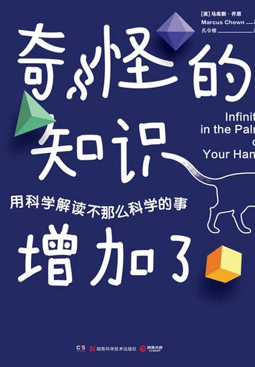

# 《奇怪的知识增加了》

作者：马库斯·乔恩

## 【文摘】

### 3 氧气戏法

化学反应的本质就是：电子重新找个位置安家。

### 5 与异类共生

细菌可比你身体的细胞小多了。虽然细菌的数量和细胞差不多，但它重量却很小。一个70千克的人体内只有1.5千克的细菌。

耳朵、后颈、鼻翼两侧和肚脐眼处更是细菌最为密集的地方。

### 6 可有可无的大脑

脑细胞，即神经元从其他神经元处，通过手指模样的树突接收到电信号。再通过长长的纤维，即轴突，将电信号传递给下一个神经元。

### 8 祖母的选择

女性每个月会周期性地排一个或两个卵子，当卵子排尽之后，她就会进入更年期。

镰状细胞贫血一直存在的原因就是，造成该病症的基因本身是有利的，它能对疟疾免疫，增加人类的存活率。

### 12 伸缩的岩石

月亮和太阳都能导致地球海洋的潮汐，而月亮的作用是太阳的两倍。

### 13 大撞击

小行星是绕太阳运行的小型岩石天体。大部分小行星处于火星和木星轨道之间。最大的小行星为谷神星，发现于1801年1月1日，直径为946千米。由于小行星间相互碰撞或受木星巨大引力影响，小行星可能从运行轨道上弹出。如果小行星轨道与地球轨道交叉，那么它对地球就有严重的潜在威胁。

### 14 阳光的秘密

能用于做功的能量叫作有效能。

### 19 那个尾随地球的天体

拉格朗日点是太阳系中五个点，天体在这些点上时其引力和离心力相平衡。所以，理论上讲，当天体处于拉格朗日点时，将永远按原轨道运行。

### 21 神秘六边形

喷流是行星大气高处风的中心。

### 29 两个世界

量子态坍塌

如果科学家在实验室中确定微粒作为一颗粒子具体存在的位置时，该粒子就会立刻掩盖住自己波属性的一面。

### 30 不走寻常路的液体

当液氦温度降至2.18开尔文以下时，它就会成为超流体。超流体流动时没有摩擦力，而且甚至能向上流动。

### 32 这是谁安排的

正常物质是由四种基本粒子组成的：两种轻子以及两种夸克。两种轻子分别为电子和电子中微子

与两种轻子结合组成正常物质的两种夸克为：上夸克以及下夸克。

夸克们三个一组地凑在一起组成了质子或中子，而它们就是原子核的原材料

质子是由两个上夸克一个下夸克组成的，而中子是由两个下夸克和一个上夸克组成的。

### 39 星尘化人

自然界一共有92种自然存在的原子或者说元素，从质量最轻的氢元素到最重的铀元素，其中一些元素在宇宙中很常见，另一些则不然。

### 44 创世余晖

宇宙微波背景辐射

### 45 宇宙主宰

黑洞周围有个区域叫作“视界”，它是一个虚构的面，表示物质和光无法逃逸的界限。

### 49 宇宙信用卡

霍金辐射