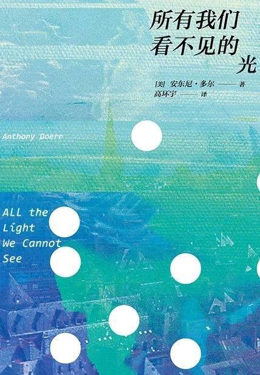

# 《所有我们看不见的光》

作者：[美]安东尼·多尔

## 【文摘 & 笔记】
### 钥匙管理处

失明是什么？失明是眼前有一堵墙，而双手却摸不到；眼前空无一物，腿却磕在了桌子腿上。

### 晚安。希特勒万岁

化肥的发明者弗里茨·哈伯，塑料的发明者赫尔曼·施陶丁格，让不可见的成为可见的赫兹。

雨从云上掉下来，落在屋顶，挂在房檐边。

### 发射机

闭上眼睛就可以告别盲人的世界。

### 追捕（第二部）

几颗以风为媒的种子盘旋着落在房屋的间缝里。