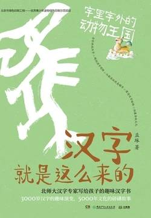

# 《汉字就是这么来的：字里字外的动物王国》

作者：孟琢

## 【文摘】

### 牛·牧 拿着棍子赶牛群

所谓“六畜”，指的是马、牛、羊、鸡、犬（狗）、豕（猪）

古人祭祀祖先要宰杀家畜，最隆重的祭祀被称为“太牢”

太牢用三种牲畜来祭祀——牛、羊、猪。

缺了牛，光用羊和猪的祭祀，在隆重程度上低了一级，被称为“少牢”。

这些用于祭祀祖先和神灵的牲畜，被统称为“牺牲”。在古人看来，生命是对神灵最虔诚的祭祀，所以，“牺牲”这个词的含义慢慢扩展为“为了某种高尚的目的而献身”。

猪、鸡、犬、牛、羊、马驯化为家养的“六畜

六书是六种汉字造字法，包括象形、会意、指事、形声、转注和假借。

### 物·件 “牛”字里的万事万物

形声字可以一分为二，一半是形符，一半是声符

形符用于表达汉字的字义，声符用于提示汉字的读音。

### 半·解 庖丁解牛的智慧

### 羊·羔·膻 吉祥的羊和奇怪的羊膻味

中国新石器早期的河姆渡遗址中出土过陶羊，晚期的仰韶遗址中出土过羊骨。

### 犬·狗 犬与狗的区别

### 马·骄·驹 大马为骄，小马为驹

千里马常有，而伯乐不常有。

### 麒·麟 神兽和鹿有什么关系呢？

《孟子》中说，麒麟在众多走兽中“出于其类，拔乎其萃”。我们今天还用“出类拔萃”形容一个人特别优秀。

### 兔 画一个“兔”字

《礼记》里记载的祭品有八种，分别是牛、豕、豚、羊、鸡、犬、雉、兔。

### 鸟·乌 长尾巴鸟与乌鸦

慈乌反哺

### 象·像 想象中的大象

人希见生象也，而得死象之骨，案其图以想其生也。