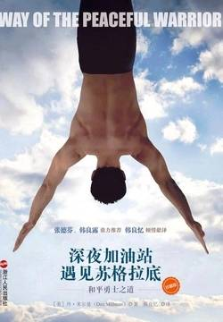

# 《深夜加油站遇见苏格拉底：和平勇士之道》

作者：丹·米尔曼

## 【文摘】

### 楔子 彩虹末端的加油站

苏格拉底一边打开汽车的油箱，一边继续说：“你就跟大多数人一样，从小只了解自身之外的信息，比如从书本上、杂志上和专家那里了解到的信息。”他把加油枪嘴插进油箱里，“就像这辆车，你把它打开，把所理解的事实真理灌进去，有时灌进去真知灼见，有时灌进谬论误导。你以市价购买知识，就跟买汽油没什么两样。”

他不理我，继续让汽油溢出来，说：“丹，你就像这个油箱，充满了太多先入为主的观念，还有毫无用处的知识。你对很多事实的了解和看法没错，然而却还不大了解你自己。在开始学习以前，你得先清空你的油箱。”

“了解是智力单一方向的理解，它带来知识；领悟则是头脑、心灵和本能三个方向同时都能理解。只有直接的经验才能让人有所领悟。”

### 第1章 魔法乍现

世界是心智的居所，心智比任何风旋转得都快，心智在寻求解脱——想要从伴随改变而来的困境，和在生死之间左右两难的窘况中逃离——因此它寻找目的、安全感及欢乐，设法了解神秘。在每个地方，在每个人身体里，都住着迷惑的心智，正在做痛苦的追寻。现实永远无法和他们的梦想相契合。幸福就在转角处，他们却从来没有走到过那个角落。而这些的始作俑者，正是人们的心智。

“对于过去，我们有不同的诠释，并且，也有不少能改变现状的方法。同样，我们有很多种可能的未来，你所梦见的是最可能发生的那一种——要是你没有认识我，就一定会走向这个未来。”

### 第2章 幻象之网

“‘心智’是在脑部飘荡的虚幻投影，包含了所有随机出现、未加控制的思绪，这些思绪从潜意识潺潺涌进知觉状态当中。意识并非心智，知觉并非心智，专注力并非心智。心智是障碍，是使情况恶化的事物，是人类的一种进化错误。心智对我没有用处。”

### 第4章 剑已磨利

### 第5章 山间小径

“人生没有平凡无奇的时刻！”

### 第6章 超越心智的喜乐

快乐=满足/欲望

“只是想确定你有足够的注意力听我下面要讲的话。现在是什么时间了？”“呃，凌晨2:35。”“错了。从以前、现在到未来，永远都是当下这一刻！当下这一刻就是时间，时间就是当下这一刻。清楚了吗？”“嗯，是的，清楚了。”“我们在哪里？”“我们在加油站的办公室里，我们不是很久以前就玩过这个游戏了吗？”“没错，而你学到的是，你唯一所能确知的事情就是，你在这里，不管这个这里究竟是在何方。从今以后，只要你的注意力开始飘到别的时空去，你就得给我马上回来。记住，时间就是当下这一刻，地方就是这里。”

“你要真的了解这一点。”他打断我，“你做什么都无法改变过去种种，而未来种种又永远不会完全如你所愿。从来就没有过去的勇士，也不会有未来的勇士，勇士活在当下、这里！你的悲伤、你的恐惧和愤怒、遗憾和内疚、你的羡慕、计划和渴望，只存活于过去或未来之中。”