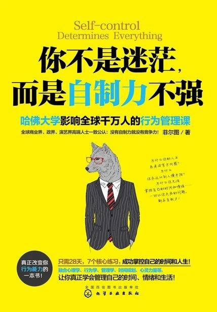

# 《你不是迷茫，而是自制力不强》

作者：菲尔图

## 【文摘】

### 决定自制力的因素

1　对你来说真正重要的东西(The Most Important Thing)

2　被剥夺的感受(The Feeling of be Deprived)

3　对可行性的判断(Feasibility Judgment)

4　合理化和讨价还价(Rationalized and Bargain)

5　负面的心理和情绪(Negative Psychological and Emotion)

### 行为管理是一门成功科学

1　先订个计划(Make a plan first)

2　一步一步推进(Proceed step by step)

3　别逞强(Don't flaunt your superiority)

### 关于干扰的好消息

很多人总是想着“我应该拿自制力去抵抗外界的干扰”，但事实上，最好的效果是用外界的干扰来锻炼自己的自制力，当你扭转了这个思维进行训练之后，你会发现自己做起事来会更专注。

### 给自己建立“制约机制”

对于习惯通过“辩护律师”来掩盖自己薄弱自制力的人来说，提高自制力的有效方式，是让自己根本无法派出“辩护律师”来，即形成“制约机制”。

对于自尊心强但自制力薄弱的人来说，帮助自己找到“制约机制”是一件值得去做的事。

### 不找借口

1　“这是我的问题”(“That's My Mistake”)

习惯于找借口为自己开脱的人，在潜意识中是害怕自己“背负罪名”的。所以，如果你想戒掉借口，那么你必须要有勇气去接受自己的问题，承认自己的错误。

2　停止使用“但是”(Stop Using “But”)

你需要努力让自己停止使用“但是”这个词，而一旦你忘记了这条原则，让“但是”脱口而出的话，那么请在后面用“这是我的问题”来修正自己吧

3　“加倍偿还”(“Pay Double”)

### 你在给自己“心理许可”吗

“心理许可(Psychology Permission)”

### 跳出舒适区域

改变会带来恐惧，而一旦克服恐惧，让改变变成现实，将会逐渐适应它并发现它的价值。

### 告别对“明天”的依赖

### 培养紧迫感的方法

### 有效练习2 治愈“拖延症”

Step 1　建立“制约机制”

Step 2　确定练习内容

Step 3　给自己5分钟

Step 4　设立奖惩制度

### 你关注什么，就是什么

困难产生→错误的意识焦点→负面答案→无法解决→终止行动

困难产生→正确的意识焦点→正面答案→有效解决→继续行动

### 主动赢得一切

1　坚定你的想法

2　让他们“闭嘴”

3　证明给别人看

### 克服内心深处的恐惧感

1　识别恐惧

2　重建信心

3　纵身一跃

### 把“放弃”从你的词典中剔除

### 有效练习3 做一件自己害怕的事

Step 1　认清恐惧

Step 2　制订目标

Step 3　重建信心

Step 4　接受结果

### 总有不想发生的事会发生

‘我们都有伤疤，外在的或内在的。亲爱的，你和我们没什么不同，记住这点(We all carry scars,Mr.Bates,inside or out.You're no different to the rest of us,remember that)’。

任何人，甚至天堂地狱都不会给你慰藉，只有我们自己能。

### 热情会让你更强

1　微笑练习

2　赞美练习

3　自励练习

### 有效练习4 情绪管理训练

Step 1　认识情绪

Step 2　控制表情

Step 3　情绪调节

刺激你的事件→你的认知→你的情绪反应→自我辩论→新的情绪

### 零碎的时间是珍珠

1　阅读

2　做整理工作

3　思考

4　运动

5　其他适合做的事情

不如把零碎时间用来做一些必须做的事情，然后在大块的时间休息、娱乐，这会给你带来更强的满足感，也有助于自制力发挥阻止干扰的作用。

利用零碎时间做这些事，还有一个非常大的好处：可以保证你有整块的时间去做必须专心投入才能完成的事情，不会让你感觉自己的生活中充满了琐事。养成这个习惯以后，你对时间的掌控感和生活的热爱程度可能都会增强不少

### 平衡的生活才会丰盛

人只要能控制自己的生活，就总能找到时间。

### 拒绝应该拒绝的人和事

另一个你需要拒绝但通常没有意识到的，是网络上的人，以及他们的观点。这里我想要改编爱迪生的一句话：成功的秘诀是1%的努力加上99%对网络观点的抵制。为什么？因为虽然网络给我们带来了极大的便利，但网上有太多毫无依据甚至不负责任的言论。即便是正确的言论，如果反对你要做的事情的声音，你依然要拒绝它。

### 想偷懒时，用“IDR”对策

1　幻想自己(Imagine Yourself)

2　描绘愿景(Describe the Future)

3　即时奖励(Reward In Time)

### 有效练习6 养成“每天整理文件”的好习惯

Step 1　列出这个好习惯的益处

Step 2　制订具体计划

### 实现一个现在就能实现的愿望

首要之务，不是着眼于既不可追又不可及的过去与未来，而是做好清清楚楚摆在手边的事情(Our main business is not to see what lies dimly at a distance ,but to do what lies clearly at hand)

“迷恋重大改变”

### 让你的行动上一个档次

1　新的目标

2　你的准备

3　孤注一掷

### 结识你想结识的人

“六度分割理论”(Six Degrees of Separation)

### 有效练习7 保持你的自制力

1　坚定目标的自制力

2　控制冲动的自制力

3　保持激情的自制力

4　规避干扰的自制力

5　排除负面情绪的自制力