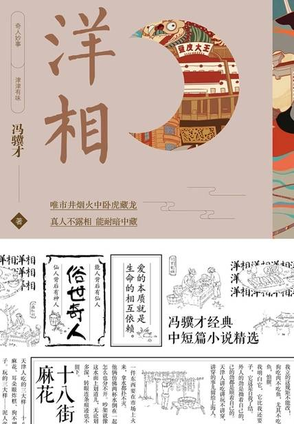

# 《洋相》

  作者：冯骥才

## 【文摘】
### 狗不理

“老天爷吃了也保管说好！” 这句话跟着从宫里传到宫外，从京城传到天津。金口一开，天下大吉，狗不理名满四海，直贯当今。  

### 洋相

### 鼓一张

### 大回
  
### 老夫老妻

夜色并不太暗，雪是夜的对比色，好像有人用一支大笔蘸足了白颜色把所有树枝都复勾一遍，使婆娑的树影在夜幕上白绒绒、远远近近、重重叠叠地显现出来。  

她多么希望身边有一只手，希望老头儿在她身边！虽然老头儿也老而无力了，一只手拉不动她，要用一双手才能把她拉起来。那也好！总比孤孤单单一个人好。她想到楼上邻居李老头，文化大革命初期老伴被折腾死了。尽管有个女儿，婚后还同他住在一起，但平时女儿、女婿都上班，家里只剩李老头一人；星期天女儿、女婿带着孩子出去玩，家里依旧剩李老头一人。——年轻人和老年人总是有距离的。年轻人应该和年轻人在一起玩，老人得有老人为伴。（【评】*婚姻的终极意义！！！*）
### 胡子

### 炮打双灯

### 三寸金莲