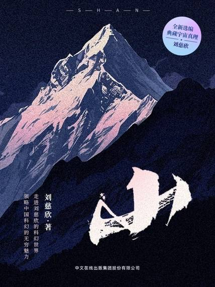

# 《山》

  作者：刘慈欣

## 【文摘】
### 山

时间长了，远山对于我已成为一种象征，像我们生活中那些清晰可见但永远无法到达的东西，那是凝固在远方的梦。  

### 流浪地球

所有的人都用泪眼探望着老师指的方向，星空在泪水中扭曲抖动，唯有那个星星是不动的，那是黑夜大海狂浪中远方陆地的灯塔，那是冰雪荒原中快要冻死的孤独旅人前方隐现的火光，那是我们心中的星星，是人类在未来一百代人的苦海中唯一的希望和支撑……  

### 欢乐颂

 褐色的陆地上布满了山脉的皱纹，一片片云层好象是紧贴着大陆的残雪，云层在大地上投下的影子给它们镶上了一圈黑边；北极也有一层白色，它们的某些部分闪闪发光，那不是云，是冰层；在蔚蓝色的海面上，有一个旋涡状物体，懒洋洋地转动着，雪白雪白的，看上柔弱而美丽，像一朵贴在晶莹蓝玻璃瓶壁上的白绒花，那是一处刚刚形成的台风……  

###  爱因斯坦赤道

 真空衰变的概念最初出现在1980年《物理评论》杂志上的一篇论文中，作者是西德尼·科尔曼和弗兰克·德卢西亚。  

如果说那个原始人对宇宙的几分钟凝视是看到了一颗宝石，其后你们所谓的整个人类文明，不过是弯腰去拾它罢了。  