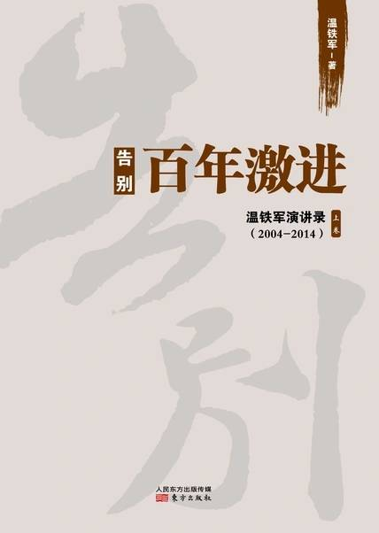

# 《告别百年激进》

作者：温铁军

## 【文摘】

本书是温铁军教授所做演讲的汇编，主要年份是 2004~2014 这十年，因为是演讲，内容有重复的地方。

（一）

1.现代化（不论是否工业化）=人类近代历史中的一个资本和风险同步向城市集中并周期性爆发危机的阶段性过程。

2.资本（不论国有私有）= 人类在资本主义历史阶段制造的、反过来控制住极少数人群使其反自然的一种异化物，主要作用在于促使多数人及他们生存依赖的资源等客体化成为“被资本化”产生利润的要素。

3.政府（不论何种制度）= 人类制造的由极少数人控制的异化物，因其反过来强制性统治多数人而无论如何改造也难以达到其应该达到的公平公正。

4.制度变迁（不论何种主义）= 原来占有收益的集团为了占有更多，并把形成的风险及其代价向外部转嫁的一种文化现象；不能顺畅转嫁代价则变成强制性变迁。

5.法律（不论何种意识形态）= 政府执行统治的一种规范工具，是主要用于保护和规范收益及分配等相关社会经济活动、体现最低道德约束的一种制度文化。

（二）

根据发展中国家比较研究提出的主要观点如下：

1.危机论——引发世界大战的西方产业资本过剩（生产过剩）导致战后产业对外转移，发展中国家工业化进程与超级大国冷战下的产业资本阶段性对外转移直接相关。随之：

一方面是主权外部性风险——接受产业转移的同时也接受了内生的资本与劳动之间的对抗性矛盾导致的社会冲突增加。 ①在资本极度稀缺压力下而普遍采取“亲外资”的政策，而一般性地顺应投资国涉及主权的制度变迁的要求。②坚持维护国家主权独立的国家，就会由于对已经进入的外资发生艰难“去依附”，而导致国内的复杂剧烈矛盾爆发。

另一方面是周期性经济危机和环境危机——进入工业化就都会随承接外资增加内生性的“资本增密机制”和本国民族资本原始积累而导致资本风险不断积聚。

2.成本转嫁论——当代全球化的实质是经济结构高度化国家的巨额制度成本向外转嫁。

经济主权残缺国家一般会被迫趋向于再次“被殖民化”；而主权相对完整的国家虽然应对巨额成本转嫁的方式有所不同，但大都趋向于加强本国政府对国内核心经济主权的国家控制。

凡属能够把握资源主权的国家，就能够有客观条件通过自主货币化占有部分资源资本化收益。

（三）

工业化原始资本积累，欧美国家靠海外殖民掠夺财富，中国没有这种条件，中国政府采取的策略是“苦一苦农民”，

（四）

现代化有制度成本，现代化的收益是少数人占有，现代化的成本却转移给大多数人。

现代化靠两大支柱：工业化和城市化。工业化是产业资本为主，城市化是房地产资本为主。

现代化出现的三大过剩危机：金融资本、工业资本和商业资本等三大资本都过剩。

（）

不论何种意识形态、何种主义、何种制度，政府都会服务于资本，这是政府的正常职能。为什么呢？因为要现代化。而现代化意味着资本的不断集中，资本在哪集中呢？在政府所在的城市集中。

（）

1971年布雷顿森林体系解体，此后的货币信用来源于国家强权。

起着主导地位的金融资本利益集团因可以凭借庞大的军事实力而造成发展中国家、弱势国家承担过多的代价，最后使这些地方危机爆发、日益贫乏。

（五）

新中国成立后，土地革命使得近 90% 的农民回归传统小农经济，有效化解了民国后期的通胀大危机。

中国农民革命带来的最大制度收益，在于用回归乡土传统化解了现代化危机。

## 【想法】

[读书·《告别百年激进》](https://mp.weixin.qq.com/s/Z9-i_Tg7gNZJp4o1iyQGBA)