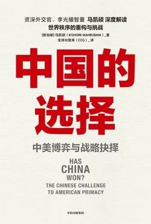

# 《中国的选择：中美博弈与战略抉择》

  作者：[新加坡]马凯硕

## 【文摘】
### 中文版序言 

实际上，自 1894 年经济总量首次超越英国以来，美国一直是世界第一大经济强国。  

### 第一章 十个值得关注的问题

  乔治·凯南是制定美国对苏联遏制战略的主要战略家。  
  
### 第二章 中国最大的战略失误

### 第三章 美国最大的战略失误 

罗纳德·里根不是左翼分子，而是一个传统的美国保守派。他的首席经济顾问是已故的哈佛大学教授马丁·费尔德斯坦，后者曾清楚地解释了美国的贸易逆差究竟是怎么形成的。费尔德斯坦说：“外国的进口壁垒和出口补贴并非造成美国贸易逆差的原因……真正的原因是美国人的消费大于生产……指责他方并不能改变这一事实。”特朗普的多项做法震惊了世界。  

特朗普和他的推特言论所引发的混乱在意料之中。然而，意料之外的是，美国自我夸耀的制衡机制却未能将它从一个出尔反尔、制造混乱的统治者手中拯救出来。美国国会、第四权力（新闻媒体）、最高法院和行政部门都无法约束特朗普。结果就是，在全球范围内，人们对美国治理制度的信任开始弱化。

与大多数国家相比，美国可以承受入不敷出（金融全球化使一些国内机构强大、宏观经济基础良好的国家，比如澳大利亚和加拿大，也能维持长期的经常账户赤字和财政赤字）。在国内层面，美国政府的支出大于收入，造成了财政赤字；在国际层面，美国的进口商品多于出口商品，造成了贸易逆差。美国如何为这两项赤字买单？借钱。  

然而，与其他国家不同，美国可以通过印刷国库券来弥补双重赤字，并为它的超额开支买单。美国财政部只需要支付纸张成本。美国分发的是一张张纸，而世界其他国家可是用实实在在的钱（辛苦赚到的钱）来购买美国国债的。  

法国前总统吉斯卡尔·德斯坦曾说，美国人享有一种“超级特权”，他们应该感激世界其他国家在为这项超级特权提供资金。  

 美元作为全球储备货币，使美国人民获得了巨大的经济利益，包括享有维持长期财政赤字和经常账户赤字的“超级特权”。特朗普在 2019 年 7 月 2 日所说的，多年来中国在贸易方面比美国占有“巨大优势”，真是错得离谱。特朗普暗示，中国人民一直在从美国人民身上赚取巨额的贸易顺差。实际上却是美国人民一直在欺骗中国人民，因为他们一直在用纸印出的钱购买中国的产品。  

### 第四章 中国在扩张吗

  
这是一个盎格鲁-撒克逊生态系统，涉及[“五眼联盟”](https://hefengbao.github.io/knowledge/world/#%E4%BA%94%E7%9C%BC%E8%81%94%E7%9B%9F)，该联盟汇集了美国、澳大利亚、加拿大、新西兰和英国的情报机构。这五个盎格鲁-撒克逊国家彼此之间不仅有着高度的信任，也高度地共享情报，还时不时地与西方主要媒体分享信息。  

1972 年的《中美联合公报》公布：“美国方面声明：美国认识到，在台湾海峡两边的所有中国人都认为只有一个中国，台湾是中国的一部分。美国政府对这一立场不提出异议。它重申它对由中国人自己和平解决台湾问题的关心。”  

 “9·11”事件之后，美国的自我约束大都消失了。  

### 第五章 美国能做出重大转变吗

相反，美国的武器系统采购是国防承包商进行一系列复杂游说的结果。国防承包商聪明地将国防制造工厂部署到美国所有关键的国会选区。因此，那些希望在选区保住工作的参议员和众议员决定了为美国军方生产哪些武器系统。

群体思维已经掌控了美国对华态度的决策。  

为何竟会如此？因为美国当前正“出售”大使职位。最好的职位都被总统竞选活动的捐款人收入囊中了。  

大多数国家的多数外交官从本国政府那里接收一系列指示，因此，他们把大部分时间花在与别国的谈判上。美国外交官的做法恰恰相反。他们几乎花费 90%的时间与华盛顿特区的几个机构交涉，以获得一套合理又不自相矛盾的指示。在这番痛苦的交涉后，美国外交官们拿到的指示让他们几乎没有妥协的余地。只有各国能够灵活地在谈判桌上做出妥协，谈判才能成功。  

今天，如果约翰·罗尔斯或其他任何一位西方道德哲学家对美国进行考察，他们都会清楚地看到，美国实际上已成为一个特权阶级社会，而不是开国元勋们努力构建的中产阶级社会——不同于早期定居者们抛下的欧洲封建社会。事实上，如果开国元勋们今天还健在，他们会很震惊：美国统治精英攫取了巨大的政治和经济实权，留给其他人的政治权力是何其少。例行的总统和国会选举并没有真正剥夺统治精英的实权，只是制造了一种幻觉，让人民以为他们掌握了自己的命运，而事实上，他们并没有。  

### 第六章 中国的民主 

这种悠久的历史和政治文化或许能够很好地解释中国对国家主席任期修改的决定。这一决定可能是基于这样一种观点：中国面临着陷入混乱的真正危险。有两个重大的挑战出现了，它们可能会削弱中国共产党强有力的中央控制。第一个挑战是中国共产党内部出现了政治派系。第二个挑战是腐败的爆发。  

可以说，习近平主席领导下的中国共产党对中国的强大中央控制，至少产生了三种“全球公共产品”，世界的确正在从中受益。  

中国共产党提供的第一种全球公共产品是控制住一条强大的民族主义“巨龙”——它显然活跃在中国的政治体制中。  

习近平主席领导下的中国共产党正在提供的第二种全球公共产品，就是做一个理性的行动者，以应对紧迫的全球挑战。  

中国提供的第三种全球公共产品是成为一种“维持现状”的力量，而非“革命”的力量。  

美国人都清楚，金钱是主导政治的力量：自理查德·尼克松以来，每一位共和党总统候选人在成为总统之前都是千万富翁；像唐纳德·特朗普、罗斯·佩罗、迈克尔·布隆伯格、霍华德·舒尔茨和汤姆·斯泰尔这样的亿万富翁也都有政治野心，并且活跃在政坛上。  

在 2014 年的一份文件中，中国政府概述了对这一体系的构想，指出它包含四个不同的方面：政府信任体系、商业信用体系、社会信任体系和司法信任体系。这个庞大的项目致力于在中国社会中建立起信任文化。  

约翰·梅纳德·凯恩斯说过一句名言：“当事实发生变化时，我就改变自己的想法。你会怎样做呢？”  

作为一个国家，美国有一种独特的能力，既表现得合乎道德——在支持“颜色革命”时，又表现得不合乎道德——在回避“颜色革命”造成的后果时。  

如果美国想在与中国打交道时推进“道德”议程，那么践行道德的最佳方式就是不要干涉中国内政，因为这么做会导致危险的混乱，甚至造成数百万人丧生。  
  
可是，让中国的经济规模变为美国的两倍或四倍，真的符合美国的国家利益吗？当前，美国安全机构的一个关键目标是，尽可能长时间地保持美国的主导地位。因此，如果民主是这样一个增长引擎，那么在中国推进民主显然会违背美国的国家利益。鉴于美国的安全机构中充满有思想和智慧的人，他们也许会认为，美国应该立即停止向中国输出民主，以免制造出一个更大的对手。然而，美国安全机构却继续推动向中国输出民主。为什么呢？因为在实践中，促进民主会产生与理论上相反的效果。它会破坏和削弱社会，而非加强社会。  

 “民主是暴民的统治——字面上由‘demos’（暴民）和‘kratos’（统治）组成。”  

习近平主席极有可能为中国提供一种哲学王的仁慈领导方式。他早年吃过很多苦，他努力在党内晋升。他认真研究过这个世界，他的公开讲话都经过深思熟虑，很有分寸，他不会疯狂地发推特。在当今世界，很少有领导人像他那般胜任。如果他能在今后一二十年里使中国保持政治稳定并实现经济增长，他很有可能作为这样一位领袖而青史留名：他最终会将中国从几个世纪的贫困中解放出来，使中国成为一个能够匹敌西方最好经济体的现代化发达经济体。他曾因取消任期限制而备受批评，但这可能是中国拥有的最大的福气之一，这可能是中国在与美国的竞争中获胜的一个关键因素。  

习近平主席的主要挑战将是，在他离任后确保中国继续保持稳定和繁荣。历史告诉我们，这并非易事。除非习近平主席开始组建一支强大的潜在继任者队伍，并加强在他退休后实现顺利接班的制度框架，否则他所有的政绩都可能被湮灭。  

### 第七章 美德假设

很难精确地描述这种假设对美国人态度和行为的影响程度与范围，但美德假设无疑为他们如何看待自己以及美国人在世界上的角色奠定了基础。几位美国学者描述了为什么美国人认为自己与众不同。斯蒂芬·沃尔特说：“在过去的两个世纪里，杰出的美国人把美国描述为‘自由帝国’‘山巅闪光之城’‘地球上最后的、最好的希望’‘自由世界的领袖’‘不可或缺的国家’。”

约翰·罗尔斯——美国近代最伟大的道德和政治哲学家之一，会如何看待美国的经济和社会发展轨迹呢？他提出了一项关于如何衡量是否成功实现社会公正的测试：“当且仅当境况较佳者的更高期望可以作为提高社会最弱势成员期望的方案的一部分时，才是公正的。”  

马丁·沃尔夫说：“最高法院 2010 年对公民联合会的不当裁决表明，公司是人，金钱是言论。事实证明，这是美国迈向富豪政治的一大步。”  

美国人对自由的崇拜有一个矛盾之处。理论上，美国政治制度和中国政治制度的深刻区别在于，美国人民可以自由地改变自己的政治制度，中国人民却不能。实际上，到了历史的现阶段，美国人民也没有多少自由从根本上改变或修正他们的政治制度，从而确保其有利于大多数人。然而，鉴于美国人民抱有一种幻觉，认为自己可以改变美国的政治制度，故而倾向于支持它。这使美国的政治制度更加稳定，因为美国人民根本不想改变这种他们认为自己掌控着的制度。  

洛克、卢梭和康德都强调了自由和平等的重要性，因为他们经历过欧洲世袭贵族统治所造成的扭曲。  

### 第八章 其他国家会如何抉择

   可悲的是，日本从未真正从整个事情中吸取实质性教训：当中国和美国这样的大国走到一起时，哪怕像日本这种主要中等大国的利益也会被牺牲。尽管日本的利益已被证实可有可无，但大多数美国决策者仍然期望日本无论在何种情况下都会是美国完全忠诚的盟友，这一点颇令人惊讶。  
 
### 第九章 一个自相矛盾的结论

在美国国内，反华声势正在不断积聚壮大。《华尔街日报》的格雷格·伊普在与几位研究中国数十年的权威人士交谈后总结道：“如果过去钟摆摆得太过倾向于迁就中国，那么现在可能反弹得太过倾向于对抗中国。”伊普援引美国前财政部长亨利·保尔森的话说：“我们在对华态度上，不是对华政策上……美国国土安全部、联邦调查局、中央情报局、国防部都将中国视为敌人，国会议员正竞相比拼谁是最好战的对华鹰派。没有人逆风而行，做出平衡，问问我们能够切合实际地做些什么，以便有机会取得不会损害我们经济和国家安全利益的长期成果。”  
 
###  附录 “美国例外论”的神话

  美国人或许对自己在缔造和保卫以色列以及打击全球反犹太主义方面扮演的角色感到自豪，但美国“一边倒”的政策也延长了巴勒斯坦人的无国籍状态，使其长期被以色列野蛮侵占。

## 【想法】

[读书·《中国的选择：中美博弈与战略抉择》](https://mp.weixin.qq.com/s/gCGU22_sqXw6hFS5ytg_Qw)
