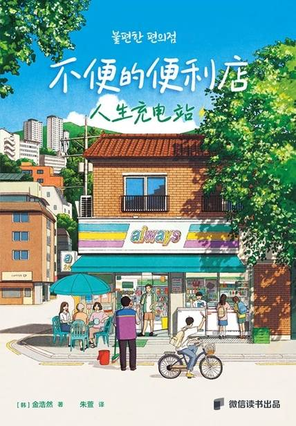

# 《不便的便利店：人生充电站》

 作者：[韩]金浩然

## 【文摘】
### 店长吴善淑

如今善淑不再对儿子干涉过多，既不要求他考取稳定的岗位，也不催他结婚。儿子这代人所处的社会和她年轻时已大不一样，接受了儿子的说法后，她的思想也开始有所转变。虽然仍会担心儿子离自己越来越远，但现在的她已经认识到彼此间的差异，并决定跟对方保持一定的距离。 儿子长大了，他的人生同样也是“车到山前必有路”。即便是当妈妈的，也无法左右儿子的人生。一旦接受了这个事实，无论儿子做什么，她都愿意选择相信和支持。只要是儿子喜欢的工作，即使不怎么赚钱，她也想尝试着去喜欢。

善淑说多亏了廉大姐的建议，自己和儿子的关系才改善了许多。廉大姐却面露沮丧，说不知为何那些道理放在自己身上就行不通了。

最好的人际关系，就是保持一定的距离，无论是和同事还是和朋友。  

#### 买二赠一

这个世界很不公平。不信你看看在建筑工地干活的爸爸。只要不下雨，他都得去工地干活，挣的钱却不多。他说这都是因为自己只是包工头底下的一个杂工……虽然不理解那是什么意思，但爸爸总是骂他们龌龊、肮脏。每次骂完之后一定还会说，民玖啊，你小子可得好好学习，不然以后就要像我一样，只能夏天顶着烈日、冬天迎着寒风在工地里干活。

“这是一个巴西作家写的书，大叔小的时候可多人爱看了。书中的泽泽不是只对明基诺说心里话吗？多好啊，人嘛，就是需要有个人听他说说心里话。”

从现在开始就尝试着改变思考和行动的轨道，乐观一点儿。  

“听说年纪越大，越要了解三件事：一是我擅长做什么，二是我想做什么，最后是我要做什么。”“嗯……”“第一个嘛，就是特长，第二个是梦想，最后那个，我们就把它当成职业。这三者之间肯定会存在交集，我们只要找到那个交集就行了。换言之，如果你的特长就是你的梦想，而且它还可以赚钱、可以当作职业的话，那就是最理想的状态。”  

“不过我们还是要努力去探索自己的内心。只有了解自己擅长做什么、喜欢做什么，才能活得更像自己。”  

“就是把特长和梦想结合起来？”  

后来妈妈开了一间租书店，他才开始和书本打交道。最早接触的是漫画，然后是短篇故事集、名著、文摘和武侠杂志，后来不管是青少年小说还是一般小说，他都一股脑地拿来看，最后把散文和自我开发类的书也看完之后，店里有意思的书就都让他读了个遍。
#### 深夜的便利店

演出结束后，锦贝带妈妈去了大学路一家他经常光顾的米酒店。眼前喝着米酒、吃着葱饼的妈妈已然头发花白，再过一年也是位花甲老人了。锦贝让妈妈去染个发，妈妈反倒让他顾好自己别秃头就行，还唠唠叨叨地让他吃点儿预防脱发的药，洗发水也换成防脱发的。那段时间因为经常戴面具，正好掉了很多头发，经妈妈这么一说，锦贝更是头疼不已。没想到母子俩竟要互相担心对方的头发问题……这难道就是所谓的一起老去吗？  

这时，她看到锦贝的名牌上写着“洪金宝”，不禁瞪圆了双眼。“这是什么？你的外号吗？”“是的，因为我的名字是黄锦贝，所以外号叫洪金宝。”  

 “儿子，比较是癌，担心是毒。人生本来就很艰难了，还是多想想当下的自己吧。”

《修正轨道》  

锦贝看这孩子不回家，总跑来便利店待着，心里有些惋惜，便告诉他可以去图书馆打发时间。他把自己常去的南山图书馆推荐给了孩子。后来不知从何时起，孩子就再也没来过便利店。这是好事。虽然一次也没能请他吃上炸猪排便当，多少有些遗憾，但锦贝还是不想他待在便利店里浪费光阴，他希望给孩子消暑的不是便利店里空调吹出的冷气，而是书籍撑出的荫凉。  

#### 老板兼职生

民植是渴望的，也是孤单的。全世界仿佛都在逼着他往火坑里跳。为了不陷入被动，他一直在虚张声势；为了不被人拿来做比较，他随心所欲地去跟别人攀比；为了走在别人前面，他强撑着自己往前冲。可换来的是失败，最后什么也没有剩下。  

民植本来想和金宝商量一下生意上的事情，但发现纯聊天也不错。他意识到以前自己总是带着某种目的和人相处。原来只是随便唠唠家常，也能放松身心、燃起对生活的希望！说不定民植需要的正是这种一起消磨时光的朋友呢？  

#### ALWAYS

四年前举办完丈夫的葬礼后，我竭尽全力让每一天照旧如常。既是为了守住平凡的生活，也是为了维持日常。其实说到底，开便利店也是为了让日子忙碌起来。我希望二十四小时都亮着灯的那个地方，能像哨所一样守护我的生活，我希望ALWAYS便利店能填补丈夫的空缺，像它的名字那样“一直”陪伴着我。  

在这里，我可以稍稍喘口气，可以整理疲惫的心绪，把积压已久的想法摊在阳光下晾晒。与其对束缚自己的问题视而不见，不如学会与之共存。就像无法把这座房子里接连不断出现的虫子一锅端一样，我已经领悟到，任何人都需要学会接受生活中的不便和困难。  

平静。不是因为问题解决了才获得平静，而是因为可以把问题当成问题来看待了。我回顾了从前自以为的岁月静好，并努力正视自己的不足。就像湖面上的鸭子看着悠闲自在，双脚却在水下不停摆动，我也应该时刻留意自己的伤痛，及时调整好心态，找到那份平静。  

“每个人都应该认清自我，这样才能成为独立的个体。我们既要扮演好家人的角色，也要保持住个人的独立，这样关系才能长久。”  

改变。只有发自内心才能真正改变，别人是勉强不来的。我以前听过这样的话，人并不是讨厌改变，只是讨厌被人要求改变。所以不要去强求别人做出改变，只要耐心等待和默默帮助就好了。  

## 【想法】

[读书·《不便的便利店：人生充电站》](https://mp.weixin.qq.com/s/wNA-BWGszeywMMmrJ9Q85Q)