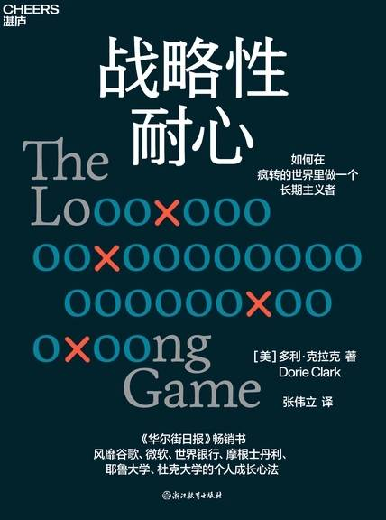

# 《战略性耐心：个人成长新法》

作者：多利·克拉克

## 【文摘】
### 前言 在疯转的世界里做一个长期主义者

美国著名诗人、翻译家亨利·沃兹沃思·朗费罗(Henry Wadsworth Longfellow)有一句名言：“我们用‘我能做什么’来判断和定位自己，而别人用‘你已经做过什么’来判断和定位你。”  

当未来的结果不明确时，当我们付出努力的工作取得进展，却没有得到认可时，你是否还能安心工作？然而越是这样，我们越应该坚定信念，克服困难去完成工作，这就是战略性耐心。

做一名长期主义者：

首先，我们要理解，真正有意义的生活一定会符合我们自己对于生活的期许。  

其次，我们要相信自己可以实现任何目标，但不是立即实现。  

### 第1章 摆脱忙碌才能重新掌控时间

1.重新思考忙碌意味着什么。忙碌并不是实现自我价值的唯一动力，有时候只是为了让我们没有时间去思考那些令自己不安的问题。

2.用日历代替待办清单，围绕真正的优先事项安排工作。

3.为工作设置一个时限。  

### 第2章 应该说“不”的4个信号

 “对每件事都说“是”就意味着一切都会很平庸。”  

 说“不”是成为长期主义者的终极武器，这是一场艰难的战斗。  

 没有“太棒了”的感觉  

这件事对我来说不重要  

处在不擅长的领域  

“选择短板是你成就事业的唯一途径，而抵制它则是一种平庸的选择。”  

 你可以这样说：“我很乐意试着帮助你。你能多告诉我一点你的想法吗，好让我知道应该怎么帮你？”  

这就需要他们进行解释：  
	· 他们想谈些什么。这是为了减少不必要的对话。  
	 · 他们认为你可以提供怎样的帮助。  

说“是”比说“不”更容易  

承诺了多少时间  

 身体和情感的代价是什么  

充分理解“是”背后的隐性成本特别重要，这包括身体上和情感上的付出。  

如果我现在不这样做，一年后会后悔吗  

 我们无法预测未来，更无法控制未来。但是，如果我们将目光放得更远，问问自己一年、五年，甚至十年后的感受，我想我们或许可以在当下做出更好的决定。  

1.强迫自己只对感兴趣的事情说“是”。

2.学会拒绝那些会导致你变得平庸的选择。

3.向对你提出请求的人询问更多信息，如果他们连基本的功课都没做好，就拒绝他们的请求。

4.确定一件事是否值得去做前，问自己4个问题：
-  一共承诺了多少时间？
- 机会成本是多少？
- 身体和情感的代价是什么？
- 如果我现在不这样做，一年后会后悔吗？  

### 第3章 寻找长期目标最好“兴趣优先”

  
“朝着有意义的事情努力迈进时，目标可以帮助你忽略那些琐碎步骤。”  

追随自己的好奇心  

挑战极端目标  
 
1.找到兴趣点的4个方法：
- 看时间花在了哪里；
- 寻找感兴趣的事情之间的共性；
- 回想自己的初心；
- 问自己想成为怎样的人。

2.追求我们真正想要的终极目标，而不是为了避免无法实现的尴尬，选择退而求其次的简单任务。  

### 第4章 只用20%的时间检验目标的可行性

 “要在实力雄厚的时候去勇敢尝试，而不是在毫无退路的时候拼尽所有。”  

找到通往目标的明确路径  

即使我们改变最终计划去走不同的路，我们现在所走的每一步也会随着时间的推移而汇合，并在未来给我们创造更多的选择机会，尤其是我们以十年为单位进行长期思考的时候。  

1.检验目标是否可行的3个问题：
- 进一步探索后仍然觉得感兴趣吗？
- 其他人也对此感兴趣吗？
- 自己是否有机会参与进去，贡献一份力量？
 
2.坚守一条底线：你下的赌注永远不应该超过你能承受的损失。

3.有效利用20%时间的6种方法：
- 获得支持；
- 聘请教练；
- 设定期限；
- 不断学习；
- 即使失败也要有所收获；
- 以十年为单位思考。  

### 第5章 用波浪式思考制定策略

 “花费时间在理解工作本质和运作方式上，会让之后的行动事半功倍。”  

战略性地确定关注点  

采取“抬头看，低头干”模式  

贾里德告诉我：“人们很难确定自己的首要任务是什么，因为有些事只有经历后才能真正弄清楚。你可能有一个前景非常不错的项目，但你能确定他的前景一定是好的吗？这时，你是花时间把它搞清楚还是去尝试其他事情，或许新的项目前景也不错呢？”  

波浪式思考的4个关键  
- 关键1：学习  
 >我会在晚上阅读商业名著，从迈克尔·格伯(Michael Gerber)的《突破瓶颈》(The E-Myth Revisited)到基思·法拉齐(Keith Ferrazzi)的《别独自用餐》(Never Eat Alone)，再到吉姆·科林斯(Jim Collins)的《从优秀到卓越》(Good to Great)。我会记下注释中提到的内容，然后沿着线索进行拓展阅读，看看我还应该读哪些书来培养我的文化素养。  

> 你花在理解工作本质和运作方式上的时间，会让你在之后变得事半功倍。成为长期主义者意味着我们不能总是立即撸起袖子去干活。  

- 关键2：创造  

- 关键3：连接  

- 关键4：收获  

> 他思考这些问题的原因是参加了一个名为“设计你所喜爱的人生”的研讨会，这个研讨会由著名工业设计师艾塞·比塞尔(Ayse Birsel)组织，艾塞在2017年曾被《快公司》杂志(Fast Company)评为100位最具创造力的人物之一。  
    
1.把精力集中在一个关键目标上可以让收益最大化。

2.交替使用“抬头模式”和“低头模式”。在“抬头模式”中积极寻求机会，探索新的可能；在“低头模式”中专注于执行。

3.要成为所在领域公认的专家，需要遵循4个关键的职业浪潮：
- 学习，钻研自己的领域，发表独特的见解；
- 创造，通过创造内容和分享知识换来回报；
- 连接，加强与同行的联系，向他们学习，并作为群体的一员做出贡献；
- 收获，享受努力工作带来的收获。  

### 第6章 战略性规划时间使收益最大化

为维系人际关系撬动杠杆  

为理想的生活方式撬动杠杆  

为达成职业目标撬动杠杆  

充分发挥自己的优势是最有力的杠杆  

成为你的公司或你所处领域的公认专家有以下3个要素：
- 要素1：内容创作。  
- 要素2：背书。  
- 要素3：人脉网络。  

战略性耐心养成清单

1.合理规划时间必须思考的2个问题：
-  怎样利用好每天浪费掉的时间？
- 什么事情投入20%的精力却能获得80%收益？

2.优化日程做出取舍的3个要点：
- 明确自己最在意的人或事；
- 弄清理想的生活方式是什么；
- 清楚要达成的职业目标。  

### 第一十三章 第7章 实现目标需要与他人建立真正的连接

 短期社交，一年内不提需求  

长期社交，利用共同点建立友谊  

无期限社交，被优秀的人吸引  

当你以无限的视野与他人建立联系时，不带有任何其他目的，为他人提供帮助，加深与有趣的人的关系，机会也会随之而来。  

成为一名人际网络的连接者  

此外，高层领导经常陷入回声室效应中。他们希望听到不同的观点，但往往事与愿违。因此，如果你来自行业的一线，并对你的工作内容有独特见解，或者你有与众不同的技能，这些都会使你的观点更容易被高层领导采纳。  

回声室效应：指在网络空间内，人们经常接触相对同质化的人群和信息，听到相似的评论，倾向于将其当作真相和真理，不知不觉中窄化了自己的眼界和理解，走向故步自封甚至偏执极化。

陌生人效应：由加拿大著名作家、演讲家马尔科姆·格拉德威尔提出，旨在告诉人们在与陌生人打交道时，如何减少和避免一些错误，做一个清醒决策的聪明人。

战略性耐心养成清单

1.人际交往的秘诀是：要想得到邀请，你得先发出邀请。

2.短期社交，有时候是必要的，但要注意在交往一年内不向对方提需求。

3.长期社交，通过利用与他人的共同之处建立友谊。关注优秀的人并保持长久联系，这些人会对你的长期目标很有帮助。

4.无期限社交，可以与不同领域具有吸引力的人建立关系。这种简单纯粹、顺其自然的关系眼下可能无法帮助你，但随着时间的推移可能会以惊人的方式给你回报。  

### 第8章 战略性耐心是突破瓶颈的关键

留意两到三年间的微小进步  

五年后迎接指数级增长  

自我怀疑时至关重要的3个问题  
- 问题1：我为什么要这样做  
- 问题2：我做的事情对其他人有什么作用  
- 问题3：我信任的顾问怎么说  

战略性耐心养成清单

1.在瓶颈期仔细留意微小的进步，这些进步可以证明你走在正确的道路上。

2.战略性耐心进度条：大约两到三年就会获得小小的胜利，五年后会让你与竞争对手拉开差距。

3.自我怀疑时至关重要的3个问题：
- 我为什么要这样做？
- 我做的事情对其他人有什么作用？
- 我信任的顾问们怎么说？  

### 第9章 重新定义失败就能有所收获

理解试错与失败的区别  

拓展多条路径通往目标  

提高成功概率的2个方法  
- 设定最终日期  
- 让其他人参与进来  

战略性耐心养成清单

1.在失败中坚持下去的2种关键心态：
- 失败并不意味着终结，而是为未来的成功收集有用的数据；
- 被拒绝的经历也能成为杠杆，迫使你开拓多条路径通往目标。
 
2.提高成功概率的2个方法：
- 设定最终日期；
- 让其他人参与进来。  

### 第10章 成为长期主义者的4个策略

从小处着手，培养延迟满足  

制订可行目标，找到自己的节奏  

拉长战线，给梦想预留空间  

你其实不必在七年里坚持同样的计划，但是从事长期规划能让你从大处着眼，并在必要时进行调整。  

耐心等待，只要开始就是进步  

每个人都是这样，我们被独特的偏好和经历所影响，最终影响了我们对成功的定义。  

1.成为长期主义者的秘诀是，把目标分解成更小的任务，从小处着手。当然，关键是开始。

2.理解成功的过程和所需的必要条件会减少挫败感，让自己更有复原力。

3.平衡工作与生活的2个小妙招：
- 了解自己目前的“极限距离”，并努力从战略上扩大这一距离；
- 训练出将每天的工作停在一个固定时间的能力，为自己创造“绿洲”时间。  

### 结语 拥有3种能力，养成战略性耐心

- 独立。  

- 好奇心。  

- 复原力。  

## 【想法】

[读书·《战略性耐心：个人成长新法》](https://mp.weixin.qq.com/s/8kK9tn5b2i6XUwVBt8xp3A)