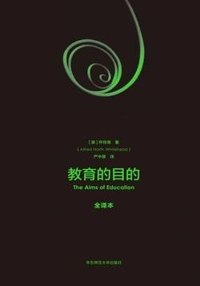

# 《教育的目的（全译本）》

作者：怀特海

## 【文摘】

### 怀特海胸中的教育江山图（代译序）

到了1919年，怀特海才将“广延抽象化方法”发表在《自然知识原理》中。从这个事实中，怀特海的学术品格可见一斑。

在《过程与实体》一书的序言中，怀教授说，“我写了该在首章开头以及全书中经常出现的几句话”。那几句话是：“我们在探求事物本性的深度上所作的努力还是多么的肤浅，多么的柔弱和不完善。在哲学的探讨中，对于终极性陈述，即使是最细微的一点武断的确定，都是愚蠢的表现。”

### 第一章 教育的目的

文化是思想的活动，是对美和人文情感的接受。碎片似的信息或知识与文化无涉。

我们要成就的是既有文化又掌握某些特殊领域的专门知识的人才。专业知识给他们一个开始的土壤，而文化则会引领他们深如哲学又高如艺术。

我们必须记住，自我发展才是有价值的智力发展，而这种发展往往发生在16岁到30岁之间。而培养这种自我发展，最重要的是人们12岁以前从母亲那里接受的教养。

一个曾经在拉格比公学读书时成绩一般的男孩，长大后获得了成就，这不禁使人感到惊喜。坦普尔大主教的回答是：“人不在于他18岁时怎样，而在于他们经历过18岁之前那些事情，后来的日子里他们会如何。”

这种仅为大脑所接受，没有经过运用，或没有经过测试，或没有与其他新颖的思想有机地融为一体的思想。（知识仅被大脑接受意在强调心灵和情感尚未接受，缺乏浪漫的精神。未被运用和测试意味着缺乏精审的过程，知识的接受是粗糙浅薄的。没有与其他新颖事物有机结合，说明知识不能融汇贯通。按照怀特海的教育节奏思想：浪漫—精审—综合，惰性思想是既不浪漫，也不精审，也不能融合其他，完全在教育节奏之外的。——译者注）

我们先来说明教育上的两条戒律：首先，“不可教太多科目”；其次，“所教内容务须透彻”。

教授大量科目，而每个科目只教一点点，结果是学生对无关联观念的被动接受，没有被活力的火花启明。

我所说的利用一个观念，是指将它与一连串复杂的、构成我们生活的感性知觉、情感、希望、欲望以及调节思想的精神活动联系在一起。

教育是教人们掌握如何运用知识的艺术。这是一种很难传授的艺术。

要使知识充满活力，不能使知识变成惰性的，而这是一切教育的核心难题。

希腊七贤

如果我们希望在儿童生动活泼的头脑里唤起美好品性，可是我们自己对要唤起的美好品性缺乏清晰的概念，则改革教育的计划表是没有价值的。

生活与所有智力或情感认知能力的某种基本特点之间存在着关系，如果你不能成功地展现这种关系，你也就无法将生活融入任何普通教育的计划中。

对许多中等学校来说，我建议使用测量和绘图法。尤其是平板测量法可以使学生对几何原理的直接应用产生一种生动的理解。

最优秀的教育在于能够用最简单的工具获得最多的知识。

最后，应该培养所有精神活动品质中最庄敬的特质，我指的是对风格的鉴赏。这是一种审美感，它基于欣赏，简单而毫不浪费，直奔可预见的终点。文学中的风格，科学中的风格，逻辑中的风格，实际做某件事的风格，从根本上说，都具有相同的美学特质，即实现和约束。

风格是专家独享的特权。谁听说过业余画家能有什么风格？谁听说过业余诗人的风格？风格永远是专业化学习的结果，是专业化研究对文化做出的特有的贡献。

宗教性的教育是这样一种教育：它教导受教育者要担责任、知敬畏。责任来自于我们具有潜在控制力，能潜在地控制事物的发展过程。当可习得的知识能够改变结局时，无知即罪恶。而敬畏是基于这样的认识：现在本身就包含着全部的存在，向后也向前无限延展。现在是那漫长而完整的时间，它属于永恒。

### 第二章 教育的节奏

在学生智力发展的不同阶段，我们应该适时采用不同的课程，并配以不同的方式。

#### 幼儿期的任务

首先我们考量的问题是学业难度的标准。科目应该先学简单的而后学难的，这是不对的。相反，有些最难学的东西恰恰必须先学，因为自然如此规定，也因为它们是生命力必不可少的。

#### 心智成长的各个阶段

教育呆板无效，忽视智力发展的这种节奏和特点是一个主要原因。

说到智力的发展，我要用浪漫阶段、精审阶段和贯通阶段来描述这一过程。

#### 浪漫阶段

浪漫阶段是最开始领悟的阶段。

在这个阶段，知识还不受系统进程统领。浪漫阶段的知识系统一定是零敲碎打地被创造出来的。

#### 精审阶段

精审阶段也代表对知识的一次增补。

在这个发展阶段，要使学生一点儿一点儿地接受一种被给定的分析事实的方法。新的事实不断增加，但这是一些适合于分析的事实。（【评】*比如学习一篇课文，浪漫阶段是朗读，先有一个感性的认识，精审阶段是结合上下文分析句子段落？*）

#### 贯通阶段

最后的贯通阶段相当于黑格尔的“合”。在补充了分类概念和相关的技能后，贯通阶段是对浪漫的复归。这是以精审训练为目标所得的成就。

#### 循环的过程

儿童智力发育的外在表现是，他注意把自己身体活动与自己的感知能力相协调。

#### 语言的精通

因此，从11岁开始，儿童需要越来越专注于语言的精确知识。最后，从12岁到15岁，这三年时间应该专攻语言，从而实现明确计划好的、本身就值得拥有的好结果。

不论是对理论感兴趣，还是以技术为目的，科学的重要性的实质在于将科学在具体细节中的运用，而每一次这样的运用都会引出一个新的研究题目。因此，科学方面的一切训练都应该从研究开始，以研究结束，抓住事件发生的本质。

#### 专注于科学

到了15岁，语言上的精确时期和科学上的浪漫时期都接近尾声，接下来是语言上的贯通时期和科学上的精审时期。

这一年时间科学的学习，紧随着前面浪漫的顶峰，应该让每个人都理解力学、物理学、化学、代数学和几何学诸学科发展的各种主要原理。

#### 心智能力的培养

不管你向学生灌输的是什么细节，他在以后的生活中遇到这种细节的机会都微乎其微。即便他确实遇到了这个细节，或许他那时早已忘记了你曾教过他。真正有用的教育是使学生透彻理解一些普遍的原理，这些原理适用于各种不同的具体细节。在随后的实践中，这些人将会忘记你教他们的那些独有的细节。但他们会记起在即刻的境况中如何应用这些原理，凭他们潜意识的判断力。

直到你丢失了教科书，烧掉了你的听课笔记，忘记了你为考试而用心背熟的细节，你才算是真的学会了。在细节方面，无论什么，你时刻需要的那些，如朗朗清晰的日月，坚守于你的记忆之中；你偶然需要的那些，可以在参考书中查到。大学的功能是使你摆脱细节、掌握原理。

所谓智力培养只不过是指，人在行动时大脑以一种令人满意的方式进行运转。学习常被如此言说，犹如我们在看着我们读过的所有书籍的翻开的书页，然后，当机会出现时，我们选取正确的那一页，大声读给世界。

一所大学的理想，不在于知识，而在于力量。大学要做的事是把儿童的知识转化为成人的力量。

### 第三章 自由与训导的节奏性主张

我们必须接受一个无可回避的事实——上帝创造一个有很多话题的世界，绝对无法以一个凡人的能力来获得这世界的全部知识。（【评】*吾生也有涯，而知也无涯。以有涯随无涯，殆已！*）

通往智慧的唯一的途径是在知识面前的自由，但通往知识的唯一途径是对有次序的事实进行获取时的训导。

知识的重要性在于它的应用，在于人们对它的积极的掌握，也就是说，（知识的重要性）在于智慧。

教育中没有任何阶段可以没有训导，或没有自由；但是在浪漫阶段，必须永远侧重于自由，让儿童自己去领会，自己去行动。

教育的节奏性规律，即在发展的早期应注重自由，中期偏后则应强调确实掌握指定学习的知识。

此外，我坚持认为，唯一的训导是自我训导，自我寻求的训导很重要。而这种自我训导唯有通过享有广泛的自由才能得到。但是——教育中有这么多微妙之处须要考虑——在生活中学生必须养成这种习惯：愉快地去完成被强加的任务。如果这些任务符合学生所处发展阶段的自然渴望，如果它们能使学生充分发挥自己的能力，如果它们能取得明显的结果，如果在做的过程中允许学生有适当的自由，那么情况还是能够让学生满意的。（【评】*先培养兴趣，然后学生自觉的求知！*）

教育就是引导，引导个体去领悟生活的艺术。我所说的生活的艺术，是指人的各种活动的最完整的实现，它表现了充满生命力的个体在面对环境时所具有的潜力。

### 第四章 技术教育及其与科学和文学的关系

工作应该伴随理智和道德的想象，这样工作就会转换成为一种乐趣，克服工作本身的疲惫和痛苦。

技术教育，如果缺失了人文教育就不可能完美。人文教育，如果不涉及技术教育，也不可能达成。也就是说，教育必传授技术和智力视野。用更简单的语言来概括：教育应该培养出这样的学生，他既会知识，又会做事。

在教学时，你一旦忘记你的学生是血肉之躯，那你就会遭遇失败——我把它当作一条教育公理。

在传授科学时，应该传授思维的艺术；即：形成清晰的概念以应用于第一手经验的艺术，凭借直觉来领悟一般性的真理的艺术，验证假设的艺术，以及将一般性的真理运用在特殊的、具有某种独特重要性的特定情况下的艺术。此外，还须要有科学阐述的能力，这样才能够突出重点，从一团纷乱的思想中清晰地梳理出有关的问题。

教育的艺术从来不容易。克服种种困难，特别是初等教育中的困难，是值得最杰出的天才去为之努力的任务。这是培养人的灵魂的工作。

任何人能得到的，也不过就是不完全的知识和不完整的能力训练。然而，我们有三种主要的途径，去努力追求智力与性格的最佳平衡，这就是：文学文化之路，科学文化之路，技术文化之路。其中任何之一都不能孤立进行，否则会招致智力活动和性格方面的巨大损失。但把这三种途经机械混合，也会产生糟糕的结果，支离破碎的知识永远互不关联，或是得不到运用。

僵化是所有失败教育的主要原因。

世界是宽广绵延、超越物质意识的传达，有着微妙的反应和情感的涌动。各民族之间竞争的终极问题，决定于工厂而不是战场。谁拥有大量训练有素、精力充沛的工人，谁在有利于成长的条件下工作，竞争的胜利就属于谁。有利于成长的条件中，必不可少的一个条件是艺术。

### 第五章 古典在教育中的地位

当学生的注意力集中在如何用语言表达自己想要表达的东西，或者是理解别人对他说话的意图，或是要弄明白作家的作品的含义，他们就会自动地分析起来。

我们应该本能地抓住那些观念的流变，思想、审美和理性的脉动，是这些真正控制了人类多灾多难的历史。

一个民族的语言体现该民族的精神生活，每一个短语和单词都体现了男人和妇女们在耕犁田地、照料家庭、建造城市时形成的某种习俗观念。

我们必须让学生们通过接触来学习：建筑图片、雕像模型、花瓶照片以及说明宗教神话或家庭生活场景的壁画，通过这些直观演示来展示过去的生活方式。

### 第六章 数学课程

基础数学中的主要观念其实根本不深奥，只能说它们抽象。在通识教育中开展数学教育，一个主要的目标就是培养学生掌握抽象观念的能力。

#### 二

大学存在的理由是，在知识和追求生命的热情之间架起桥梁，它使青年和老年人融为一体，对学术进行充满想象力的探索。大学确实传授知识，但它以充满想象力的方式传授知识。至少，这是它对社会应该起的作用。一所大学如果不能发挥这种作用，它就失去了存在的价值。

青年是富有想象力的，如果这种想象力通过训导被加强了，想象力的能量就能在很大程度上使其受益终身。人间的悲剧是：有想象力的人，没有生活体验；有生活体验的人，缺少想象力；蠢人没有知识，胡乱想象；书呆子没有想象力，只凭知识。大学的任务是融合想象力和体验。

脑力劳动的职业——如现代商业或者某些传统的需要专门知识的职业，大学教育为这类职业做准备时，应该起到促进学生对职业生涯的基本原则做出想象性思考的作用。这样，学生在进入专业技术学徒期时，他们通过把具体细节与一般原理相结合的练习具备了想象力。

#### 三

在教育方面，一所大学的全部要义在于，让年轻人受惠于一批充满想象力的学者，智力发展上受到影响。经验证明，我们必须对产生这种学者的各种条件给予适当的注意。

### 第八章 思想的组织

科学是一条有两个来源的河流，即实践源头和理论源头。

理论源头是对理解的欲望。

一个成功的理论家应该对即时事件感兴趣，否则他就不太可能过分正确地规划任何有关它们的一切。当然，科学的两种源头存在于所有人身上。

我的论点是，这个世界是一个观念的世界，其内在关系是抽象概念之间的关系。

理念的经验，紧密地关联着我们对其他人的实际经验的想象性再现。

我们可以分辨出逻辑理论的四个部分。通过一个不那么遥远的类比，我将这些部分或部门称为算术部分、代数部分、一般函数理论部分和分析部分。

第一个部分，也就是算术阶段，处理确定命题之间的关系，就像算术处理确定的数字那样。

第四个逻辑部分是分析阶段，主要研究特殊逻辑结构的性质。确切地说，是研究集和特殊种类的集的关联。

#### 一 事实

本体论

形而上学

科学的目标是，把我们的反思和衍生的思想，与感觉表象的即刻领会所涉及的最初思想相协调。它还旨在产生这样的衍生思想，并逻辑地编织在一起。

#### 二 客体

必须记住，在知觉的思想客体形成过程中，判断和概念的产生主要是本能判断和本能的概念，而不是有意识地寻求的概念和判断，不是在采纳之前有意识的批判。它们的采用是由对未来的期望所推动和交织而成的。

斯芬克斯狮身人面像的鼻子被削成了碎片，通过适当的调查，在西欧或北美的一些私人住宅中，我们可以找到丢失的部分。（【评】*这群强盗土匪👎
*）

我们意识中的两个因素：感觉表象，和假想的感知思想客体的实际表象，通过反思性的批判，在相关的地方达成一致。即，把我们的感觉表象理解为对假想的知觉的思想客体的实际实现。

科学的思想客体是分子、原子和电子。这些客体的特点是，它们摆脱了所有能在意识中直接地感觉表象的品质。它们只是通过它们的关联现象，被我们获知。即，在我们的意识中，它们以它们所关涉的一系列事件的方式表象出来。按这个方式，科学的思想客体就被认为是感觉表象的原因。从感知的思想客体到科学的思想客体，这种转变被一个关于事物的第一性和第二性的详尽理论所掩盖。