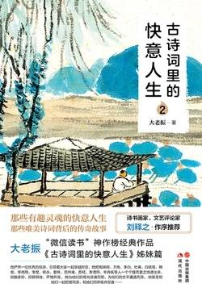

# 《古诗词里的快意人生2》

作者：大老振

## 【文摘】

### 前言 诗词的力量

黄梅时节家家雨，青草池塘处处蛙。有约不来过夜半，闲敲棋子落灯花。

有约不来过夜半，闲敲棋子落灯花。

小娃撑小艇，偷采白莲回。不解藏踪迹，浮萍一道开。

千山鸟飞绝，万径人踪灭。孤舟蓑笠翁，独钓寒江雪。

前不见古人，后不见来者。念天地之悠悠，独怆然而涕下。

少年不识愁滋味，爱上层楼。爱上层楼，为赋新词强(qiǎng)说愁。　如今识得愁滋味，欲说还休。欲说还休，却道天凉好个秋。

莫听穿林打叶声，何妨吟啸且徐行。竹杖芒鞋轻胜马，谁怕？一蓑烟雨任平生。　料峭春风吹酒醒，微冷，山头斜照却相迎。回首向来萧瑟处，归去，也无风雨也无晴。

南朝梁的皇帝、文学家萧纲说：“一善染心，万劫不朽。百灯旷照，千里通明。”

“满目河山空念远，落花风雨更伤春。不如怜取眼前人。”（晏殊《浣溪沙》）

北宋司马光说：“积金以遗子孙，子孙未必能守；积书以遗子孙，子孙未必能读；不如积阴德于冥冥之中，以为子孙长久之计。”

禅宗六祖惠能大师脍炙人口的《菩提偈》：菩提本无树，明镜亦非台。本来无一物，何处染尘埃？

正如南怀瑾先生所说：“三千年读史，不外功名利禄。九万里悟道，终归诗酒田园。”

### 陶渊明 当灵魂失去庙宇，雨水便会滴在心上

园田居（其一）少无适俗韵，性本爱丘山。误入尘网中，一去三十年。羁鸟恋旧林，池鱼思故渊。开荒南野际，守拙归园田。方宅十余亩，草屋八九间。榆柳荫后檐，桃李罗堂前。暧暧远人村，依依墟里烟。狗吠深巷中，鸡鸣桑树颠。户庭无杂陈，虚室有余闲。久在樊笼里，复得返自然。

归园田居（其三）种豆南山下，草盛豆苗稀。晨兴理荒秽，带月荷锄归。道狭草木长，夕露沾我衣。衣沾不足惜，但使愿无违。

饮酒（其五）结庐在人境，而无车马喧。问君何能尔，心远地自偏。采菊东篱下，悠然见南山。山气日夕佳，飞鸟相与还。此中有真意，欲辨已忘言。

“盛年不重来，一日难再晨。及时当勉励，岁月不待人。”（《杂诗》其一）

“勤学如春起之苗，不见其增，日有所长。”（《劝学》）

“纵浪大化中，不喜亦不惧。应尽便须尽，无复独多虑”（《形影神》）

“人生天地间，忽如远行客。”

李白恨不得穿越到陶渊明的时代，他写下了：“梦见五柳枝，已堪挂马鞭。何时到彭泽，狂歌陶令前。”（《寄韦南陵冰，余江上乘兴访之遇寻颜尚书笑有此赠》） 白居易被贬官江州时，是陶渊明的诗给了他疏解郁闷的力量：“数峰太白雪，一卷陶潜诗。”（《官舍小亭闲望》） 苏东坡更是毫不掩饰他对陶渊明的喜爱之情：“吾于诗人无所甚好，独好渊明之诗。”（《与苏辙书》）（【评】*他们都在积极入世，陶渊明的诗与他们就像是桃花源吧，人生不顺时的自我慰藉！*）

### 王维 就算上天让我一无所有，我仍然会一笑而过

父亲王处廉赶紧进行素质教育，亲自教授王维诗文。爷爷的得意弟子又教授王维各种乐器。母亲在教他画画之余，还给他讲佛经，因为她笃信佛教，是当时著名高僧大照禅师的弟子。（【评】*别人难以企及的教育环境👍*）

“独在异乡为异客，每逢佳节倍思亲。遥知兄弟登高处，遍插茱萸少一人”（《九月九日忆山东兄弟》）

《相思》：“红豆生南国，春来发几枝。愿君多采撷，此物最相思。”

“君自故乡来，应知故乡事。来日绮(qǐ)窗前，寒梅著花未？”（《杂诗》）

王维《少年行》：“新丰美酒斗十千，咸阳游侠多少年。相逢意气为君饮，系马高楼垂柳边。”

鸟鸣涧人闲桂花落，夜静春山空。月出惊山鸟，时鸣春涧中。

山居秋暝空山新雨后，天气晚来秋。明月松间照，清泉石上流。竹喧归浣女，莲动下渔舟。随意春芳歇，王孙自可留。

使至塞上单车欲问边，属国过居延。征蓬出汉塞，归雁入胡天。大漠孤烟直，长河落日圆。萧关逢候骑，都护在燕然。

观猎风劲角弓鸣，将军猎渭城。草枯鹰眼疾，雪尽马蹄轻。忽过新丰市，还归细柳营。回看射雕处，千里暮云平。

渭城曲渭城朝雨浥轻尘，客舍青青柳色新。劝君更尽一杯酒，西出阳关无故人。

南别业中岁颇好道，晚家南山陲。兴来每独往，胜事空自知。行到水穷处，坐看云起时。偶然值林叟，谈笑无还期。

鹿柴(zhài)空山不见人，但闻人语响。返景入深林，复照青苔上。

竹里馆独坐幽篁里，弹琴复长啸。深林人不知，明月来相照。

苏轼曾说：“味摩诘之诗，诗中有画；观摩诘之画，画中有诗。”

王维为后世留下了《山水论》《山水诀》等绘画理论著作，独创的“破墨法”对后世影响很大，在绘画中处理人和山水的画风更是深深影响了后世。自王维之后，山水画中的人物都是那样渺小，在大自然面前，人类不过是一粒粒尘埃。

《伊州歌》：“清风明月苦相思，荡子从戎十载馀。征人去日殷勤嘱，归雁来时数附书。”

王维，被世人称为“诗佛”。

### 李白① 交友之道，贵在一个字

行侠仗义畅游天下万分想要做官（【评】*理解李白诗文的一个要点！*）

“吾与尔，达则兼济天下，穷则独善一身。安能餐君紫霞，荫君青松，乘君鸾鹤，驾君虬龙，一朝飞腾，为方丈、蓬莱之人耳？此则未可也……事君之道成，荣亲之义毕，然后与陶朱、留侯，浮五湖，戏沧洲，不足为难矣。即仆林下之所隐容，岂不大哉？”（《代寿山答孟少府移文书》）

司马承祯

“有仙风道骨，可与神游八极之表。”

黄鹤楼送孟浩然之广陵故人西辞黄鹤楼，烟花三月下扬州。孤帆远影碧空尽，唯见长江天际流。

“少小离家老大回，乡音无改鬓毛衰”，“碧玉妆成一树高，万条垂下绿丝绦”

《赠李白》秋来相顾尚飘蓬，未就丹砂愧葛洪。痛饮狂歌空度日，飞扬跋扈为谁雄？

李白是“谈笑安黎元”“终与安社稷”，杜甫是“致君尧舜上，再使风俗淳”。

“笔落惊风雨，诗成泣鬼神。”（《寄李十二白二十韵》）

《不见》不见李生久，佯狂真可哀。世人皆欲杀，吾意独怜才。敏捷诗千首，飘零酒一杯。匡山读书处，头白好归来。

“廉夫唯重义，骏马不劳鞭。人生贵相知，何必金与钱？”（《赠友人·其二节选》）

“知章骑马似乘船，眼花落井水底眠。”（杜甫《饮中八仙歌》）

“人生交契无老少，论交何必先同调。”（杜甫《徒步归行》）

何谓益友？“友直，友谅，友多闻，益矣。”“友直”，即朋友很正直，正直的朋友也叫“诤友”。

何谓损友？“友便辟(biàn pì)，友善柔，友便佞(pián nìng)，损矣。”

### 李白② 他一生张狂，却旖旎了月光

“十步杀一人，千里不留行。事了拂衣去，深藏功与名。”（《侠客行》）

“宣父犹能畏后生，丈夫未可轻年少。”（《上李邕》）

“仰天大笑出门去，我辈岂是蓬蒿人。”（《南陵别儿童入京》）

“人生在世不称意，明朝散发弄扁舟。”（《宣州谢朓楼饯别校书叔云》）

峨眉山月歌峨眉山月半轮秋，影入平羌江水流。夜发清溪向三峡，思君不见下渝州。

秋浦歌（其十三）绿水净素月，月明白鹭飞。郎听采菱女，一道夜歌归。

《月下独酌》花间一壶酒，独酌无相亲。举杯邀明月，对影成三人。月既不解饮，影徒随我身。暂伴月将影，行乐须及春。我歌月徘徊，我舞影零乱。醒时同交欢，醉后各分散。永结无情游，相期邈云汉。

《关山月》明月出天山，苍茫云海间。长风几万里，吹度玉门关。

《把酒问月》青天有月来几时，我今停杯一问之。人攀明月不可得，月行却与人相随。皎如飞镜临丹阙，绿烟灭尽清辉发。但见宵从海上来，宁知晓向云间没。白兔捣药秋复春，嫦娥孤栖与谁邻。今人不见古时月，今月曾经照古人。古人今人若流水，共看明月皆如此。唯愿当歌对酒时，月光长照金樽里。

屈原在《天问》中问过：“日月安属，列星安陈？”张若虚在《春江花月夜》中问过：“江畔何年初见月，江月何年初照人？”

《静夜思》：床前明月光，疑是地上霜。举头望明月，低头思故乡。

### 杜甫 命运掌握在谁的手中

杜甫的励志语是这样的，“奉儒守官”就是我的家传理想，“致君尧舜上，再使风俗淳”就是我的人生目标，“周室宜中兴，孔门未应弃”就是我的儒家抱负。

贫困潦倒愁眉锁，居无定所四处漂；无钱无官无政绩，独立乱世一野老。

望岳（其一）岱宗夫如何？齐鲁青未了。造化钟神秀，阴阳割昏晓。荡胸生曾云，决眦入归鸟。会当凌绝顶，一览众山小。

《江村》清江一曲抱村流，长夏江村事事幽。自去自来堂上燕，相亲相近水中鸥。老妻画纸为棋局，稚子敲针作钓钩。但有故人供禄米，微躯此外更何求。

《登高》：风急天高猿啸哀，渚(zhǔ)清沙白鸟飞回。无边落木萧萧下，不尽长江滚滚来。万里悲秋常作客，百年多病独登台。艰难苦恨繁霜鬓，潦倒新停浊酒杯。

《旅夜书怀》细草微风岸，危樯独夜舟。星垂平野阔，月涌大江流。名岂文章著，官应老病休。飘飘何所似，天地一沙鸥。

### 杜甫与李龟年 与你重逢在江南

大哥李龟年唱歌好，在乐器上他就选择筚篥(bì lì)，这是一种管乐器，吹奏起来声音浑厚。他还苦练羯鼓，把这鼓敲到了出神入化的地步。他的二弟李彭年苦练胡舞，三弟李鹤年苦练声乐。三兄弟迅速火遍了长安，迅速成为唐玄宗的御用歌手和王孙贵族的座上宾，迅速在长安买了房子，还在东都洛阳建了一套超级豪华的大别墅。

《江南逢李龟年》岐王宅里寻常见，崔九堂前几度闻。正是江南好风景，落花时节又逢君。

“日出江花红胜火，春来江水绿如蓝。”

“往时文采动人主，今日饥寒趋路旁”

“亲朋无一字，老病有孤舟”

“飘飘何所似，天地一沙鸥。”

### 白居易① 唐诗江湖，王者归来

“古来圣贤皆寂寞，惟有饮者留其名”（李白《将进酒》）

“曾经沧海难为水，除却巫山不是云”

“还君明珠双泪垂，恨不相逢未嫁时”

“今夜月明人尽望，不知秋思落谁家”

“谁知盘中餐，粒粒皆辛苦”

元稹《菊花》：“秋丛绕舍似陶家，遍绕篱边日渐斜。不是花中偏爱菊，此花开尽更无花。”

王建《十五夜望月》：“中庭地白树栖鸦，冷露无声湿桂花。今夜月明人尽望，不知秋思落谁家。”

心泰身宁是归处，故乡何独在长安。宦途自此心长别，世事从今口不言。

“同是天涯沦落人，相逢何必曾相识”

《钱塘湖春行》：孤山寺北贾亭西，水面初平云脚低。几处早莺争暖树，谁家新燕啄春泥。乱花渐欲迷人眼，浅草才能没马蹄。最爱湖东行不足，绿杨阴里白沙堤。

“江南好，风景旧曾谙；日出江花红胜火，春来江水绿如蓝。能不忆江南？”（《忆江南》）

“弄日临溪坐，寻花绕寺行。时时闻鸟语，处处是泉声。”（《遗爱寺》）

“一道残阳铺水中，半江瑟瑟半江红。可怜九月初三夜，露似真珠月似弓。”（《暮江吟》）

“绿蚁新醅(pēi)酒，红泥小火炉。晚来天欲雪，能饮一杯无？”（《问刘十九》）

“人间四月芳菲尽，山寺桃花始盛开。长恨春归无觅处，不知转入此中来。”（《大林寺桃花》）

“谁道群生性命微？一般骨肉一般皮。劝君莫打枝头鸟，子在巢中望母归。”（《鸟》）

“花非花，雾非雾，夜半来，天明去。来如春梦不多时，去似朝云无觅处。”（《花非花》）

“花开生两面，人生佛魔间。浮生若骄狂，何以安流年。”（《世说新语》）

《中庸》里有这样一句话：“正己而不求于人则无怨。上不怨天，下不尤人。故君子居易以俟命，小人行险以缴幸。”

“面上减除忧喜色，胸中消尽是非心。”（《咏怀》）

“门前有流水，墙上多高树。竹径绕荷池，萦回百馀步。”（《闲居自题》）

离离原上草，一岁一枯荣。野火烧不尽，春风吹又生。远芳侵古道，晴翠接荒城。又送王孙去，萋萋满别情。

### 韩愈 一言不合就拿动物开涮的“段子手”

《论语·先进》曰：“子曰：求也退，故进之；由也兼人，故退之。”

《左迁至蓝关示侄孙湘》：一封朝奏九重天，夕贬潮州路八千。欲为圣明除弊事，肯将衰朽惜残年。云横秦岭家何在？雪拥蓝关马不前。知汝远来应有意，好收吾骨瘴江边。

### 李商隐 知道你傻呀，偏偏还是喜欢你

登乐游原向晚意不适，驱车登古原。夕阳无限好，只是近黄昏。

《无题（一）》相见时难别亦难，东风无力百花残。春蚕到死丝方尽，蜡炬成灰泪始干。晓镜但愁云鬓改，夜吟应觉月光寒。蓬山此去无多路，青鸟殷勤为探看。

昨夜星辰昨夜风，画楼西畔桂堂东。身无彩凤双飞翼，心有灵犀一点通。隔座送钩春酒暖，分曹射覆蜡灯红。嗟余听鼓应官去，走马兰台类转蓬。

《无题（三）》来是空言去绝综，月斜楼上五更钟。梦为远别啼难唤，书被催成墨未浓。蜡照半笼金翡翠，麝熏微度绣芙蓉。刘郎已恨蓬山远，更隔蓬山一万重。

《无题（四）》飒飒东风细雨来，芙蓉塘外有轻雷。金蟾啮锁烧香入，玉虎牵丝汲井回。贾氏窥帘韩掾(yuàn)少，宓妃留枕魏王才。春心莫共花争发，一寸相思一寸灰。

《夜雨寄北》君问归期未有期，巴山夜雨涨秋池。何当共剪西窗烛？却话巴山夜雨时。

《锦瑟》锦瑟无端五十弦，一弦一柱思华年。庄生晓梦迷蝴蝶，望帝春心托杜鹃。沧海月明珠有泪，蓝田日暖玉生烟。此情可待成追忆，只是当时已惘然。

### 李煜 我来到这人世间，也许就是个错误

《望江南》多少恨，昨夜梦魂中。还似旧时游上苑，车如流水马如龙，花月正春风。

《望江梅》闲梦远，南国正清秋。千里江山寒色暮，芦花深处泊孤舟，笛在月明楼。

《相思》一重山，两重山。山远天高烟水寒，相思枫叶丹。　菊花开，菊花残。塞雁高飞人未还，一帘风月闲。

《相见欢》无言独上西楼，月如钩。寂寞梧桐深院锁清秋。　剪不断，理还乱，是离愁。别是一般滋味在心头。

《乌夜啼》林花谢了春红，太匆匆。无奈朝来寒雨晚来风。　胭脂泪，留人醉，几时重。自是人生长恨水长东。

“世事漫随流水，算来一梦浮生。”（《乌夜啼·昨夜风兼雨》）

《虞美人》春花秋月何时了？往事知多少。小楼昨夜又东风，故国不堪回首月明中。　雕栏玉砌应犹在，只是朱颜改。问君能有几多愁？恰似一江春水向东流。

### 柳永 生命不过是一场灿烂的烟花

《论语》中子夏的一句话：“君子有三变，望之俨然，即之也温，听其言也厉。”

《望海潮》东南形胜，三吴都会，钱塘自古繁华。烟柳画桥，风帘翠幕，参差十万人家。云树绕堤沙，怒涛卷霜雪，天堑无涯。市列珠玑，户盈罗绮，竞豪奢。　重湖叠巘(yǎn)清嘉，有三秋桂子，十里荷花。羌管弄晴，菱歌泛夜，嬉嬉钓叟莲娃。千骑拥高牙。乘醉听箫鼓，吟赏烟霞。异日图将好景，归去凤池夸。

《鹤冲天》黄金榜上，偶失龙头望。明代暂遗贤，如何向。未遂风云便，争不恣游狂荡，何须论得丧？才子词人，自是白衣卿相。　烟花巷陌，依约丹青屏障。幸有意中人，堪寻访。且恁偎红倚翠，风流事，平生畅。青春都一饷，忍把浮名，换了浅斟低唱！

“独自个、千山万水，指天涯去”（《引驾行·中吕调》）

《雨霖铃》寒蝉凄切，对长亭晚，骤雨初歇。都门帐饮无绪，留恋处，兰舟催发。执手相看泪眼，竟无语凝噎。念去去，千里烟波，暮霭沉沉楚天阔。　多情自古伤离别，更那堪，冷落清秋节！今宵酒醒何处？杨柳岸，晓风残月。此去经年，应是良辰好景虚设。便纵有千种风情，更与何人说？

《八声甘州对》潇潇暮雨洒江天，一番洗清秋。渐霜风凄紧，关河冷落，残照当楼。是处红衰翠减，苒苒物华休。惟有长江水，无语东流。　不忍登高临远，望故乡渺邈，归思难收。叹年来踪迹，何事苦淹留？想佳人，妆楼颙(yóng)望，误几回，天际识归舟。争知我，倚阑干处，正恁凝愁。

《凤栖梧》伫倚危楼风细细。望极春愁，黯黯生天际。草色烟光残照里，无言谁会凭阑意。　拟把疏狂图一醉。醉酒当歌，强乐还无味。衣带渐宽终不悔，为伊消得人憔悴。

### 晏殊 让你们这些“后浪”瞧瞧，什么叫高情商

《浣溪沙》一曲新词酒一杯，去年天气旧亭台。夕阳西下几时回？　无可奈何花落去，似曾相识燕归来。小园香径独徘徊。

天涯地角有穷时，只有相思无尽处。”（《玉楼春》）

欧阳修《蝶恋花》：“庭院深深深几许，杨柳堆烟，帘幕无重数。玉勒雕鞍游冶处，楼高不见章台路。　雨横风狂三月暮，门掩黄昏，无计留春住。泪眼问花花不语，乱红飞过秋千去。”

《浣溪沙》小阁重帘有燕过。晚花红片落庭莎。曲阑干影入凉波。　一霎好风生翠幕，几回疏雨滴圆荷。酒醒人散得愁多。

《浣溪沙》一向年光有限身，等闲离别易销魂，酒筵歌席莫辞频。　满目山河空念远，落花风雨更伤春，不如怜取眼前人。

《破阵子·春景》燕子来时新社，梨花落后清明。池上碧苔三四点，叶底黄鹂一两声。日长飞絮轻。　巧笑东邻女伴，采桑径里逢迎。疑怪昨宵春梦好，元是今朝斗草赢。笑从双脸生。

看这句“昨夜西风凋碧树，独上高楼，望尽天涯路”（《蝶恋花》），被王国维说是成就大事业的第一境界。第二境界是柳永的“衣带渐宽终不悔，为伊消得人憔悴”。第三境界是辛弃疾的“众里寻他千百度，蓦然回首，那人却在，灯火阑珊处”。

### 范仲淹 如何把稀巴烂的人生活出“王炸”的感觉

《渔家傲·秋思》塞下秋来风景异，衡阳雁去无留意。四面边声连角起，千嶂里，长烟落日孤城闭。　浊酒一杯家万里，燕然未勒归无计，羌管悠悠霜满地。人不寐，将军白发征夫泪。

《苏幕遮·怀旧》碧云天，黄叶地，秋色连波，波上寒烟翠。山映斜阳天接水，芳草无情，更在斜阳外。　黯乡魂，追旅思，夜夜除非，好梦留人睡。明月楼高休独倚，酒入愁肠，化作相思泪。

岳阳楼与黄鹤楼、滕王阁、鹳雀楼并称“四大名楼”，

《御街行·秋日怀旧》纷纷坠叶飘香砌。夜寂静，寒声碎。真珠帘卷玉楼空，天淡银河垂地。年年今夜，月华如练，长是人千里。　愁肠已断无由醉，酒未到，先成泪。残灯明灭枕头欹，谙尽孤眠滋味。都来此事，眉间心上，无计相回避。

### 苏轼① 用一生把别人的苟且活成潇洒

《江城子·乙卯正月二十日夜记梦》十年生死两茫茫。不思量，自难忘。千里孤坟，无处话凄凉。纵使相逢应不识，尘满面，鬓如霜。　夜来幽梦忽还乡。小轩窗，正梳妆。相顾无言，惟有泪千行。料得年年断肠处，明月夜，短松冈。

水光潋滟晴方好，山色空蒙雨亦奇。欲把西湖比西子，淡妆浓抹总相宜。

《念奴娇·赤壁怀古》大江东去，浪淘尽、千古风流人物。故垒西边，人道是、三国周郎赤壁。乱石穿空，惊涛拍岸，卷起千堆雪。江山如画，一时多少豪杰！　遥想公瑾当年，小乔初嫁了，雄姿英发。羽扇纶巾，谈笑间、樯橹灰飞烟灭。故国神游，多情应笑我、早生华发。人生如梦，一樽还酹江月。

苏轼《水调歌头》：“明月几时有？把酒问青天。不知天上宫阙，今夕是何年。我欲乘风归去，又恐琼楼玉宇，高处不胜寒。起舞弄清影，何似在人间。　转朱阁，低绮户，照无眠。不应有恨，何事长向别时圆？人有悲欢离合，月有阴晴圆缺，此事古难全。但愿人长久，千里共婵娟。”

### 张先 放个大招给你看

“云破月来花弄影”

“天不老，情难绝。心似双丝网，中有千千结。”

宋祁《木兰花》：“东城渐觉风光好，縠皱波纹迎客棹。绿杨烟外晓寒轻，红杏枝头春意闹。　浮生长恨欢娱少，肯爱千金轻一笑。为君持酒劝斜阳，且向花间留晚照。”

### 李清照 女神的朋友圈

《如梦令》常记溪亭日暮，沉醉不知归路。兴尽晚回舟，误入藕花深处。争渡，争渡，惊起一滩鸥鹭。

李清照《如梦令》：“昨夜雨疏风骤，浓睡不消残酒。试问卷帘人，却道海棠依旧。知否，知否？应是绿肥红瘦。”

《点绛(jiàng)唇》蹴(cù)罢秋千，起来慵整纤(xiān)纤手。露浓花瘦，薄汗轻衣透。　见客入来，袜刬(chǎn)金钗溜。和羞走，倚门回首，却把青梅嗅。

《减字木兰花》卖花担上，买得一枝春欲放。泪染轻匀，犹带彤霞晓露痕。　怕郎猜道，奴面不如花面好。云鬓斜簪，徒要教郎比并看。

《一剪梅》红藕香残玉簟(diàn)秋，轻解罗裳，独上兰舟。云中谁寄锦书来？雁字回时，月满西楼。　花自飘零水自流，一种相思，两处闲愁。此情无计可消除，才下眉头，却上心头。

《醉花阴》薄雾浓云愁永昼，瑞脑销金兽。佳节又重阳，玉枕纱橱，半夜凉初透。　东篱把酒黄昏后，有暗香盈袖。莫道不消魂，帘卷西风，人比黄花瘦。

《武陵春·春晚》风住尘香花已尽，日晚倦梳头。物是人非事事休，欲语泪先流。　闻说双溪春尚好，也拟泛轻舟。只恐双溪舴艋舟，载不动、许多愁。

《声声慢》寻寻觅觅，冷冷清清，凄凄惨惨戚戚。乍暖还寒时候，最难将息。三杯两盏淡酒，怎敌他、晚来风急？雁过也，正伤心，却是旧时相识。　满地黄花堆积，憔悴损，如今有谁堪摘？守着窗儿，独自怎生得黑。梧桐更兼细雨，到黄昏、点点滴滴。这次第，怎一个愁字了得！

### 岳飞 尽忠报国岳鹏举，岁月不负少年头

《满江红》怒发冲冠，凭栏处，潇潇雨歇。抬望眼，仰天长啸，壮怀激烈。三十功名尘与土，八千里路云和月。莫等闲，白了少年头，空悲切！　靖康耻，犹未雪；臣子恨，何时灭？驾长车踏破，贺兰山缺。壮志饥餐胡虏肉，笑谈渴饮匈奴血。待从头，收拾旧山河，朝天阙！

《小重山》昨夜寒蛩(qióng)不住鸣，惊回千里梦，已三更。起来独自绕阶行，人悄悄，帘外月胧明。　白首为功名，旧山松竹老，阻归程。欲将心事付瑶琴，知音少，弦断有谁听？

### 陆游 相濡以沫，不如相忘于江湖

《列子·仲尼》中有“务外游不如务内观”一语

“夜月一帘幽梦，春风十里柔情。”（《八六子·倚危亭》）

《钗头凤》：红酥手，黄縢酒，满城春色宫墙柳。东风恶，欢情薄，一怀愁绪，几年离索。错！错！错！　春如旧，人空瘦，泪痕红浥鲛绡透。桃花落，闲池阁，山盟虽在，锦书难托。莫！莫！莫！

《钗头凤》：世情薄，人情恶，雨送黄昏花易落。晓风干，泪痕残，欲笺心事，独语斜阑。难！难！难！　人成各，今非昨，病魂长似秋千索。角声寒，夜阑珊，怕人询问，咽泪装欢。瞒！瞒！瞒！

“人生天地之间，若白驹之过隙，忽然而已。”

### 辛弃疾 铁血男儿告诉你，什么叫兄弟

“不恨古人吾不见，恨古人不见吾狂耳。知我者，二三子。”（《贺新郎·甚矣吾衰矣》）

“众里寻他千百度，蓦然回首，那人却在，灯火阑珊处。”（《青玉案·元夕》

“我见青山多妩媚，料青山，见我应如是。情与貌，略相似。”（《贺新郎·甚矣吾衰矣》）

《西江月·夜行黄沙道中》明月别枝惊鹊，清风半夜鸣蝉。稻花香里说丰年，听取蛙声一片。　七八个星天外，两三点雨山前。旧时茅店社林边，路转溪桥忽见(xiàn)。

“休去倚危栏，斜阳正在，烟柳断肠处”（《摸鱼儿·更能消几番风雨》）

“把吴钩看了，栏杆拍遍，无人会，登临意”（《水龙吟·登建康赏心亭》）

“想当年，金戈铁马，气吞万里如虎”（《永遇乐·京口北固亭怀古》）

“少年不识愁滋味，爱上层楼。爱上层楼，为赋新词强说愁。而今识尽愁滋味，欲说还休。欲说还休，却道天凉好个秋”（《丑奴儿》）

“问渠那得清如许？为有源头活水来”（《观书有感》））

朱熹说过：“朋友，以义合者。”

“铸就而今相思错，料当初、费尽人间铁。长夜笛，莫吹裂。”（《贺新郎·把酒长亭说》）

《破阵子·为陈同甫赋壮词以寄之》醉里挑灯看剑，梦回吹角连营。八百里分麾下炙，五十弦翻塞外声，沙场秋点兵。　马作的卢飞快，弓如霹雳弦惊。了却君王天下事，赢得生前身后名，可怜白发生！

《示儿》死去元知万事空，但悲不见九州同。王师北定中原日，家祭无忘告乃翁。（陆游）

### 文天祥 中国人应该牢牢记住的两个字

“峰峦如聚，波涛如怒，山河表里潼关路”（张养浩《山坡羊·潼关怀古》

东京开封府（今河南开封）、西京河南府（今河南洛阳）、南京应天府（今河南商丘），就差北京大名府（今河北大名）

《过零丁洋》辛苦遭逢起一经，干戈寥落四周星。山河破碎风飘絮，身世浮沉雨打萍。惶恐滩头说惶恐，零丁洋里叹零丁。人生自古谁无死，留取丹心照汗青。

### 后记：把生命交付出去的阅读

《望月怀远》海上生明月，天涯共此时。情人怨遥夜，竟夕起相思。灭烛怜光满，披衣觉露滋。不堪盈手赠，还寝梦佳期。