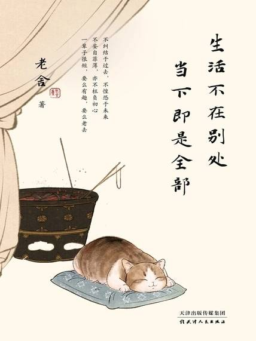

# 《生活不在别处 当下即是全部》

作者：老舍

老舍（1899年2月3日-1966年8月24日），原名舒庆春，字舍予，出生于北京，毕业于北京师范学院，中国现代小说家、作家、语言大师，新中国第一位获得“人民艺术家”称号的作家。

## 【文摘】
### Chapter 壹：生活不在别处，当下即是全部

当是时也，小济拉拉我的肘，低声说：“上公园看猴？”于是我至今还未成莎士比亚。小儿一岁整，还不会“写字”，也不晓得去看猴，但善亲亲，闭眼，张口展览上下四个小牙。我若没事，请求他闭眼，露牙，小胖子总会东指西指地打岔。赶到我拿起笔来，他那一套全来了，不但亲脸，闭眼，还“指”令我也得表演这几招。有什么办法呢！（【评】*有儿有女，生活乐趣多！*）

闹钟应当，而且果然，在六点半响了。睁开半只眼，日光还没射到窗上；把对闹钟的信仰改为崇拜太阳，半只眼闭上了。

除夕是热闹的，可是没有月光；元宵节呢，恰好是明月当空。

读书能引起倦意，写文可不能；读书是把别人的思想装入自己的脑子里，写文是把自己的思想挤出来，这两样不是一回事，写文更累得慌。

### Chapter 贰：万物可爱，平凡的生活也有诗意

点子是白身腔，只在头上有手指肚大的一块黑，或紫；尾是随着头上那个点儿，黑或紫。

### Chapter 叁：慢品人间烟火色，闲观万事岁月长

每逢接到家信，我总不敢马上拆看，我怕，怕，怕，怕有那不祥的消息。人，即使活到八九十岁，有母亲便可以多少还有点孩子气。失了慈母便像花插在瓶子里，虽然还有色有香，却失去了根。有母亲的人，心里是安定的。我怕，怕，怕家信中带来不好的消息，告诉我已是失了根的花草。

最近二年，何容先生不知戒了多少次烟了，而指头上始终是黄的。（【评】*下载安装游戏，一段时间后，感觉这么不是个事，卸载游戏，一段时间后，觉得无聊，又下载安装游戏，如此反复不知多少次，四天前吧，再一次卸载了游戏，不知道这次能坚持多久不玩游戏🤣*）

有了朋友，我们才有心理上的健康。这并不是说，因为朋友肯帮忙我们，我们能诸事顺利，而心广体胖。我是说，友谊的建立与维持是基于“取与予”。友谊像梭，必须一来一往。我们关切别人，帮助别人，而后我们才泰然的能接受，明白，与欣赏别人对我们的关切与帮助。这，我们才会有了活跃的生活，与和平的心境。一个乖谬的人，不会交友；一个吝啬的人，不肯交友；一个自私的人，不能交友。因为他们没有朋友，所以他们就日甚一日地更乖谬，更吝啬，更自私；而这些——乖谬、吝啬、自私——都不是美德。

### Chapter 肆：晴雨有时，趣味是生活的解药

### Chapter 伍：雨天不要赶路，天晴自有通途

孤立地读一本作品，我们多半是凭个人的喜恶去评断，自己所喜则捧入云霄，自己所恶则弃如粪土。事实上，这未必正确。

我永远不会成为英雄，只求有几分英雄气概；至少须消极地把受苦视为当然，而后用事实表现一点积极的向上精神。