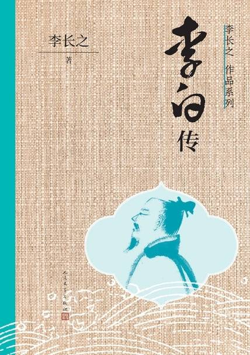

# 《李白传》

作者：李长之

## 【文摘】

### 道教徒的诗人李白及其痛苦

#### 李白求仙学道的生活之轮廓

君不见黄河之水天上来，奔流到海不复回？君不见高堂明镜悲白发，朝如青丝暮成雪？人生得意须尽欢，莫使金樽空对月！天生我材必有用，千金散去还复来。烹羊宰牛且为乐，会须一饮三百杯。岑夫子，丹丘生，将进酒，君莫停！与君歌一曲，请君为我倾耳听。钟鼓馔玉不足贵，但愿长醉不愿醒。古来圣贤皆寂寞，唯有饮者留其名。陈王昔时宴平乐，斗酒十千恣欢谑。主人何为言少钱，径须沽取对君酌。五花马，千金裘，呼儿将出换美酒，与尔同销万古愁！

#### 道教思想之体系与李白

花间一壶酒，独酌无相亲。举杯邀明月，对影成三人。月既不解饮，影徒随我身。暂伴月将影，行乐须及春。我歌月徘徊，我舞影凌乱。醒时同交欢，醉后各分散。永结无情游，相期邈云汉。——《月下独酌》

众鸟高飞尽，孤云独去闲。相看两不厌，只有敬亭山。——《独坐敬亭山》

#### 失败了的鲁仲连——李白的从政

他本人所自负的也是能够治国平天下的本领，也就是所谓“经济”“经纶”“济世”“济时”

“富贵吾自取，建功及春荣”

“壮志恐蹉跎，功名若云浮”（《忆襄阳旧游赠济阴马少府巨》）

“富贵日成疏，愿言杳无缘”（《赠宣城宇文太守兼呈崔侍御》）

“功业莫从就，岁光屡奔迫”（《淮南卧病书怀寄蜀中赵征君蕤》）

他所希望的自然是有人来请，他希望坐得安安稳稳的，忽然出山，忽然立功，这样，诸葛孔明便是他理想的人物之一了，但更为理想的则是谢安，谢安是李白心目中仅次于鲁仲连的人物。

渡远荆门外，来从楚国游。山随平野尽，江入大荒流。月下飞天镜，云生结海楼。仍怜故乡水，万里送行舟。——《渡荆门送别》

“学剑翻自哂，为文竟何成？”

#### 李白的文艺造诣与谢朓

人烟寒橘柚，秋色老梧桐。

### 李白：寂寞的超人

兰陵美酒郁金香，玉碗盛来琥珀光。但使主人能醉客，不知何处是他乡。——《客中作》

### 李白

#### 楔子

李白最喜欢谈。在崔宗之的同一诗里就说：“清论既抵掌，玄谈又绝倒；分明楚汉事，历历王霸道。”

#### 李白的故乡和他的少年生活

峨眉山月半轮秋，影入平羌江水流。夜发清溪向三峡，思君不见下渝州。

像他在《宣城见杜鹃花》中所流露的：蜀国曾闻子规鸟，宣城还见杜鹃花。一叫一回肠一断，三春三月忆三巴。

#### 壮年的漫游——学道和从政的矛盾

在李白生的那一年（公元七〇一），唐朝还是在武则天的统治之下。

在他五岁的那年，也就是他家住在四川彰明县的开始的一年，武则天死了

和李白同年生的大诗人有王维，比李白小十二岁的大诗人是杜甫。

二十五岁到二十七岁，这期间曾经东游扬州（现在江都）

大概在他二十七岁的时候吧，定居在安陆。这时，他和当过宰相的许圉师的孙女结了婚。

在他三十岁的那年，曾积极地做过一些政治活动。

《与韩荆州书》

《上安州李长史书》

《代寿山答孟少府移文书》

申管晏之谈，谋帝王之术，奋其智能，愿为辅弼。

使寰区大定，海县清一，事君之道成，荣亲之义毕。

他在江陵，曾会见过当时有名的隐士司马承祯

在这时前后，他又认识道教中的另一个著名人物胡紫阳。胡紫阳在随州（现在湖北随县，在安陆之北，相去不远）有餐霞楼，李白的好友元丹丘即学道于此，为胡紫阳弟子。

在湖北的一个期间，他认识了当时的大诗人孟浩然，孟浩然比李白大十一岁。

有《黄鹤楼送孟浩然之广陵》诗：故人西辞黄鹤楼，烟花三月下扬州。孤帆远影碧空尽，唯见长江天际流。

《赠孟浩然诗》：吾爱孟夫子，风流天下闻。红颜弃轩冕，白首卧松云。醉月频中圣，迷花不事君。高山安可仰？徒此揖清芬！

他在太原认识了郭子仪

此后，李白就到了山东，大概有三十七八岁了吧，最常住的地方是济宁（当时叫任城）。他在这里又安了家，住了相当久。

孔巢父，韩准，裴政，张叔明，陶沔，加上他自己，别人称为“竹溪六逸”。

他们隐居的地方是泰山以南的徂徕山。

上李邕》诗：大鹏一日同风起，扶摇直上九万里。假令风歇时下来，犹能簸却沧溟水。时人见我恒殊调，闻余大言皆冷笑。宣父（孔子）犹能畏后生，丈夫未可轻年少。

鲁仲连

《五月东鲁行答汶上翁》诗：五月梅始黄，蚕凋桑柘空。鲁人重织作，机杼鸣帘栊。顾余不及仕，学剑来山东。举鞭访前途，获笑汶上翁。下愚忽壮士，未足论穷通。我以一箭书，能取聊城功。终然不受赏，羞与时人同（即鲁仲连的故事）。西归去直道，落日昏阴虹。我去尔勿言，甘心如转蓬。

《南陵别儿童入京》诗：白酒新熟山中归，黄鸡啄黍秋正肥。呼童烹鸡酌白酒，儿女嬉笑牵人衣。高歌取醉欲自慰，起舞落日争光辉。游说万乘苦不早，著鞭跨马涉远道。会稽愚妇轻买臣，余亦辞家西入秦。仰天大笑出门去，我辈岂是蓬蒿人？

又写了和太太开玩笑的《别内赴征》诗三首，其中头两首是：王命三征去未还，明朝离别出吴关。白玉高楼看不见，相思须上望夫山。出门妻子强牵衣， 问我西行几日归？归时倘佩黄金印，莫见苏秦不下机。

他就这样洋洋得意地往长安而去。这时大概是唐明皇天宝元年（公元七四二），李白四十二岁了。

#### 李白在长安——李白对盛唐的政治之认识

贺知章见李白飘然不群，就又给他加了一个称呼，叫：“谪仙人”

承认是“青莲居士谪仙人，酒肆藏名三十春”（《答湖州迦叶司马问白是何人》）

晨趋紫禁中，夕待金门诏。观书散遗帙，探古穷至妙。片言苟会心，掩卷忽而笑。青蝇易相点，《白雪》难同调（受人排斥，曲高和寡）。本是疏散人，屡贻褊促诮。云天属清朗，林壑忆游眺。或时清风来，闲倚栏下啸。严光桐庐溪，谢客（谢灵运）临海峤，功成谢人间，从此一投钓。——《翰林读书言怀呈集贤诸学士》

他在长安一共多久呢？“离居在咸阳，三见秦草绿”（《以诗代书答元丹丘》），不过三年！他在长安，头一年为贺知章老诗人赏识，第二年贺知章走了，第三年他自己也走了。

#### 漫游生活的第二期——更多的暴露和批判

一朝去京国，十载客梁园”（《书情赠蔡舍人雄》）的河南开封以及“爱子在邹鲁”（魏万《金陵酬谪仙子》）的山东单县

歌且谣，意方远，东山高卧时起来，欲济苍生未应晚！

杜甫非常佩服李白的诗的成就，称为“清新庾开府（庾信），俊逸鲍参军（鲍照）”，“李侯有佳句，往往似阴铿”，这些人都是杜甫自己悬想的目标，正是所谓“庾信文章老更成”，“颇学阴何（阴铿，何逊）苦用心”，“流传江鲍（江淹，鲍照）体，相顾免无儿”，现在拿来比李白的。“飘然思不群”，杜甫很倾倒李白的才思；“酒后见天真”，杜甫很欣赏李白的醉态。

这一个时期，李白相当穷困，他说：“余亦不火食，游梁同在陈”（《送侯十一》），是说他在开封的时期就像孔子在陈绝粮的光景；又说：“他日见张禄，绨袍怀旧恩”（《送鲁郡刘长史迁弘农长史》），是说他在兖州接受一位去职的官吏的一件破棉袍，他竟要像战国时的张禄报答须贾似的不忘恩呢。

“而我竟何为，寒苦坐相仍，长风入短袂，两手如怀冰。故友不相恤，新交宁见矜”（《赠新平少年》）

杜甫怀想他的诗道：“渭北春天树，江东日暮云”（《春日忆李白》），这时杜甫已经到了长安，这是在公元七四七年杜甫第二次入长安。李白这时四十七岁了。江东是现在江苏一带

李白的第二期漫游告了结束。李白这时五十四岁（天宝十三年，公元七五四），距自长安出走，已经十一年。

长安一片月，万户捣衣声。秋风吹不尽，总是玉关情。何日平胡虏，良人罢远征？——《子夜吴歌》四首，其三

《答王十二寒夜独酌有怀》

可是当李白漫游到宣城（安徽南部）的时候，矛盾所丛集的天宝之乱爆发了。

#### 天宝之乱和永王璘的一幕——李白的爱国思想

天宝之乱的这一年（七五五），李白五十五岁了。

所冀旄头灭，功成追鲁连（和平恢复时，即身退）

这时杜甫十分不放心李白，在听不到李白的消息中，曾写《不见》一首：不见李生久，佯狂真可哀！世人皆欲杀，吾意独怜才。敏捷诗千首，飘零酒一杯。匡山读书处，头白好归来！

“富贵与神仙，蹉跎成两失”（《长歌行》）

叹我万里游，飘飘三十春。空谈帝王略，紫绶不挂身。雄剑藏玉匣，“阴符”生素尘。

《临终歌》：大鹏飞兮振八裔，中天摧兮力不济，馀风激兮万世。游扶桑兮挂左袂。后人得之传此，仲尼亡兮谁为出涕？

李白一生在文学上最佩服谢朓，他的墓也就葬在谢朓所常去的青山之旁。

#### 李白的诗——和民歌的关系，和魏晋六朝诗的关系，文学史上的地位

青天有月来几时？我今停杯一问之。人攀明月不可得，月行却与人相随。皎如飞镜临丹阙，绿烟灭尽清辉发。但见宵从海上来，宁知晓向云间没？白兔捣药秋复春，嫦娥孤栖与谁邻？今人不见古时月，今月曾经照古人。古人今人若流水，共看明月皆如此。唯愿当歌对酒时，月光长照金樽里。——《把酒问月》

就可知李白诗的风格，一方面是来自民歌，一方面是来自六朝，它的会合处就是“清水出芙蓉”的清，“诗传谢朓清”的清，“中间小谢又清发”的清。真的，李白的诗正是那样澄澈，那样朗朗然，那样明净，那样一尘不染的！

人生得意须尽欢，莫使金樽空对月”（《将进酒》）

“抽刀断水水更流，举杯消愁愁更愁。人生在世不称意，明朝散发弄扁舟”（《宣州谢朓楼饯别校书叔云》）