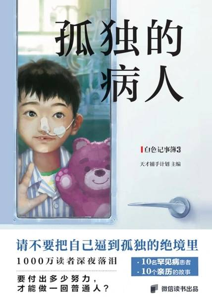

# 《孤独的病人：罕见病患者口述纪实》

## 【文摘】

### 东方美女病

多发性大动脉炎

### 瓷娃娃

成骨不全症

### “大哥”历险记

肌营养不良症

皮肌炎是一种无法治愈的慢性疾病，就像一枚生锈的铁钉钉进了肌肉里，肌肉会无力、疼痛、肿胀，最后萎缩，失去功能。患者甚至不能晒太阳，稍微强一点儿的日光也会损伤皮肤。

皮肌炎

### 妈妈爱美丽

一些由蛋白质形成的纤维样物质，因为状似淀粉，被叫作淀粉样物质。

### 孤勇者

肝豆病也叫肝豆状核变性，是一种罕见的遗传性基因病，由于体内积聚了过量的铜而发病。多发于孩子和年轻人身上，我国的误诊率在半数以上。

伴鱼鳞病的中性脂肪沉积症

## 【想法】

不得这些罕见病，已经足够幸运了吧！