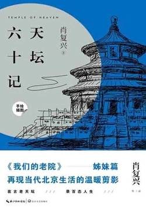

# 《天坛六十记》

作者：肖复兴

## 【文摘】

### 文前

我步入天坛，因为我希望生活得有意义，我希望活得深刻，并汲取生活中所有的精华。

初夏时分，槐花一地如雪，映衬着大殿红色的后墙，色彩对比得那样明艳，仿佛白发红颜。

这里既有磅礴的皇家气，也有平民的烟火气；既有历史的叹息，也有今天的感喟。

### 画为媒

画，似乎比日记还要可靠，迅速让逝去的日子水流般回潮，曾经在天坛所闻所见所思所忆，立刻复活。

天坛是明朝永乐十八年（1420年）所建。

我想起布罗茨基在论及俄罗斯诗人茨维塔耶娃时曾经说过的话：“在一个显然没有任何意义的地方看到意义，这一能力就是诗人的职业特征。”

### 回音壁

天坛的入门，以前没有东门、北门和南门。天坛的正门是西门，名叫祈谷门。当年皇上来天坛祭天的时候，走的就是这道门。门是地道的皇家坛庙的老门，三间开阔，红墙红门，拱券式，歇山顶，黑琉璃瓦铺设，在天坛独一份，一直延续至今。

巴乌斯托夫斯基在回忆自己少年时曾经说：“记忆仿佛从布料中剪掉一块坏的，只把一些好的——克里木的秋天和这个声音响亮的俄罗斯的冬天拼接在上面。”

### 垣墙九里十三步

每次经过墙根儿，进天坛里面的时候，都会忍不住想起这一切，特别是马齿苋。才觉得时间并非是如水一样一去不返，因曾经有过它们的存在，便有了物证一般，让流逝的时间不仅是可以追怀的，也是可以触摸的。

### 跑道

其实，天坛墙根儿并不是一体的圆，它是东西南三面方，北一面圆，和古罗马的万神庙三面圆一面方正相反。

### 柏树林

天坛有两道墙，分为外垣和内垣，天坛由此分为外坛和内坛。外垣，就是我们叫俗了的墙根儿；内垣，是我们称之为的二道墙。

### 祈年殿

自古建国之制，遵从的是左祖右社。

祈年殿，上中下三重，红柱金窗，天蓝色琉璃瓦铺顶，内铺金砖，正中有天然龙形方石。祈年殿外，汉白玉栏杆，也是分为上中下三层，正中的台阶上有龙纹石刻。

### 梅妃

每个人都有自己的故事，或许，有些故事，是专属于他们自己的秘密，只需自己珍藏，无须外人打搅。

### 神乐署和斋宫

洗心曰斋，防患曰戒

### 神乐槐

### 每一首诗都是重构的时间

纵使生命之舟被浪打碎，我也要把命运的大海游渡。

### 三角梅

为自己年迈的父母拍照，和为自己的孩子拍照，或为自己的情人拍照，是两种完全不同的意思，镜头里出现的人物，是两种完全不同的景象。人生季节的流逝，是生命的流逝，在这样的流逝中，孩子的心，总会情不自禁地有所偏移，向自己如花似玉的孩子一边，而有意无意地将已经是霜叶凋零的老人冷落一旁。特别是节假日里出门去远方旅游的年轻人，更容易把腿脚不利索的父母撇在家中。这是一种孩子也是父母都心安理得的选择，谁也不会责怪。

### 超短裙

人生，对于个人而言，多是命运浮沉；对于亲人而言，其实就是聚散离合。

### 袋装参茶

我正要告诉老太太，参茶已经过期了，老太太对我说话了：是前两天孙子给我特意买的！那语气带有一种温情。我把到唇边的话又咽了下去，撕开纸袋，递给老太太。

### 银杏树叶黄了

银杏树的叶子全黄了。进北天门内，大道两旁的两排银杏树的叶子，遮天盖地，一片金黄。大自然在这个季节里，才如此奢侈地将这样炫目的色彩，通过银杏树，挥洒在人间。

### 发小儿是那把老红木椅子

只是，劝慰的话好说，事情轮在自己的身上，纾解自己的心情，都不那么容易。

童年建立起来的友谊，真的就如同老红木椅子，年头越老，越结实，耐磨耐碰，漆色总还是那么鲜亮如昨。而且，有了岁月打磨过的厚重包浆，看着亮眼，摸着光滑，使着牢靠。

### 古柏日晷

风吹树叶沙沙的响声，不是树的语言。树的语言，无需借助风。

### 如歌的行板

### 长廊牌局

我去天坛，路过长廊，常常会看见他在那里吆三喝四地打牌，打得非常投入尽兴。每次，我都不愿意惊动他，远远地离去。有一次，看见他的脸上和脑袋上贴满了白纸条，还在那里吆三喝四地打牌，那些白纸条随着他挥扑克牌的动作不住地来回摆动，怎么看都觉得像是米缸里爬出来的白色的毛毛虫，又像是打幡时随风摇摆的白幡布条。我心里特别难受。（【评】*只能说各有各的活法，打发余生，总要找点事做！！！*）

### 踩影子

不过，我总觉得相亲角紧挨着七星石，不怎么吉利。七星石是陨石，不知何时从天坠落，成为没有生命的石头。相亲，恋爱，怎么也应该找个生机勃发一点的地方才是。（【评】*相亲不就是赌个意外嘛，意外遇见合适的人，陨石处挺好！*）

### 成贞门

### 六百个春天

我步入丛林，因为我希望生活得有意义，我希望活得深刻，并汲取生活中所有的精华，然后从中学习，以免让我在生命终结时，才发现自己从来没有活过。

### 后记

人，只有经历过灾难的磨洗，才会真正感知自身的渺小，而对大自然多一分敬畏之心。

## 【想法】

人生中有一个如“天坛”的地方，是件幸事。 你见证它的历史变迁，你在此看着人来人往，你在这里有所思、有所念，你在这里散步、运动，你在这里会友，你在这里打发时光！