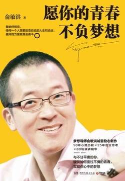

# 《愿你的青春不负梦想》

作者：俞敏洪

## 【文摘】

人生中总会有迷茫，但迷茫的时候也不能停下进步的脚步，前行之中总会有转机，生命就是这样转动起来的。

人对自己的定位是看所加入的人群而定的。如果进入的人群都比自己牛的话，不想自卑也难；如果进入的人群都不如自己，不想骄傲也难。

一个自卑的人一定比一个狂妄的人更加糟糕，因为狂妄的人也许还能抓住生活中本来不属于他的机会，但是自卑的人会永远失去本来就属于他的机会。

当我们有勇气跨出第一步的时候，首先要克服内心的恐惧，因为这个世界上，往前走的脚步声只有自己能听见。

人是一种受思想指引的动物，你的思想走到哪里，你就会走到哪里；你的理念指向哪里，你就会走向哪里。

人生的成长有三个要素：读书，交友，行走——读书充电，形成自己的思想、理念，交往能让自己成长的朋友，自己要学会行走。

所谓制造感动，就是你做了那件事情，回头看，你自己都感动得想要掉泪。能让你掉泪的日子一定不是平凡的日子。生命不付诸努力，是没有辉煌的顶点的。

青春其实跟三个“想”有关，叫梦想、理想和思想。当我们能坚持自己的理想，追逐自己的梦想，并且探索自己的独立的思想的时候，我们的青春就已经开始了。

每个人生命的起点不一样，这是每个人无法选择的，但人生怎么过，人生的终点在哪儿，却要靠每个人自己去走。

我始终相信，任何一个人想要改变自己的人生，想要改变自己的命运，最佳的法宝或者说最好的力量就是去奋斗。

不要为了避免危险而变成胆小鬼，一定要做有一定把握的但有点冒险的事情，这是成就事业的最好方法。

当你发现一个失败对你来说能够承受得起的时候，你就要去冒险，你就要去大胆地尝试，否则你的生命将会因为你的谨慎和小心失去色彩。

一个人对自己的过分保护也会使自己失去机会。

谁能把自己的未来设计得更好，谁就能取得生命的最佳位置。

什么东西能给我们能量？答案是对未来的期待。

## 【想法】

青春易逝，一不留神，青春已是过去时，往后余生，人生境遇各异，回望过去，有人的青春越酿越甜，有人的青春越酿越苦。

这本书的作者是新东方创始人俞敏洪，作为一个功成名就的人，他眼中的青春自是不负梦想。不过书中的内容难免有些重复乃至唠唠叨叨，他的观点也未必都是金玉良言。

出生在农村的俞敏洪，三次参加高考，成功考入北京大学。对一个家庭条件一般的人而言，考大学、考名牌大学，可以作为优先的选项，优先的奋斗目标。

大三时他患了肺结核，“在医院里，我做了两件对我的人生产生很大影响的事情。第一件事情是读书。住院一年，我几乎一天看一本书。所有文学、哲学、诗歌、散文、历史方面的名著，我都是在医院里读完的。第二件事情是背单词。为了打发时间，我平均每天背50个单词，到年底时，我的词汇量已经从原来的8000多个上升到了20000多个。”一个人的观念、思想、知识，不会是“无源之水，无本之木”，不主动去学习，那大概来自周边人的潜移默化或者灌输；不主动去学习，则囿于已有的观念、思想、知识。

创业，是最终成功者的勋章，失败的故事更多。成功者以各样的方式讲述自己的故事，告诉人们当年大学辍学、离开体制内岗位等等是多么的明智，然而有机会讲述这个故事的只有少数人。创业并非人生的必选项。

我们常说的一个人内向，要更准确一点，应该称之为害羞，人生之大敌，如果极度害羞，那么青春大概多是遗憾。如果能克服害羞的心理，那无疑会给自己的人生增加助力。“自由的保证是什么?是对自己不再感到羞耻。——尼采”，共勉。

【公众号】[读书·《愿你的青春不负梦想》](https://mp.weixin.qq.com/s/OCPJnHBR-I9MpAkBfGfLvw)