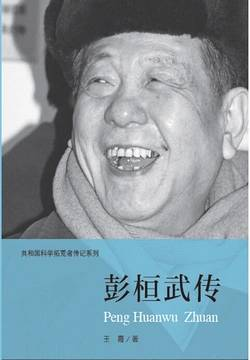

# 《彭桓武传（共和国科学拓荒者传记系列）》

作者：王霞

## 文摘

### 第二章 少小离巢自学飞

### 第三章 清华六载登堂座

深与广是学习中相辅相成的两个侧面。

四杰”是王竹溪、彭桓武、林家翘、杨振宁。

衙作禅堂心作佛，民为眷属国为家

### 第四章 天殷瞩我重斯文

铀的裂变现象

### 第五章 一昧真心向碧霄

彭桓武也是一个和平主义者，也反战，但他积极参加中国制造原子弹的工作。

研究制造中国第一颗原子弹的任落在了彭桓武、王淦昌、郭永怀、朱光亚等科学家身上。在这支光荣的队伍里，还有程开甲、邓稼先、陈能宽、周光召、黄祖洽、于敏、龙文光、杨承宗、王承书、周毓麟等一大批优秀的专家和技术骨干。

1962年9月原子弹理论方案终于诞生。

西北核武器研究院

在无数科技人员和工人师傅共同努力下，当1964年新年钟声敲响的时候，兰州浓缩铀厂正式启动投产。1月14日，世界上被人们称为难以捕捉的铀235终于被生产出来了。这是一个辉煌的日子。

### 第六章 人情世事依然远

凝聚态物理是由量子力学的发展而形成的物理学新的巨大分支，它给材料学的发展提供了坚实的理论基础，其应用前景十分广阔。

“集体、集集体；日新、日日新。”

科学家声誉的建立，应该完全是依靠自己的工作，在严肃的科学书刊发表论文，经过科学界反复的实践，逐渐取得国际同行的公认，而不是依靠新闻媒体冠以“科学明星”的大肆宣传。

彭桓武和刘秉娴的独子彭征宇此时已患癌症，后于2005年11月16曰去世。

2007年2月28日21时40分，彭桓武在北京逝世，享年92岁。

但彭先生的儿子最终还是没能回来，他心里承受了多么大的痛苦啊，这痛苦旁人是无法理解和承受的。（【评】*带着自己的老婆孩子去国外生活，留老父亲一人在国内独自生活，国外就那么好？*）