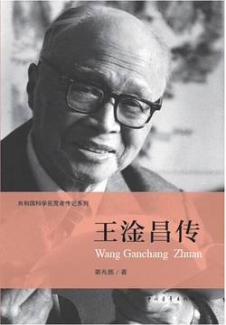

# 《王淦昌传（共和国科学拓荒者传记系列）》

作者：郭兆甄

## 文摘

### 第一章 王淦昌和他的时代

公元1964年10月16日下午，中国爆炸了第一颗原子弹。

反西格玛负超子

清华大学建校于1911年。

科学馆和图书馆不仅仅是当代科技成果的展览和科技资料的陈列。任何摆在那里的东西都是昨天的创造，是历史的遗产，是前人架设的桥梁。它活着的灵魂是暗示，是启迪，是基础和起点，是通向未知世界的幽径。凡是来采撷知识的学者，都应该借用这些活的因素激发自已的创造性思维，拓展开去，在新的领域建造更为壮美的科学园林。

那是1919年6月的一天。那天，卢瑟福卡文迪许研究所的实验室发射的第一枚a粒子炮弹，宣告新时代的诞生。

“时间对于生命来说是金贵的。生命对于时间来说是神圣的。那么，让时间服从生命吧。”

1926年，血染的3月18日。在“三一八”惨案中，爱国学生惨死47人、伤150多人。

吴有训

胡刚复

初冬的北京气温已降至零下，枯草凝着寒霜，湖面结着薄冰，清华园地处郊外就更冷得多了。

### 第二章 跋涉在欧洲大陆上

### 第四章 流亡的岁月

天目山，山高林密，陡崖泻白瀑，幽谷藏古庵。

### 第五章 追寻“物理美人”的芳踪

### 第七章 辉煌的瞬间

1949年，美国报刊又透露出一些惊世骇俗的秘密，美国当年居然在某地用飞机撒播放射性物质，用活人做效应实验。此一秘密事件的揭露，对于谆谆教导他国尊重人权的美国政府，不啻是一记响亮的耳光。

东风起舞， 壮志千军鼓。 百年苦斗今复主， 英雄矢志伏虎。 霞光喷射云空， 腾起万丈长龙。 春雷震惊寰宇， 人间天上欢隆。

机载的中国第一颗氢弹，终于在1967年6月17日起飞，飞向强大，飞向崇高，飞向辉煌。

1964年10月16日，中国第一次核爆炸使人吃惊，因为中国人试验的炸弹，不是一颗钚弹，而是一颗浓缩铀弹。没有遵循其他核大国的老路。 1966年5月9日，中国进行的核爆炸又令人震惊，因为试验的炸弹包含有热核材料，是一颗“加强了”的炸弹。 1966年10月27日进行的爆炸，再令人惊奇，这是一颗原子弹，爆炸前由一枚中程火箭运载。 1966年12月28也使人十分惊奇，因为中国的第五次爆炸是一颗威力达几十万吨级的氢弹（广岛的炸弹是1.5万吨级)。