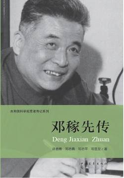

# 《邓稼先传（共和国科学拓荒者传记系列）》

作者：许鹿希

## 文摘
### 第一章 邓稼先（ 代 序）

1948年到1950年在美国普渡大学（Purdue University）读理论物理，得到博士学位后立即乘船回国，1950年10月到中国科学院工作。（【评】*于1948年10月考取留学美国研究生，赴普渡大学物理系学习深造。1950年，修满学分并通过论文答辩，获得普渡大学博士学位。 两年时间拿到博士学位👍👍👍👍*）

1964年10月16日中国爆炸了第一颗原子弹。1967年6月17日中国爆炸了第一颗氢弹。

而邓稼先竟有能力说服两派继续工作，于1967年6月成功地制成了氢弹。（【评】*邓稼先却只用一个口号，平息了研究院的纷争。据说，邓稼先发现外刊有一则消息：法国计划在1967年爆炸氢弹。他便与于敏、周光召等人商量，用大字报写出那则新闻，号召大家为国争光赶在法国前面研制出氢弹。摘自《王淦昌传》*）

中国男儿、中国男儿，要将只手撑天空。 长江、大河，亚洲之东，峨峨昆仑，古今多少奇丈夫，碎首黄尘，燕然勒功，至今热血犹殷红。

### 第二章 出生在铁砚山房

1924年6月25日，邓石如的六世孙，中国“两弹”元勋邓稼先便诞生在这座铁砚山房里。

### 第三章 北平陷落

他说：“稼儿，以后你一定要学科学，不要像我这样，不要学文。学科学对国家有用。”

### 第四章 在西南联大和北京大学

1927年的索尔维会议则在实际上宣布了量子力学已经创立。

### 第五章 留学在普渡

什么是氘？氘就是重氢。氢由一个电子加上一个质子组成，而氘比氢多一个中子。

因为在中子和质子结合时要放出一点东西来，质量有些亏损，这亏损就叫结合能。

### 第一十六章 生命的最后一段时光

他自己在生活上很平民化，没有那么多讲究，但他并不是苦行僧。他主张美化生活，丰富生活。抽中华烟，喝五粮液，用美加净牙膏。有条件的话，他也乐于去享受这些好商品的愉快。但是他量力而行，并不摆谱，没有的话，穷凑合也都能过得去。他也不是有意显示自己的朴素，要在群众中造成什么印象。

1986年7月29日，邓稼先终因全身大出血而与世长辞。他的遗言：死而无憾。

### 第一十八章 一份建议影响深远

聚变发电