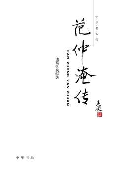

# 《范仲淹传（中华名人传）》

作者：诸葛忆兵

## 文摘

### 北宋政治环境：与士大夫治天下

北宋学者邵雍称当代有五大超越前人的盛事，其一是“百年无心腹患”（《邵氏闻见录》卷一八），即没有其他的政治势力对赵宋皇位构成威胁。赵宋王朝是被一而再、再而三的外族入侵势力所颠覆，从王朝内部来说，横亘两宋三百多年时间，始终没有一股政治势力膨胀到足以威胁赵宋皇位的稳固。

### 丁忧居丧：应天府书院与《上执政书》

“失志之人其辞苦，得意之人其辞逸，乐天之人其辞达，觏闵之人其辞怒。”

### 任职言官：仁宗亲政，先用后贬

### 贬知睦州：神仙境激发创作热情

江上往来人，但爱鲈鱼美。君看一叶舟，出没风波里。

### 三任京官：仁宗始终不能忘记范仲淹

### 西夏崛起：宋朝西北告急

夏国崛起于宋朝的西北边境，史称“西夏”，这是由党项拓跋部在北宋时期建立的国家。党项族自唐朝以来，一直散居于今天的宁夏、甘肃、青海等地区，而以居住在夏州（今陕西靖边北白城子）的一个党项部落尤为强大，称平夏部。

北宋太祖、太宗时期，拓跋族与中原政权时而战争，时而结盟，对宋朝没有构成太大的威胁。

经过数年的周密准备，宝元元年（1038）十月十一日，元昊正式立国称帝，国号大夏，自称“始文英武兴法建礼仁孝皇帝”。

### 范韩攻守异同：范仲淹的军事思想

### 主持环庆路：身在西北边陲，心怀国家大事

以“岁币”换和平的主张，是从北宋现实情况出发的务实的长远的观念，已经被历史证明是合理正确的。（【评】*养虎为患而已！*）

### 宋夏议和：燕然未勒归无计

塞下秋来风景异，衡阳雁去无留意。四面边声连角起。千嶂里，长烟落日孤城闭。浊酒一杯家万里，燕然未勒归无计。羌管悠悠霜满地。人不寐，将军白发征夫泪。
### 任职二府：回京任参知政事

宋代以中书和枢密院为二府，二府正副长官都属于宰辅系列。

### 答手诏条陈：系统的政改意见

宋代设参知政事，以为副宰相，辅佐宰相治理国家。

### 新政流产：“人治”社会制度下，无法改变“人治”问题

宋代文人士大夫与皇室共忧患，以天下为己任，对国计民生关切的热情，超过了以往任何时代。（【评】*也不知谁先提出这个理论的，这些人被套在这个逻辑里出不来！*）

### 范仲淹罢政：一件小事引发的政治清算运动

### 《岳阳楼记》：中国古代知识分子精神境界的最高写照

范仲淹在邓州期间的文章，最脍炙人口的是庆历六年九月十五日在“春风堂”写就的《岳阳楼记》。

### 设立义庄：创立八百年的慈善事业