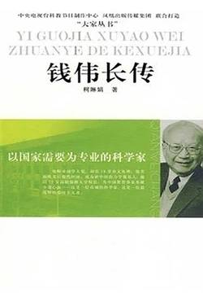

# 《以国家需要为专业的科学家：钱伟长传》

作者：柯琳娟

## 文摘

### 第一章 坚韧少年

#### 2、素书堂里的学前教育

钱家住的是七间五进的老宅，第三进是书斋素书堂。

#### 6、在四叔身边念高中

吴蕴初，字葆元，化工专家，著名的化工实业家，我国氯碱工业的创始人。1891年9月29日生于江苏省嘉定县，1953年病逝于上海。年少时因家贫辍学，后以刻苦好学考入上海兵工学堂，半工半读学化学。20—30年代，他研究成功廉价生产味精的方法，在我国创办了第一个味精厂、氯碱厂、耐酸陶器厂和生产合成氨与硝酸的工厂，为我国化学工业的兴起和发展作出了卓越的贡献。

#### 7、文科高才生是理科盲

### 第二章 清华学子

#### 2、弃文学理

但国学对他的影响只是表面的隐退，国学的精髓，以天下为己任的大担当，则早已融入到了他的血液里，影响着他整个的人生走向。

#### 3、物理系的试读生

20世纪30年代的清华物理系，名师荟萃。不但有吴有训、叶企孙和赵忠尧（物理学家、教育家，中国核物理、中子物理、加速器和宇宙线研究的先驱和启蒙者）三位教授，另外又新聘了多位知名教授。

1928年，萨本栋受聘任教于清华物理系；1929年，周培源加盟清华物理系；1934年，任之恭接受邀请任教清华园；1935年，霍秉权入清华物理系任教。

#### 6、参加抗日救亡活动

###  加拿大留学生 

#### 3、辛吉的得意门生

林家翘和郭永怀专攻流体力学，钱伟长专攻弹性力学。

#### 第四章 再进清华园

1945年9月2日上午9点，日本投降仪式在东京湾的美国战列舰“密苏里”号上举行。

### 第五章 黄金时期

#### 4、中国“三钱”

1954—1956年，新中国开始制定科学技术发展的12年规划，这也是新中国制定的第一个科学技术发展的远景规划，周恩来总理亲自领导。

钱学森生于1911年，父亲钱均甫曾留学日本；钱伟长生于1912年，国学大师钱穆是其四叔；钱三强生于1913年，父亲钱玄同乃一代国学大师。

钱伟长1946年回国；钱三强1948年回国；钱学森1955年回国。

### 第六章 右派生涯

### 第七章 忠贞如故

#### 4、发明高能电池

“电瓶安装在汽车车架上方是资产阶级路线，装在汽车的车架下方才是无产阶级路线”（【评】*这些人坏起来真是毫无底线！！！*）

### 第八章 春回大地

### 第九章 教育思想

#### 5、理工科生也要注意文化修养

### 第十章 一个纯粹的爱国者