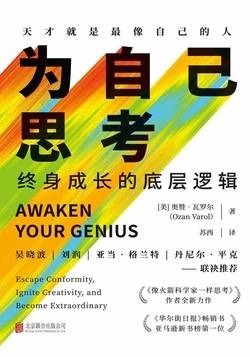

# 《为自己思考:终身成长的底层逻辑》

作者：奥赞·瓦罗尔

## 文摘
#### 前言 该醒来了

作选择的时候，我们会基于习惯，而非心中的热望。我们不断加固同样的信念，得出同样的想法，作出同样的选择，于是得到同样的结果。
### 第一部分 死亡
#### 第一章 忘掉所学

#### 第二章 弃旧

身份是一种观念。

我们将身份与自我混为一谈，而身份会遮蔽自我。

身份也会令我们更容易被他人分门别类。

“我是……”这个句式中的省略号代表的标签越少，在探索真正自我的路途中，你拥有的自由就越多。

你会发现，有许多我们坚信不疑的真理，在很大程度上取决于我们自己的视角。——欧比旺·克诺比(Obi-Wan Kenobi)，《星球大战6：绝地归来》(Star Wars：Episode　Ⅵ-Return of the Jedi)

一旦我们形成一种观点——属于我们自己的、聪明睿智的看法——我们就很容易爱上它。

事实不会影响我们的信念，信念却会影响我们对事实的选择：接受哪些，又忽略哪些。

当信念与自我融为一体，我们就会为了捍卫自我而拥护这个信念体系。

如果他们的观点是正确的，哪些前提条件必定为真？他们看到了哪些我没有看到的东西？我错过了大象的哪一部分？

研究表明，我们越是努力地说服对方，就越发说服了自己，于是我们的信念就变得越发牢固。

每当你发现一个新的视角，你就改变了自己对世界的看法。世界本身并没有变，但你对它的感知变了。

我们看的是叙事，而不是证据。

智商抵御不了这种倾向。事实上，研究显示，认知能力强的人更容易受到模式化观念的吸引，因为他们更擅长识别模式。

当我们不断看到他人与我们的观点产生共鸣的时候，我们的自信水平就会飙升，观点会变得更加极端。反对意见是被隐藏的，因此我们假定它们不存在，或者觉得持那种意见的人肯定是脑子坏掉了。即便在某些罕见的情况下，信息流里出现了不同的观点，我们想不看也很容易：只要退订、取关或拉黑就行了——把列表筛选一遍，直到留下的都是鹦鹉学舌一般、跟我们的世界观一模一样的人。

我的观点建筑在事实和逻辑之上，而我的对手道德有问题，观点充满偏见，而且无知得令人发指。要是他们肯敞开心胸，去读某书或听过某事的话，他们就会完全明白我的意思。

如果你觉得生活乏味又无聊，好像被困在了旧皮囊里，就来一剂名叫“敬畏心”的解药吧。去迷失在异国他乡；在晴朗的晚上走到户外，去享受那幅最能荡涤心智的震撼美景——夜空。

#### 第三章 排毒

每一条通知都演奏着别人的曲调，每一封电子邮件都把我们传送到别人的现实中，每一则闪烁不停的突发新闻都把我们的大脑和冲突与戏剧化事件接通。用莎士比亚那句经久不衰的话来说，我们生活在这样一个时代——“充满着喧哗和骚动，却毫无意义”。

就在此时此刻，你的手机在哪儿？如果你跟其他人差不多，那么答案肯定是“一伸手就能够着的地方”。我们已经变得与手机一刻也不能分离，走路时拿着它，吃晚饭时拿着它，甚至把它拿进浴室，跟别人分享最私密的时刻。它是我们早晨起来抓过的第一件东西，也是我们上床睡觉时放下的最后一件。

如果你的注意力被切分得支离破碎，不由自主地被分配到无数个不同的方向，那你肯定记不住多少东西。你没法在想法之间建立关联，把点连成线，最后构建出新的观点——你没法思考。

你的大脑阁楼是你的空间，应当由你来决定哪些东西可以摆进去，哪些人可以留下。如果你不曾有意识地做出选择，其他人就会替你做。而那些人做选择的时候，想的可是他们的最大收益——而不是你的。

我的感受往往是这样：推特让我变得神经质，脸书令我感到又回到高中时最糟心的那段时间，照片墙让我觉得自己“混得可真差”，新闻让我觉得整个世界就快完蛋了。

请记住作家安妮·狄勒德(Annie Dillard)那永不过时的箴言：“我们怎样度过一天，就怎样度过一生。”

正如畅销书作者蒂姆·费里斯(Tim Ferriss)所写：“把不重要的事情干得再漂亮，也不能让它变得重要。”

#### 第四章 独特的你，非凡的你

努力融入群体，反而让人更难找到归属感。就像心理学家布琳·布朗(Brené Brown)所写的那样：“归属感指的是你真正的自我被接纳了，而融入指的是你必须变得跟其他人一样才会被接纳。如果我可以做自己，这是归属感；如果我必须要像你一样，这是融入。”

#### 第五章 发现你的使命

“不必问世界需要什么，”正如美国神学家兼学者霍华德·瑟曼(Howard Thurman)所说，“问问自己，什么事让你变得生机勃勃，充满活力，然后就大胆去做。因为世界需要的正是生机勃勃、充满活力的人。”

我们的身体是明智的。当肠胃已经饱足之后，它会大声告诉我们，别再吃了。可我们的小我是愚蠢的。它会周期性地感到不满足，它渴求更多金钱、更多注意力——更多一切——即便我们拥有的已经比足够更多。

如果你不去界定自己心目中的“足够”是多少，默认的答案永远是“更多”。

改变的三个阶段1.你认为你做不到。2.被逼无奈之下，你做了（或者你足够勇敢，主动尝试了）。3.你发觉自己其实可以做到。

#### 第六章 解锁内在的智慧

阅读的目的不只是理解，而是把你读到的东西当作工具——一把开启你内在宝藏的钥匙。

#### 第七章 释放玩耍的力量

#### 第八章 大胆创造

知识应当让你变得更渊博，而不是束手束脚；它应该能启发你，而不是蒙蔽你。

#### 第九章 是谁在胡扯

作家乔纳森·斯威夫特在18世纪写下的句子如今依然成立：“谎言飞一样地散播，事实一跛一跛地跟在后面。”

我们绝大多人都没时间去阅读和消化那些涉及生活方方面面的科研报告，即便真的看了，可能也不知道该留心哪里，该问什么问题。于是我们转向了专家的观点。不幸的是，网络上到处都是所谓的“专家”，个个都宣称自己发现了真理。在网上，“专业”二字已经成了可以自封的认证标签，一个人说自己是“专家”，就真的是了。极度渴求关注度的媒体求助于一群可信的“专家”，但这些人偏爱的是一致性而不是准确度，他们更喜欢满满的自信，不愿探究其中微妙的因素。

防震内置式胡扯检测器

当心那种适用于所有人的论调（“对每个人来说，早餐都是最重要的一餐”“冥想是万能疗法”）；当心那些不承认自己的观点有局限的作者，他们会忽略微妙因素，也不会援引那些可能质疑自己结论的研究结果。

#### 第十章 看向别人不看的地方

>要独立思考。否则别人就会替你思考，并且不会替你着想。——佚名

算法不关心内容的质量，它们只关心你的注意力——得到它，留住它。在我们这代人里，有一批绝顶聪明的头脑把绝大多数时间都花在这件事上：确保你不断观看，不断点击，不断刷新。

多年之后，我将叹息着把往事回顾——林中分出两条路，我选择了少有人走的那一条，由此走出了迥异的旅途。

#### 第十一章 我不是你的上师

没有人会来拯救你，疗愈你，从芸芸众生中选出你；告诉你，你的机会来了；夸奖你，说你做到了；把你背起来往前走，把成功法则告诉你，或是替你走人生路。你不是落难的少女，你是你自己故事里的英雄，你是你自己的、身披闪亮盔甲的骑士。

#### 第十二章 放开手，让未来自然发生

当未来不符合我们的期望时，我们就会把自己的想法投射出去（更糟的是，我们会依然执着于那些想法）。

#### 第十三章 蜕变

小心翼翼的人生你从来不曾面对失败，不曾离开走惯了的老路，不曾跃入未知，不曾改变习惯，不曾吃下禁果，不曾真正地大声歌唱，不曾真正地忘形起舞，不曾冲到雨中，不曾显露出不完美的那一面，不曾酣畅地哭泣，不曾坦承爱意，不曾允许自己心碎。你把所有的墙都刷成白色，只敢望向安全的路径。你压抑自己最强烈的冲动，畏缩着躲开你的使命。你说着其他人希望你说的话，你的内在小孩因为想玩耍而受到惩罚。你无视自己的想法，因为它们是你想出来的。你待在“没有危险”的危险之中，不断地重走老路，不断地推迟梦想，逼着自己勉强挤进别人画的框框。你浇灭内心燃烧的火焰，调暗眼中闪烁的星光，每天将自己的灵魂杀死一点点。小心翼翼的人生，是奄奄一息的人生。因为人生的意义不在于追求安稳，而在于活得蓬勃、酣畅。

#### 第二部分 新生

#### 第三部分 内在的旅程
