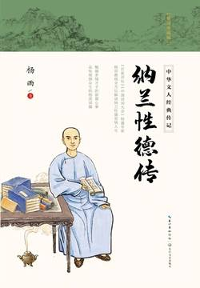

# 《纳兰性德传》

作者：杨雨

## 文摘

### 总序

“登山则情满于山，观海则意溢于海”

### 第一章 我是人间惆怅客——生平概述

“我是人间惆怅客，知君何事泪纵横。”

对纳兰性德的称呼，我们熟悉的就有好几个：纳兰性德、纳兰成德、容若、成容若等等。其中，纳兰成德是本名，字容若，因此纳兰也常常被称作纳兰容若或成容若。

康熙十四年（1675），皇子保成被立为太子，为了避皇太子的名讳，纳兰成德改名为纳兰性德。不过皇太子保成后又被改名为胤礽，这个避讳也就不存在了。因此在纳兰性德亲笔写的书信里面，经常还会署名“成德”，这说明纳兰性德、纳兰成德这两个名字一度是同时在使用的。

纳兰出生于冬天，他还有个乳名叫“冬郎”。

纳兰成人之后，又给自己取了一个号——楞伽山人。这个号来自大乘佛教的经典《楞伽经》，唐代诗人王维、白居易、刘禹锡、李贺等人都深受其影响，如李贺就曾在《赠陈商》一诗中这样写道：“《楞伽》堆案前，《楚辞》系肘后。”

这个部族强大以后，先是消灭了呼伦河流域的女真族纳兰姓部落，于是改姓纳兰（又译作纳喇）。

“纳兰”是女真语，即汉语“太阳”的意思，是贵族的专属姓氏，《金史》说“天子娶后必于是，公主下嫁必于是”。

明代的时候，满族分化为几大部族，其中势力较大的是建州女真和海西女真。叶赫纳兰氏属于其中的海西女真，是海西女真的盟主。明代中叶以后，以爱新觉罗·努尔哈赤为首的建州女真逐渐成为几大部族中最强大的一支，海西女真为了跟建州女真交好，与努尔哈赤订立了婚约。

王国维曾这样评价纳兰词的特点：“纳兰容若以自然之眼观物，以自然之舌言情。此由初入中原，未染汉人风气，故能真切如此。”（《人间词话》）

### 第二章 多情自古原多病——少年坎坷

《木兰花令·拟古决绝词》：人生若只如初见，何事秋风悲画扇。等闲变却故人心，却道故人心易变。骊山语罢清宵半。泪雨霖铃终不怨。何如薄幸锦衣郎，比翼连枝当日愿。

“谁怜辛苦东阳瘦，也为春慵。”这是纳兰“三瘦”的名句之一。这句词也有出典。“东阳”指的是南朝时候的诗人沈约，因为沈约曾经做过东阳太守，后人也以“沈东阳”称呼他。据《梁书·沈约传》记载，沈约在写给朋友徐勉的信中称自己老病：“百日数旬，革带常应移孔，以手握臂，率计月小半分。”意思是最近瘦得很厉害，每隔几个月，皮带上的孔就要往里移一格；用手握一下手臂，每隔个把月就要小半分。于是后人就以“沈腰”指腰肢消瘦。李煜的经典词作《破阵子》也用过这个典故：“沈腰潘鬓消磨。”

可别轻易忽略了“芙蓉”这个再普通不过的意象，这里的“芙蓉”并不是我们平时所说的荷花，而是指古代的芙蓉镜。传说唐代有一位书生参加科举考试落第后到蜀中散心，旅途中遇到一位老太太，老太太对他说：“郎君明年芙蓉镜下及第。”第二年，这位书生果然高中进士。从此以后，“芙蓉”的意象就多了一层含义：它非关风花雪月，而是有关科举仕途。

### 第三章 一生一代一双人——幸福婚姻

“浆向蓝桥易乞”，这是讲裴航和云英有情人终成眷属的故事。蓝桥，在陕西蓝田县东南边的蓝溪上。唐代裴硎《传奇》一书记载：古代有一个秀才叫裴航，他在途经蓝桥驿的时候，因为口渴向一位老妇人讨水喝。老妇人让自己的女儿云英给裴航端来一碗琼浆。裴航与云英一见钟情，便向老妇人提出想要重金聘云英为妻子。老妇人对裴航说：“想娶我的女儿可以，但我这里有一些神仙给的灵药，一定得用玉杵臼来捣药才行。如果你能帮我找到玉杵臼，我就将女儿许配给你。”于是裴航四处寻访，终于找来了玉杵臼，并且帮老妇人捣药百日，制成灵药，娶得云英为妻，最后夫妻一起得道成仙。

“药成碧海难奔”，是我们都熟悉的嫦娥奔月的传说。《淮南子·览冥训》载：“羿请不死之药于西王母，恒娥窃以奔月。”“恒娥”，又名“姮娥”，即嫦娥。传说中嫦娥是后羿的妻子，因为偷吃了西王母的长生不老药，飞到月亮上成了月仙。唐代大诗人李商隐的《嫦娥》诗中就写过这样的句子：“嫦娥应悔偷灵药，碧海青天夜夜心。”

“若容相访饮牛津”，是关于牛郎织女的神话。古时候人们认为大海的尽头就是天河，每年八月海上有木筏通往天河。有个人很好奇，就乘着木筏到了天河，正好碰到一个男子牵着牛在河边的渡口让牛喝水，原来这个牵牛的人就是传说中的牛郎。

他曾写过“赌书消得泼茶香”的词句，这句词来源于古代一对著名夫妻的典故——宋代女词人李清照和她的丈夫赵明诚。

“赌书消得泼茶香”，这正是李清照和赵明诚早年婚姻生活的写照。在李清照晚年写的自传性文章《金石录后序》中，有这样一段文字提到了他们早年的夫妻生活：余性偶强记，每饭罢，坐归来堂烹茶，指堆积书史，言某事在某书、某卷、第几页、第几行，以中否角胜负，为饮茶先后。中即举杯大笑，至茶倾覆怀中，反不得饮而起。甘心老是乡矣。

就是“林下风致”。纳兰多次形容妻子卢氏是一个具有林下风致的美女，他的词当中多次出现类似这样的句子，像“林下荒苔道韫家”，“林下闺房世罕俦”等。这几句词当中的“林下”和“林下风致”中的“林下”意思是一样的。那么，“林下风致”到底是一种什么样的女性气质呢？要回答这个问题，就要说到古代的另外一位著名女性了——东晋时候的大才女谢道韫。“林下风致”最初就是用来形容谢道韫与众不同的气质的。

魏晋时代思想相对较为开放，这种令人追慕不已的“竹林”风度也传入了闺阁之中，人们就用“林下风气”或“林下风致”来高度评价具有类似气质的女性了。

### 第四章 当时只道是寻常——丧妻之痛

“不见卢郎少年时”则是纳兰的自喻。“卢郎”这个称呼来自一个很有趣的典故。据说在唐代的时候，有个姓卢的书生很有才华，仕途却不太顺利，年岁老大了才当上校书郎这种小官。不过这个官运不济的卢郎倒是很有艳福，后来娶了一个比自己年轻很多的崔姓女子为妻。崔氏女子年轻貌美，而且也颇有才情。才女往往都心比天高，崔氏也是如此。她总觉得这门老夫少妻的婚姻委屈了自己，言语当中常常流露出对丈夫卢郎的不满。面对妻子的满腹牢骚，卢郎并没有和妻子争吵，而是故意幽默了一把。他问崔氏：“我对你这么好，你还有什么不满意的呢？你要是真觉得委屈，那就把你心里的不满写成诗让我看看啊？”崔氏一听，也不客气，立刻写了这么一首诗：“不怨卢郎年纪大，不怨卢郎官职卑，自恨妾身生较晚，不见卢郎年少时。”意思是说：我不怨你年纪大，也不怨你官职低微，恨只恨我自己生得太晚了，没赶上你年轻英俊的时候！卢郎固然幽默，崔氏的智慧也毫不逊色啊！

在他所有的悼亡词中，可能这首《浣溪沙》是人们最熟悉的：谁念西风独自凉。萧萧黄叶闭疏窗。沉思往事立残阳。被酒莫惊春睡重，赌书消得泼茶香。当时只道是寻常。

### 第五章 不辞冰雪为卿热——悼亡哀思

“不辞冰雪为卿热”也是运用了一个典故，这个典故出自《世说新语》：荀奉倩与妇至笃，冬月妇病热，乃出中庭，自取冷，还，以身熨之。妇亡，奉倩少时亦卒，以是获议于世。

陈维崧曾经这样评价纳兰的词，他说：“《饮水词》哀感顽艳，得南唐二主之遗。”（《词评》）

### 第六章 不是人间富贵花——父子矛盾

### 第七章 留将颜色慰多情——师生关系

### 第八章 幽怨从前何处诉——君臣恩怨

“华亭鹤唳”的故事出自《世说新语》，华亭即今上海松江。这个故事讲的是西晋陆机在没有做官之前，曾经跟弟弟陆云一起游过华亭。陆机的祖父是三国时期东吴的名将陆逊，看过《三国演义》的人都知道，刘备就是被陆逊用火攻的方式打得大败，最后抱恨死于白帝城。后来陆逊的孙子陆机被人谗害，为司马颖所杀，临刑前，陆机长叹一声：“我想再去听听华亭鹤鸣的声音都没有机会了啊！”“蛾眉”的典故出自屈原，本来是指女性的妆容。屈原因为遭小人猜忌排挤，他满怀悲愤地把自己比作遭人嫉妒的美女：“众女嫉余之蛾眉兮，谣诼谓余以善淫。”（《离骚》）那些女人自己道德败坏，反而嫉妒我的美貌，七嘴八舌地放出谣言说我是个淫荡的人，其实只有我才是那个真正品行高洁的绝代佳人啊！

### 第九章 身世悠悠何足问——友谊佳话

“青眼”又用了一个典故，这就要说到魏晋时候的名士、竹林七贤之一阮籍了。据说阮籍有个本事：能用青眼和白眼。看到志不同道不合的人，阮籍就白眼相看，不予理睬；看到高人雅士，阮籍就青眼相加，视为知己。城府很深的人，往往也是喜怒不形于色的人，轻易不会将内心的喜怒爱恨表现出来。可阮籍的白眼、青眼，却将情绪的变化充分地表现在脸上。这对一个老谋深算的人来说，是不是显得很“孩子气”呢？

岳麓书院里有一副对联，其中两句是这样的：“是非审之于己，毁誉听之于人。”

### 第十章 而今才道当时错——沈宛之恋

“天海风涛”也是有典故的，这个典故是来自唐代的著名诗人李商隐。

“校书人”和“扫眉才”原本都是指唐代的著名歌妓薛涛。