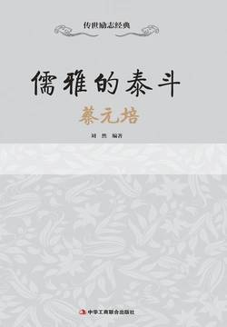

# 《儒雅的泰斗：蔡元培》

作者：刘然

## 文摘

### 序

国人都崇拜的一本书叫《易经》，那里面有一句话说：“天行健，君子以自强不息。”

孔子说：“士不可以不弘毅，任重而道远。”

李白说：大丈夫必有四方之志

大丈夫必有四方之志

白居易有诗曰：丈夫贵兼济，岂独善一身

《礼记》里说：“玉不琢，不成器。”

明代有位首辅大臣叫刘吉，他说过：有志者立长志，无志者常立志

### 第一章 青云显风华

1873年，小阿培正式进入自家延师开设的私塾，习字读书，年仅6岁，按照辈分的先后，给小阿培正式定学名为元培，家中唯一一个从事文学的六叔，给他取名为鹤卿。

进一步摹写，是墨印的或先生写的范本，叫作影格，用纸蒙在上面，照样摹写。

“人生识字始生忧，百感茫茫不自由”

### 第二章 教育始办学

### 第三章 斑驳民国情

蔡元培在迎袁过程中，其自身的品格、政治态度并没有多少过错，而在他身上表现出的“软弱性”和“不彻底性”，是当时所有革命党人的通病。 直白点说，他们远离工农群众，在思想上有较大的缺陷。他们所谓的顾全大局，是把处理内部矛盾和温和方式滥施于人；并没有用资产阶级专政来对付地主阶级专政，寄希望于革命的顺利进行，尚未全面思考，将革命果实拱手相让；他们甚至害怕流血，沉滞在议会斗争、内阁事宜之中，眼见事情不能顺利发展，便渴望以某种形式约束袁世凯；只热衷形式上的统一，却满足了盗贼袁世凯。

内阁会议，是南北政员商议事情的最佳时机。可南方阁员欲有所作为，多次与段祺瑞等人发生冲突，办事一向认真负责的蔡元培，此时也难以改变双方立场。就连总理唐绍仪，也因支持责任内阁制而遭到袁世凯的质疑，屡遭诋毁。 蔡元培对此深感失望，他感觉到，与其任此伴食之阁员，不如高蹈远引。他认为：“目前情形，政府中显分两派，互相牵制，无一事可以进行。若欲排斥袁派，使吾党同志握有实权，量力审时，绝无希望。不如我辈尽行退出，使袁派组成清一色的政府，免使我辈为人诽谤，同归于尽。”宋教仁对此并不赞同，但面对此情形，亦无可奈何，乃相约：遇适当机会，一同辞职。

### 第四章 六年治北大

俄国十月革命后，马克思主义被传入中国。说到马克思主义，则必须要说说李大钊，他作为“中国马克思主义”的第一人，在北大的贡献巨大。

同年冬天，李大钊组织成立了“马克思主义研究会”，不仅在刊物上介绍马克思主义，而且首次在课堂上讲授。

1920年3月，在李大钊的秘密组织下，“马克思学说研究会”成立，随之，“北京大学社会主义研究会”又于当年年底成立，发起人是李大钊、何思枢、梅祖芬、徐其湘等人。该会的宗旨是：集合信仰，与有能力研究社会主义的同志互助来研究并传播社会主义思想。

在德国，对蔡元培影响最大的是康德的美学思想；而在法国，他又受到孔德派实证主义哲学观念的熏染，这两种思想是蔡元培美学思想的主要来源。

### 第六章 元老生激变

就国民素质而言，“教育独立”很难被认同，人们习惯按章办事，过去有专门的教育行政机构，而此时想要把权力散给大学，大多数人还是不能接受。再加上管理上存在的问题不能解决，比如大学自身忙不过来，管理不够及时，抑或是管得不好等，这使得此种制度更难维持。

蔡元培认为，某些“别有用心”之人甚是虚伪，表面上打着“民主”的旗号，实际上只有他们才掌管着所有学生的权利。 这种说法，足以表明蔡元培的政治倾向日趋保守。他还声称：“过去之青年运动，现今不能继续。”这种立场的变化，导致蔡元培思想上的革命性消失了。他的言论也只是偏向于一方，说学生盲从，而没考虑到自身的因素。

民族的危机，笼罩着每一个中国人。蔡元培着眼民族根本利益，不惧党派限制，于1932年12月同宋庆龄、杨杏佛、林语堂等人成立中国民权保障同盟。

### 第七章 学界之泰斗

西方哲学家中，对蔡元培影响最深的莫过于德国哲学家康德。对于康德的“现象世界”和“实体世界”思想，蔡元培都有所接受，并把它们用在教学实践之中。