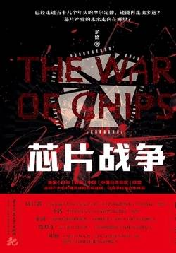

# 《芯片战争》

作者：余盛

## 文摘
 
### 楔子 华为的难题

极紫外线(EUV)光刻机

阿斯麦尔(ASML)
### 第一章 从晶体管到芯片

当金属物质被加热时，高温会导致金属物质上的电子活性增强并产生游离现象，此时若附近有一正电压强力吸引，游离的电子就会在处于真空状态的空间中流动。基于这一认识，英国物理学家弗莱明制造出第一支二极真空电子管。二极管内部封装阴极和阳极两个电极。

当加热的阴极与电源负极相连、阳极与电源正极相连时，电子从阴极跑到阳极，二极管导通，表现为没有电阻的导线；反之，二极管不通，表现为一个没有合上的开关。所以二极管起到单向阀门的作用，因此它也被叫作“弗莱明阀门”。

三极真空电子管（简称真空管或电子管）解决了电流或电波在传送信号的过程中逐渐衰弱的问题，让信号的无线传送成为可能。

第一台通用电子计算机“埃尼阿克”(ENIAC)

结型晶体管(junction transistor)

在硅管商业化技术上取得突破的竟是一家名叫德州仪器的小公司。

德州仪器总部位于美国得克萨斯州中北部的达拉斯。

德州仪器发明了世界上的第一台晶体管收音机

英国皇家雷达研究所的杰夫·达默第一个提出了集成电路的设想：把一个电路所需的晶体管和其他器件制作在一块半导体上。

以投资人谢尔曼·菲尔柴尔德的姓将新公司命名为仙童(Fairchild)

为了提高晶体管的可靠性，琼·赫尔尼发明了平面工艺，可以用类似印刷的方式一次从一块硅片上生产出多个晶体管。

1969年，美国联邦法院认定集成电路是一项“同时”的发明。基尔比被认为是“第一块集成电路的发明者”，而诺伊斯则“提出了集成电路适合工业生产的理论”。

日本为了保护自己稚嫩的电子工业，坚决实行贸易保护主义。依据通产省颁布的《电子工业振兴临时措置法》，只有极少数的高端电子器件才允许进口。日本采用提高进口关税、发放进口许可证等方式限制价格在200日元以下的中低端芯片进口。此外，日本还限制外资比例，引导日本企业发展半导体产业。德州仪器为打开日本半导体市场，不得不以技术来换市场，和索尼合作成立双方各占一半股份的合资公司。合资协议规定：在三年内，德州仪器必须向日本公开相关技术专利，并且合资公司的产品在日本市场占有率不得超过10%；三年后，合资公司才可转为独资企业。通过严苛的限制，日本不仅让美国企业交出了核心专利技术，还将本国市场牢牢掌握在自己手里，同时还大量出口半导体产品到对日本高度开放的美国市场。（【评】*贸易保护的必要性和可行性案例！！！*）

### 第二章 存储器公司英特尔

美国无线电公司引领了互补金属氧化物半导体(CMOS)技术的应用，分别在1966年和1974年研制出首块CMOS芯片和首个CMOS微处理器。

1968年，摩尔和诺伊斯离开了仙童，创办了英特尔(Intel)。公司名称来自“集成电子学”(Integrated Electronics)的缩写。

IBM于是研制出第一台拥有存储程序的商用大型计算机IBM 701，这也是第一台通常意义上的电脑。

1964年4月7日，IBM推出第一款小规模集成电路计算机System-360，每秒运算速度超过百万次大关。为了推出这款具有划时代意义的计算机，IBM在这个项目上的投资超过了二战期间美国研制原子弹的费用，攻克了从操作系统、数据库到芯片的大量技术难关，获得超过300项的专利，《财富》称其为“IBM的50亿豪赌”。

动态随机存储器(DRAM)

公司成立18个月后，英特尔做出了第一款存储器产品，是仅拥有64B容量的3101型静态随机存储器(SRAM)。

历史上第一个微处理器——4004

1981年，IBM通过对苹果二号电脑的模仿，强势进入家用电脑市场。IBM将其电脑命名为IBM PC机，PC（个人电脑）从此成为家用电脑的代名词。凭借强大的实力，IBM第一年就卖掉了10万台个人电脑。苹果引燃了个人电脑的火种，IBM则将这把火燃遍了全球。

法金对英特尔的目光短浅气愤不已，带着岛正利离职，创办智陆(Zilog)公司，专推廉价的微处理器。

德州仪器半导体中心的首席工程师也拉了一票人马，在马萨诸塞州成立了莫斯泰克(Mostek)公司，公司名称来自“MOS technology”，业务与英特尔相似，主要为计算机企业配套生产存储器件。

1976年，日本启动了“下世代电子计算机用超大规模集成电路”（VLSI）研究开发计划，要在半导体技术上超越美国。

### 第三章 英特尔向CPU转型

“芯片关系国家安全说”一出，美国政府终于被戳到了痛点。那时候，美国的媒体也都在恶炒日本威胁论。1978年，美国《财富》杂志刊登了《硅谷的日本间谍》的报道，三年后又将IBM商业间谍案耸人听闻地冠以“新珍珠港事件”之称。1983年，《商业周刊》杂志更是以11页的篇幅刊登了题为《芯片战争：日本的威胁》的专题报道。民意调查显示，68%的美国人认为日本是美国最大的威胁。在舆论的引导和半导体工业协会的推动下，里根总统宣称：“美国半导体产业的健康和生命力对于美国未来的竞争能力至关重要。我们不能容许这一领域受到不公平贸易的危害。”美国政府将信息产业定为可以动用国家安全借口进行保护的新兴战略产业，半导体产业成为美日贸易战的焦点。

《广场协议》签订后的十年时间里，日元币值平均每年上升5%。日元的大幅升值提高了日元在国际货币体系中的地位，促进了日本的对外投资大幅度增加，为日本企业在海外扩张提供了机遇。

“精简指令集计算机”(RISC)

### 第五章 丑小鸭阿斯麦尔

将自然界存在的硅原料在高温下进行多次提纯和整形，最终可以得到纯度极高的圆柱体形状的单晶硅锭。

将单晶硅锭像香肠切片一样横向切割，得到厚度不超过1毫米的硅片，也就是晶圆(wafer)。

### 第七章 美国完胜海湾战争

海湾战争结束后不过五个月，华沙条约组织解散；不过十个月，苏联宣布解体。海湾战争、华约解散和苏联解体这三件大事，居然在1991年短短的一年时间内相继完成。

### 第八章 亚洲金融危机大冲击

### 第九章 晶圆代工群雄逐鹿

### 第十章 全球金融风暴大洗牌

日本企业素有“把简单的事情复杂化”的作风。

### 第十二章 “909工程”始末

为了保证项目的快速推进，曾经担任过中共中央政治局常委和中央书记处书记、时任电子工业部部长的胡启立被李鹏总理亲自任命为承担这一项目的华虹集团的董事长。

“909工程”是中国电子工业投资规模空前、技术最先进的建设项目。

1994年4月1日，巴统正式宣告解散。然而，仅仅过了两年，就在中国实施“909工程”的过程中，美国于1996年7月在奥地利维也纳组织33个国家共同签订了《瓦森纳协定》。

### 第十三章 设计中国芯

2002年末，首颗国产32位CPU系统芯片成功流片，被命名为“众志-863”。

中国第一款自主设计研发的32位CPU“方舟1号”于2001年4月问世。

2009年初，中国同时下发了三个移动通信国际标准的牌照。TD-SCDMA牌照给了中国移动，开始了商业化的进程。

中国力推的TD-LTE，成为两个4G国际标准之一。

### 第十四章 张江的中芯国际

2000年国务院出台的18号文件《鼓励软件产业和集成电路产业发展的若干政策》

2000年4月，张汝京在上海创办中芯国际集成电路制造有限公司（简称中芯国际）

### 第十六章 十年坎坷芯路

2010年7月，注册资本为22.5亿元的成芯，将其所有资产以11.88亿元的价格公开挂牌寻求转让。

2016年12月，由国家大基金、武汉市政府牵头，紫光集团、国家大基金、湖北国芯产业投资基金合伙企业和湖北省科投集团在武汉新芯的基础上发起成立了长江存储科技有限责任公司（简称长江存储）。

### 第十八章 越过28纳米节点

到了2008年，擅长研发的梁孟松竟被降职调去其他部门。人事命令发布前他完全不知情，出国回来后才发现自己的办公室被改装成4个工程师合用。几乎人人怕看到他，都怕与他扯在一起。人事命令上，还不留情面地点出梁孟松在公司有与人不和的问题。深受其辱的梁孟松，遂萌生去意。

### 第十九章 极紫外线光刻难题

摩托罗拉拆分出安森美和飞思卡尔；西门子拆分出英飞凌，英飞凌再拆分出奇梦达；法国汤姆逊分拆出的半导体部门与意大利半导体公司合并成意法半导体；日本各电子巨头共同拆分，整合出了尔必达、日本显示公司和瑞萨电子。

### 第二十二章 云计算与人工智能