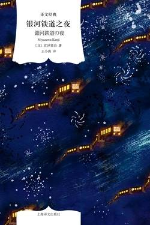

# 《银河铁道之夜（译文经典）》

作者：宫泽贤治

## 文摘

### 译者序

ACG（动画、漫画、游戏）

### 要求多多的餐厅

### 虔十公园林

### 三、沼泽地

主人笑了，一副正中下怀的样子：“那家伙坏脾气，要是我去堵的话，他肯定会生气，说我乱堵，所以我特地让他自己来。只要他那边堵住了，一个晚上水就能没过稻叶。好了，咱们回家吧！”主人在前面大踏步朝家走去。

## 想法

想象最好的表达途径就是童话、故事。