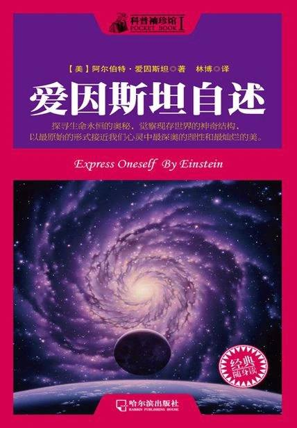

# 《爱因斯坦自述》

作者：阿尔伯特·爱因斯坦

## 文摘

### 第二章

那时，跟我一起学习的有一位女同学，后来成了我的妻子，她就是米列娃·马里奇。

我在工业大学还跟马尔塞尔·格罗斯曼同学成了很好的朋友。

时空坐标系

### 第四章

首先要做的便是破除“绝对时间”的观念，每一惯性系都有着各自特殊的、不同的时间。

有一个物理上的基本原则是在此过程中必须遵循的，即一个基本概念是否正确，决定于人们能否正确理解产生它的那些物理现象和实验。

### 第五章

高斯和黎曼两位已经在纯粹的数学领域内推广了度规。

斯里克曾针对认识论写了一本书，他说，公理实质上就是“隐形的定义”。

### 第六章

空间是三维的无限连续区，而平面就是二维的无限连续区。

### 第七章

牛顿概念体系的逻辑性很完整：一切物体，都是其本身决定了其加速度。

通过H．赫兹，“场”的概念从力学的束缚中摆脱了出来，而通过H．A．洛伦兹，“场”的概念则从物质的基体中摆脱了出来，他们两人的贡献理应得到我们的感激。

放弃了绝对同时性观念的狭义相对论的出现，是麦克斯韦和洛伦兹的理论所产生的必然结果。所以，狭义相对论是对超距离作用力的存在的否定。

论教育

学校是知识传播的最主要渠道，这一点在现在的学校中体现得更为明显。传统家庭教育的作用随着社会的发展已经逐渐衰弱，所以，在保证人类社会健康发展这一点上，现在的学校要承担起更大的作用和责任。

### 第八章

同时学校还应避免把学生变成蚂蚁或蜜蜂那样只知道死板工作的人，而要对学生的个性特别加以保护。

学校应该重点培养学生独立思考和独立行动的能力，当然，同时要引导他们将“人生的最高理想是服务社会”这一信念建立起来。

人格的形成，要依靠劳动和行动，而绝非对于道德的高谈阔论。

鼓励学生去实践，才是最重要的教育手段。不管是大学里的博士生写博士论文，是小学里的孩子初学写字，哪怕是简单地写篇作文、翻译和背诵一段课文、背诵一首诗歌，抑或是进行体育锻炼或一次小小实验，都概莫能外。

将自己的任何想法或意志强加于他人都是不应该的。

道德和感情

人类的思想和辅助它的语言以及其他符号工具在人的活动中起着重要作用，这就是其间的微妙差别。因为有了思想，所以我们的行动就超越了本能冲动的局限。原始本能通过思想的升华，获得了更高的意义。本能将思想熔铸到行动上，思想又对行动进行调节，而感情又鼓舞了这些行动。在多次重复之后，观念和信仰就在我们心中形成了。

### 第一十一章

致瑞士专利局

致苏黎世州教育委员会

致玛丽·居里

为反战斗争给罗曼·罗兰的信

不回德国的声明

给五千年后子孙的信

### 第一十二章

为建议研制原子弹给罗斯福总统的信

客观世界的完备定律及其他 ——1949年9月7日给M．玻恩的信

科学家的道义责任 ——1950年10月给“意大利科学促进会”的贺信

### 第一十三章

悼念T.A.爱迪生

悼念保耳·朗之万

什么是相对论？ ——“时间、空间和万有引力”

物理学有很多种理论，其中构造性的理论是最多的。这种构造性理论开始于最简单的形式体系，进而描绘出较为复杂的现象的图像。

“原理理论”也是一种重要的理论。这种理论采用的方法是分析法而非综合法。它们并未采用假说以进行构造，而是将基础和出发点定在经验中的发现上。

构造性理论和原理理论各有自己的特色。在解释事件的时候，前者更为明确、完备，并更具普适性，而后者的优点在于有着扎实的基础和完整的逻辑。相对论就是原理理论的一种。

狭义相对论差不多能适用于所有的物理现象，但是无法将引力包容在其中，它同时是广义相对论的基础；广义相对论则刚好是狭义相对论的拓展与延伸，提出了一种引力定律，还将引力和自然界中别的力的关系揭示了出来。

对上海的印象

宗教和科学

### 第一十四章

我的世界观

叔本华曾道：“人虽然能够做他所想做的，却无法要他所想要的。”

厄运的十年 ——《我的世界观》续篇

### 第一十五章

自由和科学

什么是E=mc2？

能量守恒原理和质量守恒原理

能量守恒定律是莱布尼茨早在十七世纪的时候就已经提出的一条原理

论古典文学

培养独立思考的教育

教育的根本，在于让学生能深入地体会和理解价值的含义，并对之产生一定的感情。还有一个最起码的要求就是，让学生具有一定的辨别道德高低及明辨是非的能力。否则，学生就不能算是一个真正意义上的人，而只能是像动物园中被训练过的动物一样机械。

学生不仅要掌握一定的知识，更应该进入到社会和生活中去，体察人间百态，学会跟人打交道，如此这般，学生才不会变成一个只会机械性的工作而没有感情的动物，才能成为一个有血有肉、有感情有思想的真正的人。

空间——时间

### 第一十七章

空间和时间相互融合，共同构成了一个均匀的四维连续区。

与泰戈尔关于真理的讨论

## 想法

不知章节划分的依据是什么？简直莫名其妙！！！ 

差不多一半的内容和物理学有关，初中高中学的那点物理知识细节大都不记得了，很难理解😅