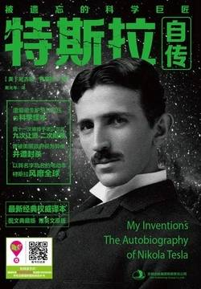

# 《特斯拉自传》

作者：尼古拉·特斯拉

## 文摘

### 第三章 早期为发明所做的努力

大多数人是如此专注于对外部世界的沉思，而完全无视自己内心正在想些什么。

我时常将玉米地里的秸秆当做敌人，然后对其进行长达数小时的砍伐。然而，我的“英雄壮举”却遭到了母亲的耳光。值得一提的是，母亲的耳光并非形式主义的，而是实实在在的惩罚。

### 第四章 旋转磁场的构想

假期结束后，我被送到了父亲精心为我挑选的历史最悠久、名望最好的位于斯蒂里亚省格拉茨市的理工学校学习。

### 第五章 特斯拉线圈和变压器的发明

1887年4月，特斯拉电气公司成立了，这意味着我拥有了自己的实验室和试验设备。

## 想法
 
中英文版，读了汉语部分😄 过于专业的部分理解不到😅