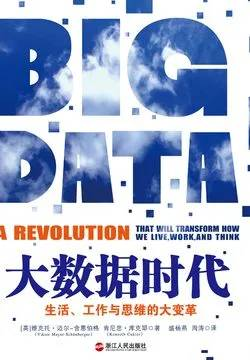

# 《大数据时代》

作者：[奥]维克托·迈尔-舍恩伯格 [英]肯尼思·库克耶

## 文摘

### 引言 一场生活、工作与思维的大变革

以一种前所未有的方式，通过对海量数据进行分析，获得有巨大价值的产品和服务，或深刻的洞见。

### 01 更多 不是随机样本，而是全体数据

大数据是指不用随机分析法这样的捷径，而采用所有数据的方法。

### 02 更杂 不是精确性，而是混杂性

大数据时代要求我们重新审视精确性的优劣。

### 03 更好 不是因果关系，而是相关关系

快速思维模式使人们偏向用因果联系来看待周围的一切，即使这种关系并不存在。

### 04 数据化 一切皆可“量化”

1971年，一个志愿者提出倡议把公共领域的书籍放上网络，制成电子书，方便更多的人阅读，这就是古登堡计划(Project Gutenburg)。

1884年，在美国华盛顿召开的国际子午线会议上，25个与会国家中的24个国家一致同意将英格兰格林尼治定为本初子午线和零度经线所穿过的地方（只有自命不凡的法国投了弃权票）。

20世纪40年代，墨卡托方位法把世界划分成了60个区域，提高了地理定位的精确性。

### 07 风险 让数据主宰一切的隐忧

### 结语 正在发生的未来

莎士比亚曾写道：“凡是过去，皆为序曲。”
