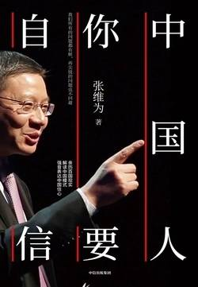

# 《中国人，你要自信（张维为作品）》

作者：张维为

## 文摘
### 代序中国人，你要自信

民主与专制”这个话语，已经落后于时代了，已经远远不能解释我们这个非常复杂而又非常精彩的世界了。

如果一定要找一个新的话语来代替这个范式的话，我想就是“良政还是劣政”，英文中“良政”叫goodgovernance，“劣政”叫badgovernance，就是国家治理的好坏。

十八大的时候，《纽约时报》的编辑给我来了一个邮件，说张教授，能不能写篇评论，我这篇评论的标题是“选贤任能挑战西方民主”。我讲了一个简单的故事，我说，你看一下中国十八大产生的最高执政团队，政治局常委们的履历，基本的要求是两任省委书记。也就是说，他们至少治理过一亿人口，而且要有政绩。你看一下习近平，他治理过三个省（直辖市），当第一把手，福建、浙江、上海，这三个省（直辖市）的人口加在一起，大约是1.2亿；经济规模加在一起，接近印度的经济规模。治理过这么多的人口、这么大的经济版块之后才进入了政治局常委，然后又给他5年的时间熟悉全国的政治、经济、军事、社会方方面面，最后再出任党和国家的最高领导人。这个制度是世界上最具有竞争力的，你怎么能比？

### 第一部分 中国崛起

1989年中国发生了政治风波，1990年前后东欧发生了剧变，1991年12月25日戈尔巴乔夫宣布辞职，苏联解体。

#### 中国，一个文明型国家的崛起

#### 中国崛起与文明型国家的逻辑

#### 中国模式与中国的制度安排

一个超大型的现代国家和一个延续不断的古老文明重叠在一起，就是文明型国家，就是我们中国。

四个“超”，就是超大型人口规模、超广阔疆域国土、超悠久历史传统、超丰富的文化积淀。

一个文明型国家自然有自己独特的制度安排。我自己总结是“一国四方”，“一国”就是一个文明型国家，“四方”就是四个方面的制度性安排。首先，政党制度方面，中国的特点是国家型政党。其次，民主制度方面，中国的特点是协商民主。再次，组织制度方面，中国的特点是选贤任能。最后，经济制度方面，中国的特点是混合经济。

#### 超越西方和西方模式

《中国震撼》出版后，自己言犹未尽，于是就有了今天这本《中国超越》。这本书和之前的《中国触动》《中国震撼》一起构成了我的“思考中国三部曲”，这也算完成了自己多年的一个心愿。

#### 三种力量的平衡比什么都重要

中国于1992年提出“社会主义市场经济”。

#### 中国、美国、欧洲改革之比较

如今，美国改革遭遇的障碍恐怕是福山所说的“否决政治”，美国政治体制中的否决点太多，很难进行实质性改革。

#### 全球治理：从中国经验到中国方案

要警惕民主原教旨主义和市场原教旨主义的教条。

#### “一带一路”与中国模式

就消除贫困而言，筑路（发展基础设施）比西方倡导的一人一票更有意义。

### 第二部分 中国模式

### 第三部分 中国话语

#### 中国崛起背后的十个理念

首先是实事求是。这个理念最早见于《汉书·河间献王传》，指一种做学问的诚实态度，后来的明清时代又形成了“实学”，强调通过对事物本身的探索来发现规律

第二是民本主义。这就是古人说的“民惟邦本，本固邦宁”，也就是说人民是国家的基石，只有巩固国家的基石，国家才能安宁，而民生问题解决的好坏，将决定一个国家的前途命运。

第三是整体思维。中国人的整体思维和辩证思维能力比较强，所以中国人做事情比较有战略眼光，能分轻重缓急。

第四是政府是善，更确切地说，政府是必要的善。

第五是民心向背。

第六是选贤任能。

第七是兼收并蓄。

第八是推陈出新。

第九是和而不同。

良政善治

#### 中国金融业需要一个聂荣臻

未来的世界，一个体制的整合能力、改革能力、适应能力将成为国际竞争中的关键因素。