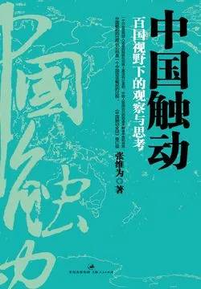

# 《中国触动：百国视野下的观察与思考》

作者：张维为

## 文摘

### 第一章 环球视野下的中国崛起

#### 二、在海外感受中国崛起

#### 三、中国崛起的意义

各种政党却忙于争权夺利，永远以民主的名义，行使部落主义、宗派主义或民粹主义之实，结果往往是国家持续动荡、政府无力整合社会、经济与民生凋敝，甚至导致内战和国家分裂。这个问题在非洲特别突出。

#### 五、别了，南斯拉夫

可以用一、二、三、四、五、六、七来概括南斯拉夫”：一个国家、两种文字（俄文字母和拉丁字母）、三种语言（塞尔维亚—克罗地亚语、马其顿语、斯洛文尼亚语）、四种宗教（东正教、天主教、耶稣教、伊斯兰教）、五个民族（塞尔维亚、克罗地亚、斯洛文尼亚、马其顿、黑山）、六个共和国（塞尔维亚、斯洛文尼亚、波黑、克罗地亚、黑山、马其顿）、七个邻国（阿尔巴尼亚、希腊、罗马尼亚、保加利亚、匈牙利、奥地利、意大利）

#### 六、东欧：家家都有难念的经

#### 七、从欧洲到美国

如果从1950年的朝鲜战争算起，美国先后发动了1961年的入侵古巴的战争、1968年的越南战争、1986年入侵格林纳达的战争、1989年入侵巴拿马的战争、1994年入侵海地的战争、1999年入侵南联盟的战争、2001年入侵阿富汗的战争、2003年入侵伊拉克的战争和2011年对利比亚的军事干预。

### 第二章 最不坏的模式？
#### 一、中国的另外四种选择

在哈瓦那城东一街口矗立着一座为古巴独立而牺牲的华人烈士纪念碑，上面刻着古巴独立战争英雄蒂格沙达将军盛赞古巴华人的两句话：“没有一个华人是逃兵，没有一个华人是叛徒。”

这个世界上，缺少基本的社会公正和贫富差距过大总会导致动乱和革命，但革命是英勇的、浪漫的、痛快的，而革命之后的建设则是艰巨的、复杂的、耗费时日的。古巴人民在发展的道路上还在探索一条符合自己国情的道路，我相信古巴人民也最终会找到这样一条道路。

### 第三章 西方”民主“遇上中国”实事求是“
#### 二、从贝•布托遇刺到肯尼亚骚乱

西方关心的只是表面的形式民主，认为形式本身就会产生正义。

#### 三、好民主才是好东西

西方一些国家现在把本应该是内容丰富、文化深厚、操作精致的民主大大简化，连经济发展、教育水平、法治社会、公民文化这些优质民主的基本要素都变成了可有可无的东西，惟有一人一票的“程序民主”才代表真正的民主

不管你如何评价哈耶克的自由主义学说，但他在其名著《通向奴役之路》中对民主建设提出的一个忠告值得注意。他是这样说的：“我们无意创造一种民主拜物教。我们这一代人可能过多地谈论和考虑民主，而没有足够地重视民主所要服务的价值。”

#### 四、政治改革：走自己的路

英国是经验主义政治变革的典型，法国则是理想主义政治变革的典型。

从1789年法国大革命以来，法国的政治制度一直比较动荡，甚至到了1946年的第四共和国还没有稳定，政党过多，议会过强。一般认为法国政治体制稳定下来是在戴高乐的第五共和确立了总统制之后。

### 第四章 应该失语的不是我们
#### 一、谁创造了人类普世价值？

法国哲学家福柯不无挖苦地说：你谈论什么并不重要，关键是谁在谈，话语的强弱是由话语者的强弱所决定的。

1948年联合国通过的《世界人权宣言》。这个《宣言》确认了人人“不分种族、肤色、性别、语言、宗教、政治或其他见解”都应该享受人权的原则。至此，我们才可以说国际社会真正开始了使“自由、民主、人权”成为普世价值的伟大进程。

#### 二、应该失语的不是我们

#### 三、也谈人权

第一，联合国界定的人权，主要指政治、公民权利和经济、社会、文化权利。西方传统上，在对外交往中，只强调政治和公民权利，忽视经济、社会和文化权利。美国不把这后三种权利看作人权。

第二，西方喜欢从法律角度来讨论人权，认为只有法庭可以受理的人权问题才可以算是人权问题，但是在对外政策中，又总是把法律问题政治化。

第三，西方总是说人权是个人的权利，甚至否认集体权利的存在。

第四，中国认为实现人权在实际操作中，应该有正确的优先顺序，没有一个国家可以同时实现所有的人权。

第五，在涉及人权的优先顺序时，也要指出，有些人权属于核心人权，属于普世价值，也是所有人类文明都必须接受的共同底线。

#### 四、公民社会之我见

### 第五章 中国：不要自己打败自己

#### 一、实事求是

“实事求是”是个很中国的概念，最早见《汉书·河间献王传》：“修学好古，实事求是。”指的是一种做学问的诚实态度，后来明清之际兴起的“实学”又把它解释为通过对事物本身的探索来发现规律和法则，英文翻译成seek truth from facts（从事实中寻找真理），应该说是比较到位的。

### 第六章 软实力，更触动世界