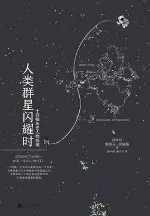

# 《人类群星闪耀时》

作者：斯蒂芬·茨威格

## 文摘

### 第二章 译序

斯蒂芬·茨威格（1881—1942）

《一个女人一生中的二十四小时》《一个陌生女人的来信》是其代表作

其传记创作的代表作当推论述巴尔扎克、狄更斯和陀思妥耶夫斯基的传记巨著《三大师》

### 第四章 不朽的逃亡者

忽然，让人匪夷所思的是，木箱的箱盖自己打开了，从里面爬出一个约莫三十五岁的人来，他佩剑执盾，头戴铁盔，全副武装，犹如卡斯蒂利亚的圣徒圣地亚哥。此人就是巴斯科·努涅斯·德·巴尔博亚，他以这样的方式对他那令人惊讶的大胆和机智做了第一次试验。

弗朗西斯科·皮萨罗

一个人最大的幸福莫过于在人生的中途、富有创造力的壮年，发现自己此生的使命。

随后，六十七人从山顶下来，1513年9月25日这一天，人类发现了地球上还不为人所知的最后一个海洋。

### 第五章 拜占庭的陷落

1451年2月5日，一名密使来到小亚细亚，给穆拉德苏丹的长子、二十一岁的穆罕默德送来其父辞世的消息。

拜占庭末代皇帝君士坦丁·德拉加塞斯的紫袍无非是一袭清风织就的大衣，他的皇冠不过是命运的戏弄。

几个土耳其人通过外墙缺口侵入到距离攻击点不远的地方，他们不敢攻打内墙，就好奇地、漫无目的地在第一道城墙和第二道城墙之间来回转悠，发现内城墙的小门中有一个小门，就是人称凯卡波尔塔的小门，出于难以理解的疏忽，竟然完全敞开着。

### 第七章 一夜天才

鲁热·德·利尔上尉一夜之间跻身于不朽人物的行列：街头和报刊最初的呼声被吸收、被借用，形成创造性的歌词，并升华为一诗节，其词永世长存，一如曲调不朽。

《马赛曲》

### 第八章 滑铁卢决定胜负的一瞬

### 第九章 玛里恩浴场哀歌

冯·歌德

《玛里恩浴场哀歌》绝不是无足轻重的，它是最重要的，是揭示他个人最隐秘的情感，因此也是他最喜爱的一首诗，是他勇敢的告别，是他英雄般的新的开始。

他偶然抬起了他的目光，从滚滚向前的游车里看到波希米亚清晨的恬静，神圣的和平与他内心的骚动不宁形成对照

### 第一十章 黄金国的发现

约翰·奥古斯特·苏特尔

依然没有人宣布他拥有的权利，只有一位艺术家——布莱希·桑德拉，给予被遗忘的约翰·奥古斯特·祖特尔的伟大命运以独一无二的权利：令后世惊异地缅怀他的权利。

### 第一十二章 飞跃大洋的第一句话

直至19世纪，地球上交通的速度和节奏才发生根本变化。

1837年是具有世界意义的一年。在这一年，电报机第一次使迄今相互隔绝的人们的经历成为同时性的，但这件事在我们学校的教科书里却很少被提起。

一个人对奇迹的信念永远是一个奇迹或一件美妙的事情所能够产生的首要前提。

这根电缆里面的金属丝线总长达三千万海里，足够绕地球十三圈，连成一条线，也足够把地球和月亮连接起来，仅这一点就足以形象地说明这个工程的规模是何等浩大。

### 第一十三章 逃向上帝

1890年，列夫·托尔斯泰着手写一部戏剧自传，后来作为他的遗稿中题为《在黑暗中发光》的片断发表和演出。这部未完成的戏剧，在它第一场中就披露了，它不是别的什么，而是他的家庭悲剧的一种最隐秘的描述。他这样写显然是对一种有意的逃亡尝试的自我辩护，同时也是对他妻子的一种道歉，即是说，这是一部在极端的灵魂分裂中寻求完全的道德上的平衡之作。

### 第一十四章 南极争夺战

被挑选出来参加这一壮举的五个人——斯科特、鲍尔斯、奥茨、威尔逊和埃文斯——继续寂寞地向未知之境走去。

一个人在和强大的、不可战胜的命运抗争中倒下去时最能显示他高尚的心灵：诗人有时也创作这种亘古以来一切悲剧中最壮美的悲剧，而生活却上千次创作了这样的悲剧。

### 第一十五章 封闭的列车

### 第一十六章 梦的破灭

谁做出一次妥协，那就再也不能止步。妥协将被迫导向一连串新的妥协。

### 第一十七章 西塞罗之死

马尔库斯·图留斯·西塞罗，罗马帝国的第一个人文主义者，演讲的大师，法律的保卫者，在三十年的漫长时间里一直为维护继承下来的法律和共和国而不懈地努力；他的演讲已刻入历史的编年史，他的文学著作已刻入拉丁语言的条形石。

一个真正的智者认识到断念是老年人和他的年代的真正尊严。

他在《论老年》中写下的生活准则：一个老人既不可以寻求死亡，也不能去拖延死亡；死亡总会在某个时候到来，必须泰然地接受它。