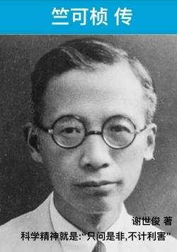

# 《竺可桢传》

作者：谢世俊

## 文摘
### 《竺可桢传》2022年再版序

竺可桢是我国气象学的奠基人和浙江大学最著名的老校长和浙江大学“求是”精神的创立者。

### 第一章故乡童年

一个生命来到人间，他的故乡和亲人也就有意无意地开始了对他的灵魂的塑造。

在这里，留下了气象史上“敬授人时”的圣人尧舜的事迹，故曹娥江又称为舜江；留下了大禹治水三过家门而不入，“告厥成功”，会天下诸侯计功江南而崩的传说，这儿因此名为“会稽”；还留下了越王勾践卧薪尝胆，忠臣伍员，美女西施等感人故事。

秦灭六国，始皇帝东巡祭禹，丞相李斯题写《会稽石刻》。靖康之变，宋室南渡，赵构挥题“绍祚中兴”，这里始有绍兴之名。

东汉时，14岁的曹娥殉父，引出了“绝妙好辞”的千古书法珍品《曹娥碑帖》。

魏源提倡“师夷长技以制夷”。

### 竺可桢世系之根

按传统习惯的说法，他姓竺，名可桢，字烈祖，号藕舫，至于绍荣、兆熊这些小名不能上书。

### 嘉祥公的事业和竺可桢的母亲

竺家台门

竺嘉祥全家从牛步迁到竺家台门不久，竺可桢就出生在这座新落成的正房楼上。第三个儿子的到来，是竺家一系列喜事的开头。这一切，既使得他妻子顾金娘沉浸在欢愉之中，也使得她辛劳过度。

### 毓菁学堂旧事

冬去春来，燕子衔泥，布谷催耕，学校放了农忙假。

杏花春雨江南，诗人觉得水乡春色醉人的美，但没完没了的雨水也令人心烦。

### 南开大学教地理

南开大学是1919年在南开中学的基础上建立的。私立南开中学成立于清光绪三十年(1904)。

### 这个日本人是干什么的

这是她的最后一胎，1930年12月28日，她生下一位千金。至此，竺可桢有了三子二女。这个小女儿取名竺宁。

### 古老月令谱新篇

竺可桢泛舟学海、遍访古籍，总结了几千年的中国物候学，又去探寻西方物候学的历史与现状。

【评】*或许只有清末民初成长起来的那批学贯中西的人才能做的了这份工作吧！*

### 壮年丧妻又西迁

1938年8月3日11时24分，张侠魂与世长辞。

### 政苛更显桃李情

他忙于各种活动，到5月11日才写《战后首都与陪都之意见书》，第二天写完，约1800字。从天、地、人、物四方面来权衡北平、南京、西安、武汉四地优劣，结论是：战后中心问题是开发工业，东北十分重要，因此主张以北平为首都。

### 刻不容缓搞卫星

”古人向学无遗力，少壮功夫老始成。纸上得来终觉浅，绝知此事要躬行。“

### 初入伊利诺伊大学

伊利诺伊大学创立于1868年。