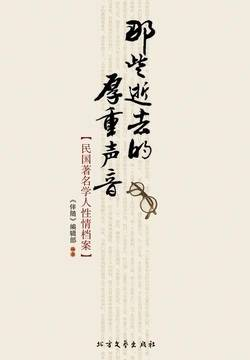

# 《那些逝去的厚重声音（民国著名学人性情档案）》

## 文摘

### 辜鸿铭：“我是老大中华的未了的一个代表”

张勋65岁生日时，辜鸿铭送给他一副贺寿联，上联是“荷尽已无擎雨盖”，下联是“菊残犹有傲霜枝”。意思是清朝灭亡了，那顶官帽已经全无着落，但还留下一条好端端的辫子，足可笑傲于这个寒光闪闪的时代。

### 章太炎：专志精微，穷研训故；首正大谊，截断众流

开始讲顾炎武的《音学五书》，其次讲段玉裁的《说文解字注》，其次讲郝懿行的《尔雅义疏》，其次讲王念孙的《广雅疏证》，这些都是小学的基本书籍

### 王国维：取义舍生欣所得，不顾人间唤奈何！

1925年，受聘任清华研究院导师，教授古史新证、尚书、说文等，与梁启超、陈寅恪、赵元任、李济被称为“五星聚奎”的清华五大导师，桃李门生、私疏弟子遍充几代中国史学界。

这是一部东西合璧的杰作，它将美国人禄尔克的《教育心理学》，康德、叔本华、尼采等人的哲学都融化在这本讨论中国古典文学的论著中。

王国维认为古今之成大事业、大学问，要经过三种境界：“昨夜西风凋碧树。独上高楼，望尽天涯路。”此第一境界也。“衣带渐宽终不悔，为伊消得人憔悴。”此第二境界也。“众里寻他千百度，蓦然回首，那人却在，灯火阑珊处。”此第三境界也。

王国维是中国最早研究叔本华、尼采等人西方哲学的学者之一。他曾长期研究西方文化和哲学，在研读了叔本华的大部分哲学和美学著作后与之产生了思想共鸣，并由此陷入唯意志论和悲观主义的深渊而难以自拔。

### 李叔同：做一样像一样的遗世独立僧

1918年到杭州虎跑寺出家，被称为“弘一法师”。

长亭外，古道边，芳草碧连天。晚风拂柳笛声残，夕阳山外山。天之涯，地之角，知交半零落。一觚浊酒尽余欢，今宵别梦寒。

### 马寅初：“言人之所欲言，言人之所不敢言”

### 马一浮：“唯诚可以感人，唯虚可以接物”

与梁漱溟、熊十力合称为“现代三圣”

唯诚可以感人，唯虚可以接物

复性书院设在四川省乐山县的乌山上，位于岷江、青衣江、大渡河交汇处，风景绝佳。山上的“尔雅台”，相传是晋人郭璞注解《尔雅》的地方。

### 刘师培：一只屡被世事“拖下水”的国学界凤凰

1903年，到北京参加会试，未中。归途中在上海停留，想找个教员职务以谋生；乃结识章太炎、蔡元培等“爱国学社”的反满志士，受他们的民族革命思想之影响，一时兴起，改名为刘光汉，表示自己有“攘除清庭，光复汉族”的决心。

1908年于《神州日报》公布所谓章太炎上端方书，诬章太炎亦叛变革命。

1909年夏，在上海向端方密告浙江革命党人准备起义的计划，致使革命党联络机关被破坏，同盟会员张恭被捕，起义失败。

1915年至北京，为袁世凯利用，与杨度、孙毓筠、严复、李燮和、胡瑛等六人组织筹安会，撰写文章鼓吹帝制。

1907年，同盟会发生了以章太炎为首的“倒孙风潮”。

### 熊十力：“吾以为人不孤冷到极度，不堪与世和谐”

人谓我孤冷。吾以为人不孤冷到极度，不堪与世和谐。——熊十力曾这样解释“孤冷”。

熊十力原名熊继智，十力本是佛家术语，专指如来佛祖的十种智力，他以十力为号行于世，可见其狷狂之盛。

### 黄侃：一个乖僻和学问成正比的怪杰

根据陶渊明《咏贫士》诗中“量力守故辙，岂不饥与寒”中之“量守”之意，为豪宅取名为“量守庐”。

### 钱玄同：一个催生新文化运动的性情中人

1928年任北师大国文系主任、教育部国语统一筹备会常委。1932年，制定以北平字音为标准的《国音常用字汇》并由教育部公布。1934年，在病中草成《第一批简体字表》, l935年8月由教育部公布第一批324个简体字，为新中国成立后的文字改革工作奠定基础。

著名科学家钱三强是钱玄同的三儿子。

### 陈寅恪：教授之教授 大师之大师

“独立之精神、自由之思想”

### 赵元任：拥有异常天赋的“汉语言学之父”

“我在小家庭里有权，可是大事情还得丈夫决定，不过大事情很少就是了。我与他辩论起来，若是两人理由不相上下，那总是我赢。”

### 梁漱溟：中国最后一位儒家

“情贵淡，气贵和。惟淡惟和，乃得其养；苟得其养，无物不长。”这是梁漱溟的座右铭。

“在人格上不轻于怀疑人家，在见识上不过于相信自己。”这是梁漱溟处事做人的原则。

孔子所关心者在人与人相处，而不在人对自然之利用。不问利用之程度高低，而人与人相处相得终是和人生直接相关的问题。于此问题应求善道，应不断用功夫。

### 顾颉刚：中国史学现代化的第一个奠基人

### 冯友兰：建立最好人生境界论的“现代新儒家”

1937年，抗日战争爆发。清华大学经长沙迁至昆明，与北京大学、南开大学合并为西南联合大学。

### 金岳霖：一个创建独立哲学体系的“顽童哲学家”

### 傅斯年：“故以学识而论，孟真真是中国的通才”

### 罗家伦：“人生的意义在能认识和创造生命的价值”

"五四运动”中，亲笔起草了印刷传单中的白话宣言（其中文言篇由许德珩起草）——《北京学界全体宣言》，提出了“外争国权，内除国贼”的口号，并在5月26日的《每周评论》上第一次提出“五四运动”这个名词，一直沿用至今。

### 潘光旦：“择善而从，择不善而改”

士不可以不宏毅，任重而道远。