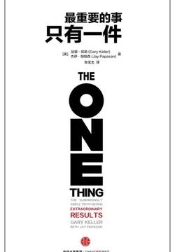

# 《最重要的事，只有一件》

作者：加里·凯勒/杰伊·帕帕森

## 文摘

“只做一件事”是一个宏大的概念，可以指导人生的各个方面。将这个概念应用到某个人，你将看到这个人的命运的转变有多么大。

### 第一部分 谎言 误导并阻碍成功

#### 4 每件事都很重要

准备做出决策的时候，如果你缺乏清晰的策略，就容易按习惯行事，接着退回熟悉、放松的状态。

“待办事项清单”复杂冗长，而“成功清单”则短小精悍。

#### 5 你可以同时处理多件事

下面简单列出“多任务处理”的弊端：
1. 大脑的潜能是无限的。要分区充分利用，也要做好浪费时间和降低效率的准备。
2. 切换至另一项任务花费的时间越多，你就越难回到原始任务上，这样虎头蛇尾的事只会越积越多。
3. 在不同的任务之间来回周旋将耗费时间，这些零碎时间会积少成多。研究显示，我们在一个工作日内平均有28%的时间浪费在任务转换上。
4. 习惯性“多面手”无法准确地估计完成一项工作的确切时间，他们的预计往往比实际耗时长。
5. “多面手”更容易犯错。他们总轻信新信息，却对更有价值的旧信息视而不见。
6. “多面手”的私人时间较少，忧虑和压力较多。

作家戴夫·克伦肖这样写道：“日常生活中，我们接触最多的人和事最值得我们重视。如果你只愿付出一部分关心及零碎的时间，若即若离，那么你失去的不仅仅是时间，还有与他人的联结。”

1. 分心是天性。精神无法集中时不要过分自责，人人都会走神。
2. 同时做几件事会得不偿失。无论个人生活或者工作，分心都会导致选择错误、致命的损失和不必要的压力。
3. 分心减少成效。同一时间里做太多事，就会什么也做不成。把你分散的注意力收回来，用在最重要的那件事上。

#### 6 过上有规律的生活

你本人就是你所做的事情的集合

#### 8 平衡工作与生活

你若在工作和生活中都摆出较高的姿态，要求颇多，就会让人十分崩溃，那时我们更会哀号：“我没有自己的生活！”

当你和时间打赌时，你下的赌注也许是你无法偿还的。

詹姆斯·帕特森在其小说《苏珊日记》中对生活与事业的权衡及其重心做了一番巧妙的比喻：“如果把生活想象成一场五球杂耍游戏，这五个球分别是工作、家庭、健康、朋友和诚信。你把球抛到空中，游戏就开始了。有一天，你会发现工作是一个橡皮球，如果掉到地上，它会弹回来；而其他的四个球——家庭、健康、朋友、诚信——都是玻璃做的，一旦掉了下来，就会磨损、破裂甚至摔个粉碎，到时再后悔已来不及了。”

#### 10 关键问题

任何梦想成功的人最后都会发现，要达到这个目的，必须以不平凡的方式来生活，除此之外，别无他法。

#### 12 如何找到正确答案

>我们不能决定未来，但我们可以决定养成什么样的习惯，正是这些习惯决定了我们的未来。——F·M·亚历山大

其他人的研究和经验是你寻找答案的最佳出发点。

### 第三部分 成就卓越 释放你内在的潜力

目标、优先事务以及生产力

#### 16 三个承诺

>总将最好的一面展示出来的人，从不会后悔。——乔治·哈拉斯

行动决定了结果，结果又充实了行动。

### 17 四个小偷

降低效率的4个小偷
1. 不会说“不”
2. 害怕混乱
3. 糟糕的健康习惯
4. 逆境

>确保你身边都是能让你得到提高的人。——奥普拉·温弗瑞

#### 18 生命的旅程

没有什么事会注定成功，但总有些事情——你要坚守的那个目标，会从所有事情中脱颖而出，比其他事情更重要。