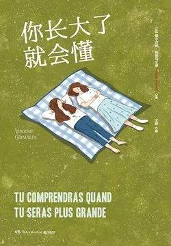

# 《你长大了就会懂》

作者：[法]维尔吉妮·格里马尔蒂

## 文摘
### 二月

>我们最自豪的不在于从不跌倒，而在于每次跌倒之后都爬起来。——拉尔夫·沃尔多·爱默生

“小宝贝，你知道的，大家都觉得每个人在每个年纪都不一样，人应该分为小孩、大人和老人，可这些都是错的。”“不是，这些都是对的。我是小孩，你是老人。”“这是一般人的想法。可实际上，我们这一辈子都是婴儿。我们只是会穿上不同的衣服把婴儿的样子藏起来，然后扮成其他人，比如，少年、成人、父母。可是当有一天我们老得扮不了的时候，我们就会把这些衣服脱掉，变回我们原来的样子。”

“小宝贝，你以后会懂的。你这一辈子想要的东西都是一样的。想要被爱，想要被安慰，想要和家人朋友在一起，想要吃，想要喝，想要玩，想要人照顾你，想要人像爱自己那样爱你。这不就和婴儿没什么两样吗？”

纵使身边有再多人的关心，痛苦、惶恐，以及喜悦，也都只能由自己一人感受与承担。

### 三月

>你我皆可活两次，顿悟再无来生时，前尘方逝，今生方始。——法国谚语

“我害怕失去所有的记忆。我不在乎忘了一小时前吃的东西，可是我害怕忘记我每个子女出生时的那份强烈的喜悦感，我害怕忘记我是多么地喜欢抚摩他们、安慰他们、看他们笑……我害怕忘记我孙子孙女们在我后院樱桃树下玩耍时的幸福笑容，我害怕忘记我父母眼中的温柔。我要用尽全力去抓住这些记忆，我希望这个病可以先把其他记忆带走，因为除此之外，我没有其他选择。”

### 四月

>获得幸福并不意味着一切都完美了，它只意味着你决定不再在意那些不完美的事。——亚里士多德

“她当时和她的表姐玛丽-乔西在一起，我认识她的这个表姐。所以我就和她们打了个招呼，然后继续走，不过我一边走一边在想我怎么才能再次遇见这位令我着迷的伊丽莎白。于是我开始跑。”伊丽莎白咯咯地笑着。皮埃尔冲她微笑了一下，继续说道：“我拼尽全力往前跑。我跑过了第一条巷子，然后绕到另一条与之平行的大街上，朝着反方向跑。几分钟之后，我再一次遇见了她们，装作一切都是那么自然。当时我的头发肯定有点乱，不过我邀请她去吃晚饭的时候，她还是答应了。”“你那时太完美了。”老妇人娇嗔道，“三个月后，我们就要庆祝结婚六十周年了。我想跟你说的是我们过去的每一天并不总是那么幸福，也有过一些艰难的时候，用年轻人的话来说，就是危机。两个人一起生活不可能不做出一些让步。但是今天我可以确认：我不可能再找到一个更好的丈夫……”

### 五月

“自从我来这儿以后，”伊丽莎白继续说道，“我应该已经习惯了。我看到过其他人去世。但这次超出了我的承受能力。我接受不了。我们一直在生活着、呼吸着、制订着计划，可突然之间，我们就不存在了。生活就像一座纸牌城堡。我们要花无穷无尽的时间去建造，我们尝试着铺设坚实的地基，然后再一层一层往上盖，可有一天，一切都轰然倒塌了，然后被某个人放进盒子里。你能告诉我这一切到底有什么用吗？”

物品对它们要陪伴的那个人而言不仅仅是物品，它们是回忆，是安慰，是不可或缺的必需品，也是生活的一部分，对老人们而言更是如此。老人们会精心挑选一些稀缺物品，用来填满他们最后落脚的房间。而将这些物品放入纸盒箱的底部，意味着我们接受了至亲之人不在的事实。

你们，以及你们带给我的那群孙子、孙女，都是我这一生中最大的幸福。我知道你们现在很伤心，可我希望你们可以只伤心一段时间。很遗憾不能把你们抱在怀里，不能告诉你们“我一切都好”。不过，我向你们保证，如果天上真的有天堂，我一定会找一把舒服的椅子坐下，然后看着你们，等着你们和我重逢。不要哭太多，要不然的话，我也会哭，到那时你们就该抱怨天气了。

我希望我今天能够站在他身边。但是我也很遗憾不能再陪在你们左右。我亲爱的小宝贝们，我会想你们的。我希望你们能够记住的唯一一件事就是：把每一天都变成一种美好的回忆，这也是我曾经一直试图教给你们的。幸福是我们唯一能够在生命尽头带走的东西。

"您身边还有其他人吗？”“有，有。还有我丈夫和离得不远的孩子。但这不一样。我当不了女儿了。”她说完便哭得更厉害了，“失去父母，意味着失去童年。我觉得没人能理解我……”

“这很正常。想哭就哭吧，想悲伤就悲伤吧，想崩溃就崩溃吧。如果母亲去世的时候都不能难过，那什么时候才可以？”

### 六月

“我一直都尽可能地来看她，可是，最近，我的工作占了很多时间。我有六个月没来了。六个月在一生当中不算什么，但是如果生命只剩极短的一段路时，它就十分重要了。昨天，看到她的时候，我震惊了。我感觉她变得更加瘦小了。仿佛她正在一点一点地消失。”

“我不知道动听不动听，不过不管怎样，这是实话。我的妻子，我爱她，我比第一眼见她时还要爱她。每当我看到现在的年轻人刚遇到困难便分开时，我就会对自己说很庆幸我们能够生活在那个年代。要不然的话，我们肯定会变成陌路人，我甚至不能体会到我本该经历的幸福。不过注意了，我没说这一切很容易。恰恰相反，放弃爱恋要比努力纠缠更容易。每天晚上睡觉的时候，我……”

“这六十年来，每天晚上，睡觉的时候，我都会举行同一个仪式：我会抱住我的妻子，紧紧地抱着她，并感谢上天让我们相遇。之后我们互道晚安。她会缩成一团，而我会闻着她的气味，我的心脏会一如初见时那般跳动。我们从来不需要培养‘爱’的习惯。我数过了，我们一起分享这一时刻已经分享了21875次，这一切并非没有意义……昨天晚上，我的怀里空荡荡的，我的心更是。”

### 七月

>生活，不是等待暴风雨过去，而是要学会在风雨中跳舞。——塞涅卡

爱情一直都在，只是被几次不愉快给藏起来了而已。因为要和一个人一直生活在一起，所以我们只看到了他不好的一面。就像我们买了件新衣服一样：最初的时候，我们很喜欢，之后，我们觉得它褪色了，最后我们再也忍受不了了。这就要求我们做出巨大的努力，不被负面的小细节污染到。最重要的是，千万不要相信爱情必须完美。和一个人分享自己的日常、自己的思想，以及生活，这一切并非毫无意义。另外，如果没有低谷，我们也就欣赏不了高峰。

### 九月

>无论什么情况，希望总比恐惧走得远。——荣格尔

“虽然我忘记了我人生中的四十年时光，”她继续说道，“但这教会了我一件很重要的事，幸福的秘诀就是——生活，就在当下。就在此时、此地。对于昨天的生活，我们只应该保留积极的部分。对于明天的生活，我们不应该抱有任何期待。我们既不能改变过去，也不能了解未来。只可惜，这一点我是从玛丽琳那里学到的。亲爱的茱莉亚，把你的包袱放下吧！我们通常到了生命的终点才会去衡量当下的价值。你运气不错，身边能够拥有一群帮你开启慧眼的人。珍惜吧！”

### 十月

>悲伤的创痕在你身上刻得越深，你越能容纳更多的欢乐。——哈利勒·纪伯伦

昨晚睡觉的时候，我才二十岁。今天早上醒来的时候，我就九十九岁了。即使生命很久远，但它看起来依然很短暂。小的时候，我觉得我奶奶特别老，可她其实比我现在的年纪还要小，她总是不停地和我说：‘小宝贝，生命短暂，并且只有一次，必须将时间花在值得去做的事情上。’我视如珍宝地将这个建议记在了脑中，并且记了一辈子。我们没有足够的时间去完成生活中出现的所有事情。所以，我们必须做出选择。我应该工作至上还是爱情至上？应该子女至上还是自我娱乐至上？阅读至上还是钓鱼至上？到底什么事情才是真正值得我们去做的？有些答案显而易见，有些却不是。我不可避免地也犯过错，但是我总是试着听从自己的内心去行事，而不是理智。”

“我这一生，”他继续说道，“总是会经常问自己假如生命就此结束，我是否会感到满意。所以，这就是秘诀——问问自己少年时的自己是否会满意今天的自己。我这个年纪已经不能再规划人生了，但是我可以总结人生。当我看到身边人的微笑时，当我看到挚爱之人的微笑时，我便再无任何遗憾。我知道我做的选择是对的。”

“然后呢？您找到真爱了吗？”我问道。“一直都没有，可是我找到一件特别宝贵的东西，就是陪伴。没有什么比孤独更糟了。我认识了好几个男人，他们也在逃避孤独，他们也除了简单交流，不再期待别的。”

### 尾声 六个月之后

“你记得吗？以前你总是和我说‘等你长大了就会懂’，这句话让当时的我很生气。不过，爸爸，你说得很对。我希望你能以我为傲。我相信我已经长大了。”