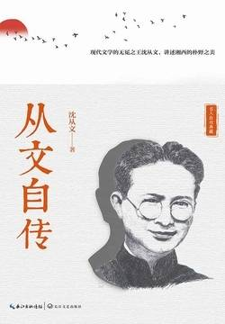

# 《从文自传》

作者：沈从文

## 文摘

### 我上许多课仍然不放下那一本大书

机会不巧不曾碰到这么一个慷慨的亲戚，我们也依然不会瘪了肚皮回家。沿路有无数人家的桃树李树，果实全把树枝压得弯弯的，等待我们去为它们减除一分担负。还有多少黄泥田里，红萝卜大得如小猪头，没有我们去吃它、赞美它，便始终委屈在那深土里！除此以外，路塍上无处不是莓类同野生樱桃，大道旁无处不是甜滋滋的地枇杷，无处不可得到充饥果腹的山果野莓。口渴时无处不可以随意低下头去喝水。至于茶油树上长的茶莓，则长年四季都可以随意采吃，不犯任何忌讳。即或任何东西没得吃，我们还是依然十分高兴。就为的是乡场中那一派空气、一阵声音、一分颜色，以及在每一处每一项生意人身上发出那一股不同臭味，就够使我们觉得满意！我们用各样官能吃了那么多东西，即使不再用口来吃喝，也很够了。  