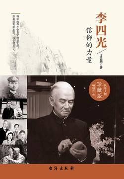

# 《李四光：信仰的力量》

作者：才云鹏

## 【文摘】
### 第二章 少年志，为国之同崛起

话说回来，李四光即是李仲揆，两个名字之间，有一种奇妙而神秘的宿命关系。

小四光的家乡黄冈县回龙山下张家湾村，山脉起伏、丘陵遍地、水塘众多，称得上是“五步一踏水，地无三尺平”。

而张之洞与张百熙、荣庆于次年即1903年推出的“癸卯学制”

该怎么办？李四光看着姓名栏中的“十四”，急中生智，在“十”字上加了几笔改成了“李”字。可这样名字就成了李四，太过俗套也不够好听。这时他猛然看到填报大厅的牌匾上书“光被四表”四个大字，自小熟读《四书》《五经》的他知道，这出自《尚书》中的“光被四表，格于上下”。这四个字让他豁然开朗，同“仲揆”这个古意盎然的名字相比，“四”再加个“光”，多好啊！而“四光”这个名字又非常响亮，亦有“四面八方追求光明”的含义，顿觉欣欣然。

### 第三章 赴日本求学，革命指路

弘文书院

1894年的甲午中日战争与次年的《马关条约》，1900年的八国联军入侵与次年的《辛丑条约》，使整个中国沦为帝国主义的半殖民地

8月20日（1905.08.20），在东京赤坂区头山满提供的民宅二楼榻榻米房，中国同盟会正式成立。同盟会最初叫“中国革命同盟会”，后为避免日本政府反对，改为“中国同盟会”，孙中山被推举为总理，黄兴等任庶务，除制定了《军政府宣言》《中国同盟会总章》和《革命方略》等文件外，还决定在国内外建立支部和分会，联络华侨、会党和新军，成为全国性的革命组织。年仅16岁的李四光，成为中国近代第一个革命党派中国同盟会第一批会员中最年轻的一位！

### 第四章 归国，一腔热血欲报国

1905年9月2日，清政府废除了延续1300年的科举制度，开始兴办新式学堂。

人尽皆知的武昌起义，是由文学社和共进会两个团体联合组织的。文学社成立于1911年，是革命党人借“研究文学”之名，在新军士兵中发展社员，以扩大组织发展力量的革命团体；共进会成立于1907年，是一部分同盟会员为策动长江流域革命而在东京另行建立的革命组织。黄花岗起义失败后，以文学社和共进会为主的革命党人决定把目标转向长江流域，准备在以武汉为中心的两湖地区发动一次新的武装起义。

1912年元旦，孙中山由上海前往南京就职。

### 第五章 人生转折点，科学才是王道

洞庭一夜无穷雁，不待天明尽北飞。

### 第六章 乱世露峥嵘

1927年11月，南京国民政府决定成立一个全国最高的综合科研机构，定名为中央研究院。蔡元培出任院长，杨铨担任秘书长（后改称总干事）。首批组建四个直属部门，即社会科学研究所，理化实业研究所，地质研究所和一个观象台。经蔡元培推荐，由李四光筹建地质研究所。

从古老的风水学来讲，武大同样是建筑史上的杰作。它紧紧地扣住了风水学中的四个要点：觅龙、察沙、观水、点穴，而这四点，每个都和环境有关。觅龙指建筑要有山而依，但不要建到山顶上；察沙指建筑不要把旁边的“左青龙、右白虎”遮挡住；观水指不要破坏地与水的联系及水的形态；点穴指要在合适位置，不能太霸道，也不能太委屈，勿邪求正。

所谓石炭二叠纪，是地质年代石炭纪与二叠纪的合称。石炭纪是主要造煤时代，分为早、中、晚三世。二叠纪分为早、晚两世。

“铁肩担道义，妙手著文章”

所谓南京国民政府，实际是蒋介石的独裁政府。它的前身是第一次国共合作时期，由孙中山先生奠定的广州国民政府。1927年4月12日，蒋介石发动反共政变，4月18日在南京另立国民党一党专政的统治机构，改称南京国民政府。7月15日，以汪精卫为首的武汉政府也宣布反共，与蒋介石一道形成“蒋汪合流”的统治集团，从而揭开第二次国内革命战争的序幕。

长恨人心不如水，等闲平地起波澜。

### 第七章 学术精深，誉满天下

美国幅员辽阔，北接加拿大，南联墨西哥和墨西哥湾，东濒大西洋，西临太平洋，从北到南长2700千米，由东至西宽达4500千米

李四光为我们提供了第一部内容丰富的著作——《中国地质学》

这是世界科学史上，第一部由中国人撰写的阐述中国地质的杰出著作。

李四光一生学术生涯中第二项重要成就：中国第四纪冰川。

法国哲学家狄德罗说过：“知道事物应该是什么样，说明你是聪明的人；知道事物实际上是什么样，说明你是有经验的人；知道怎样使事物变得更好，说明你是有才能的人。”

1945年，中华书局出版了李四光的《地质力学的基础与方法》，这是地质力学学科的第一部专著。

地球发展史上，先后出现过三大冰期——前寒武晚期、石炭二叠纪和第四纪冰期。

2012年6月5日，以中生代花岗岩地貌为特征的黄山世界地质公园盛大揭牌。它的建立，将黄山丰富的历史人文景观资源、动植物资源与花岗岩地貌、第四纪冰川遗迹、水文地质遗迹等地质遗迹和地质景观资源充分结合起来，构成了一座集山、水、人文、动植物为一体的大型天然地质博物馆！

### 第八章 时局动荡，坚守正义

翁文灏生于1889年7月26日，死于1971年1月27日；李四光生于1889年10月26日，死于1971年4月29日。他们同年生，同年逝世，表面看，翁早生3个月，早逝3个月零2天，而实际算下来，他们的寿命刚好都是81岁零185天！ 历史如此巧合。

1937年7月7日，日本发动“卢沟桥事变”，国民党第29路军奋起抵抗，抗日战争全面爆发。8月13日，日军在上海登陆。

### 第九章 发挥光与热，祖国不负我

经过充分的讨论和研究，最后提出成立“一会、二所、一局”的意见。“一会”是指成立地质工作计划指导委员会；“二所”是指成立中国科学院地质研究所和古生物研究所；“一局”是指成立财政经济委员会矿产地质勘探局。

1950年8月25日，经政务院批准，地质工作计划调配委员会改为“全国地质工作计划指导委员会”，李四光任主任委员，统一部署全国地质调查研究与勘探工作，对这三个机构进行整合，尹赞勋、谢家荣为副主任委员，章鸿钊为顾问。财政经济委员会矿产地质勘探局也随之成立。

### 第一十章 余晖璀璨

萧伯纳说的，也许更形象和通俗一些：“人生不是一支短短的蜡烛，而是一把由我们暂时拿着的火炬，我们一定要把它燃得十分光明灿烂，然后交给下一代的人们。”