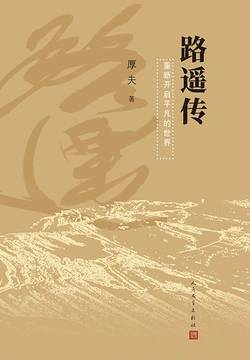

# 《路遥传》

作者：厚夫

## 【笔记】

### 第1章 苦难的童年生活

#### 与苦难为伍

农历己丑年十月十三日（即公元1949年12月2日)

>延安以及周边地区由于回乱等原因，土地肥沃，但人口一直稀少，是陕北榆林一带的“上头人”俗称的“老南山”​。​“走南路”谋活计，也叫作“滚老南山”​。

农历的十一月十三日，王家的新生儿满月。王玉宽让大给孙子起个名，王再朝思量再三，给这个长孙起了个“wei”的小名。（卫）

他只能在延川的大哥王玉德身上打主意了，用“顶门”的方式把卫儿过继给大哥，在那里供孩子念书。

### 第2章 我要上学

#### 在延川“顶门”

在王玉德的包容下，卫儿一直没有改口，直到长大成名后，他仍然叫自己的养父母为“大爹”与“大妈”​。

1958年的新学期开学，王玉德领着卫儿到村小学报名。

卫儿正式改名叫“王卫国”​，成为延川县马家店小学的一年级学生。

#### “半灶生”王卫国

王卫国于1961年夏考入延川县城城关小学高小部。

吃饭是当时住校生的头等大事。当时，城关小学的住校生，有“全灶生”与“半灶生”之分。​“全灶生”是指住校学生要给学校交纳一定数量的白面、玉米面和菜金，按照粮食“库存”情况报饭，吃什么、吃多少由自己决定。一般而言，​“全灶生”家的光景都比较好。​“半灶生”是住校生中的穷学生，自己交不起粮食，只能把家里带来的干粮带到灶房“馏热”吃，王卫国属于这一类。

#### 中学生王卫国

（1963）这年夏天，就在王卫国准备参加全县的升初中考试时，养父王玉德却下了一道死命令：不准考试，回村里“受苦”！

卫儿明确告诉大伯，哪怕不让上学，但必须参加全县的小学升初中统考，他要证明这几年来是认真学习的，要证明自己是有能力考上的！

王卫国以全县第二名的成绩，名列“榜眼”位置。

王卫国接受建议，返回村后直接找到村大队党支部书记刘俊宽。

王卫国不擅长数理化，上课时，他想听就认真听，不想听时就旁若无人地看小说，也不影响别人听课。好在班主任老师对学生很宽容，从不强迫学生，允许学生看自己喜欢的书，并且开导王卫国：​“你不爱学数学，我很理解，你对文学感兴趣就应该下工夫学，不要荒废时间。​”

### 第3章 青春过山车

#### 革命狂欢

1966年夏，王卫国在陕西省初中升中专考试中，以优异成绩考取西安石油化工学校。

1966年6月13日，中共中央和国务院发出通知，决定1966年高等院校招收新生工作推迟半年进行。6月18日，​《人民日报》发表《彻底搞好文化革命 彻底改革教育制度》​，废除高考制度。

1966年8月，全国各地的“红卫兵”开始全国性大规模串联。8月18日，毛泽东在天安门广场首次接见了来自全国各地的红卫兵。此后至11月期间，毛泽东又陆续接见了全国各地来京的一千一百万人以上的红卫兵。王卫国也因为在延川中学初六六乙班的红卫兵组织中表现突出，被选为五名代表之一，赴京接受毛主席的亲自接见。

这次北京之行尽管短暂，但使王卫国大开眼界。他第一次过黄河，第一次乘火车，第一次走进伟大首都北京，第一次走了上千公里的路程，见到了陕北之外的大千世界，第一次站在天安门广场中仰望伟大领袖毛主席，亲耳聆听毛主席的教导……总之，有许多个第一次。而这些人生的第一次，均是红卫兵“革命无罪，造反有理”的革命风暴带来的。

1966年11月以后，毛主席接见红卫兵的活动结束，全国各地原来以教师和学生为主的红卫兵运动开始向工厂和农村扩张，上海率先成立了“上海工人革命造反总司令部”​。1967年1月，​“上海工人革命造反总司令部”夺取上海的党政大权，这也成为全国“夺权”行动的开始。据《延川县志》与《中国共产党延川县历史大事记》记载：1967年1月8日，延川中学等二十余个县级机关的红卫兵组织联合召开了《彻底推进无产阶级文化大革命》的誓师大会；3月上旬，红卫兵造反派非法夺取了中共延川县委领导权，党政军各机关陷入瘫痪状态；8月，延川中学红卫兵组织砸烂城关小学孔庙牌位。

随着斗争形势的变化，延川县的派性格局基本形成，全县的造反派们逐渐联合成两大阵营—一派是由延川中学初六六乙班等红卫兵组织联合成立的“延川县红色造反派第四野战军”​（简称“红四野”​），军长由王卫国担任；另一派是由延川中学高六六级、高六七级等红卫兵组织联合成立的“延川革命造反派总司令部”​（简称“红总司”​）​，司令员由高六六级娄新文担任。

1967年11月3日，是延川县“文革”由“文斗”转向“武斗”的转折点，简称“11·3事件”​。​“11·3事件”是指延川“红总司”在县影剧院礼堂举行文艺公演期间，与延川“红四野”发生的大规模冲突。从此，​“红四野”以延川县城为根据地，​“红总司”以距县城九十华里的延长油矿总部永坪镇为根据地，各自扩大势力。自1967年农历十一月起，到1968年7月24日止，这两派先后发生过十余起动用武器的武斗事件。

最为严重的武斗事件，就是1968年4月17日在县城附近山塬的武斗枪战。

在这场战斗“游戏”中，王卫国负责带领“红四野”学生打扫“战场”​。这场“游戏”​，也就是后来有人状告路遥牵扯“人命案”的事件。

#### 人生低谷

1968年12月21日晚，中央人民广播电台向全国广播了毛主席的最新指示。这个指示的全文如下：​“知识青年到农村去，接受贫下中农再教育，很有必要。要说服城里的干部和其他人，把自己初中、高中、大学毕业的子女送到乡下去，来一个动员，各地农村同志应当欢迎他们去。​”

1968年底，延川县革委会在县城井滩广场，举行了隆重的“延川县知识青年上山下乡欢送会”​。凡各学校的“老三届”学生全部下乡，到农村广阔天地接受贫下中农再教育，直接参加到战天斗地的“农业学大寨”运动中。县革委会给每位上山下乡学生送一套时称“红宝书”的红皮《毛泽东选集》​，一把老镢头，一块新白羊肚毛巾。身为县革委会副主任的王卫国也在其中，他必须带好这个头。

1969年11月9日由村主任郭庭俊和村教师马文瑞介绍，在本村加入了中国共产党。

1969年冬，王卫国想参军。那时，参军是全中国青年的梦想。由村里到公社很顺利，而县里在政审时卡住了。原因是有人告发他，说他与“武斗”时一件人命案子有关。

王卫国的心理是征服者的心理，恋爱好比征服，只有从都市来的北京女知青才能激起他的恋爱欲望，因为北京女知青的身份、气质与才能真正打动他。

王卫国与林虹的恋爱可谓昏天黑地。1970年，国家首次在知识青年中招工，县上给王卫国一个指标，让他去铜川市“二号信箱”​（保密工厂，不公开厂名和地址）当工人。这是“文革”开始后的第一次招工，机会非常难得，但王卫国却把这个名额让给了恋人。

1970年春，全国政治运动进入到整肃造反派、打击造反派的阶段，延川县革委会主任马志亭向王卫国当面宣布：奉上级指示，令他停职反省，交代“文化大革命”中的问题。

这位招工进城后的女知青，在进厂后不久，就给王卫国寄来“绝交信”​，还把她和王卫国的定亲纪念品—一块提花被面退还回来。

### 第4章 《山花》时代

#### 缪斯在召唤

在强大的政治恣意捉弄他的时候，王卫国开始迷恋上文学这位美丽的缪斯女神了。

王卫国能走上中国文坛，与“老镢头”诗人曹谷溪不无关系。

曹谷溪原名曹国玺，1941年生，陕西清涧县人。1956年夏，属于绥德专区管辖的延川县中学招收三个初中班，其中就有从绥德专区分配的六十五名学生。年仅十五岁的曹国玺报考清涧中学，却阴差阳错地被调剂到延川中学。

中学毕业后，曹国玺因家境困难未参加高考，被推荐到县医院当炊事员。这样，他成为延川县文化程度最高、做饭水平最低的炊事员，常为擀面发愁。这位不安于现状的年轻人，在每天的洗锅刷碗后，开始做起自己的文学梦。后来，他又以“谷溪”的笔名尝试创作民歌体诗歌《老镢头》​，更被中国作家协会西安分会主办的《延河》杂志发表，成为名噪一时的“老镢头”诗人。

为培养王卫国，曹谷溪几乎每次下乡采访，都想法带上他，让他开阔视野。1970年盛夏的一天，曹谷溪带王卫国到新胜古大队采访，曹谷溪背个海鸥照相机，王卫国背个黄挎包，两人骑一辆破旧不堪的自行车出发了。

王卫国去新胜古大队采访活动的收获是，他在《革命文化》上发表的《我老汉走着就想跑》​，被曹谷溪推荐发表在新胜古大队的黑板报上。后来，这首诗歌又被曹谷溪推荐到1971年8月13日的《延安通讯》上发表。这也是王卫国第一篇公开发表的作品。

署名“路遥”的《车过南京桥》在《革命文化》上刊出不久，陕西省群众艺术馆主办的《群众艺术》杂志也选载了这首诗。

#### 路遥走来了

路遥在延川创作的诗歌、散文、小说的首发阵地均是《山花》​。他最初的诗歌《车过南京桥》​《塞上柳》​《我老汉走着就想跑》​《当年“八路”延安来》​《走进刘家峡》​《电焊工》​《歌儿伴着车轮飞》​《老汉一辈子爱唱歌》等，均刊于《山花》​；他的叙事诗《桦树皮书包》​，短篇小说《优胜红旗》​《基石》等，也同样是在《山花》上刊发后才引起外界注意，并被选入省级文艺刊物的。

王卫国搞创作“一炮打响”后，延川县再没人叫他“王卫国”​，更没人叫他“王军长”​。不管是熟人也好，陌生人也罢，都叫他“路遥”​。

#### 收获爱情

路遥与林达在一间“照相暗室”里，正式开始了他们的恋爱。

路遥在文学创作开始进入门道的时候，也开始收获了爱情。距离产生美，与路遥拉开距离的林达更加清晰地看准路遥的优缺点后，她决心抓住这次爱情，不让它从身边再溜走。这样，他们拉开距离的时期结束了，难分难舍的时间到来了。1973年春节，林达没有探望下放到福建的父母，而是随路遥到郭家沟的养父母那里过年。

事实上，当林达成为路遥的未婚妻后，她给路遥付出了很多。她每月挣三十八元工资，除了自己的伙食和必不可少的零花钱外，其余的都让路遥花了。这还不是最主要的，林达也是一个十分了得的“笔杆子”​，无论在领导还是群众中间都有很好的口碑。以她的才气和表现，上大学是完全有可能的，但为了支持路遥，她放弃了这个选择。

### 第5章 延大啊，这个温暖的摇篮！

#### 好风凭借力

1973年夏，全国高校普遍恢复招生。当时的招生方式是实行推荐选拔制，即上级把大专院校的招生名额分配到县上，由公社给县文教局上报推荐对象，文教局负责政审及向大专院校推荐。

延川县文教局对路遥的推荐更是煞费心思。路遥的数理化不行，只有文学创作一样特长，只能往文科专业上送。

应该说，路遥在不断奋斗的过程中，一直有“贵人”相扶。具体到他上大学的过程，倘若没有延川县文教局同志的不懈努力，没有县委书记申昜的亲自出马做“保送”工作，没有申沛昌的仗义，没有郭玉宝与张逊斌的开明，他的大学梦根本无从谈起。可以这样说，路遥能一路走来，成为我国当代著名作家，与众多有名与无名人的帮助分不开！

在众多好心人的帮助下，终于以好事多磨的方式，成为延安大学中文系73级中的一员。

#### 生活在杨家岭

革命选择了延安，时代孕育了延大。延安大学坐落在延安城北郊的杨家岭，它有较为久远的办学历史。早在1941年7月30日，中共中央做出决定，把抗战之初就创办的陕北公学、中国女子大学、泽东青干校合并，由毛泽东亲自确立校名为延安大学。1943年3月，中共中央西北局决定，把鲁迅艺术文学院、自然科学院、民族学院、新文字干校并入延安大学。1944年5月，陕甘宁边区行政学院并入延安大学。1944年5月24日下午，重组后的延安大学在边区大礼堂隆重举行开学典礼，毛泽东和朱德相继讲话。

路遥还说：​“要想在文学上获得成功，就必须按文学的发展规律循序渐进，不断提高。我以为搞创作首先应该写诗，写诗可以激发想象力，锻炼思维能力，开阔认知视野；其次是写散文，写散文能打好文字功，为小说创作铺平道路；最后写小说，先从短篇写起，再写中篇，待中篇成熟了才能创作长篇。​”

#### 在饥渴的路上

路遥在延大中七三级上大学时，基本的生活费用是在延川县通讯组当干事的恋人林达提供的。而林达当时领三十八元的最低工资，既要维持自己的正常开销，也要供路遥上大学，这确实有点太难为她了！路遥在延川期间养成了嗜烟如命的毛病，一直到病逝都没有克服。深知路遥这项毛病的林达，总是把工资的大部分无私地支援了恋人。

路遥入校后，就充分利用学校图书馆资源，全身心地投入到文学刊物和著作的海洋。他的发奋读书，在中七三级同学中是出名的。他的学习阵地是学校阅览室，他每天坚持阅读各种报纸，了解国内外大事；同时，有计划有步骤地翻阅图书馆收藏的“五四”以后的各种文学期刊和报纸，了解中国现代文学的发展轨迹，弥补知识空白点。

读书读报是学习，与人交往也是学习。与人交往是丰富人生阅历的重要环节，路遥虽不是刻意交往，但也十分重视与文学朋友的交往，进而通过他们的人生经验丰富自己的阅历。

#### 有准备的头脑

路遥十分喜欢柳青《创业史》中的一句名言：​“人生的道路虽然漫长，但紧要处常常只有几步，特别是当人年轻的时候。​”他懂得如何抓住青春的时光认真读书，更懂得读书与丰富阅历的目的是为了更好地创作。

1973年10月，路遥应邀参加了《陕西文艺》编辑部召集的创作座谈会。就是在这次座谈会上，路遥结识了在西安仪表厂工作的陕北籍青年诗人申晓，结识了曾在黄陵插队后参军入伍的北京知青叶咏梅，还结识了正在陕西师大中文系上学的青年作家白描，以及正在秦岭深处一家工厂的青年诗人叶延滨。这些朋友，后来都是路遥在《陕西文艺》实习时的同事，均不同程度给他以精神支持。路遥的中篇小说《人生》被改编成广播剧，长篇小说《平凡的世界》在中央人民广播电台“长篇连续广播”节目中播出，均有叶咏梅的努力。

路遥是位善于抓住机遇的年轻人。也就是在这次座谈会上，他认识了原“裴多芬俱乐部”成员、负责筹备《陕西文艺》的知名编辑董墨。

1974年冬，路遥来到《陕西文艺》编辑部，协助小说组看稿。

路遥在《陕西文艺》前后大体实习了一年左右。1975年秋，延安大学中文系来函，要他返校准备毕业。这样，他才告别省城。这次愉快的实习，为路遥打开一扇观察世界的新窗户，也给他日后大学毕业顺利进入《陕西文艺》工作埋下了重要伏笔。

1976年9月13日，陕西省革委会教育局正式给陕西省文化局发去《关于延安大学应届毕业生王路遥同志分配问题的复函》​，同意路遥分配到省文艺创作研究室工作。

### 第6章 文学发轫期

#### 小编辑生活

1976年9月中下旬，路遥以大学毕业生的身份分配到陕西省文艺创作研究室的《陕西文艺》编辑部工作。

路遥分配到小说组担任初审编辑。文学编辑部的稿件，一般是三审制，即首先要初审编辑把关，提交到组长二审，再由组长提交到主编三审。倘若三审通过，这篇作品就能发表了。

977年7月，​《陕西文艺》恢复了《延河》原刊名。​《延河》是1956年由中共陕西省委宣传部批准创立的文学月刊，它曾刊出过茹志鹃的《百合花》​、杜鹏程的《夜走灵官峡》​、李若冰的《柴达木手记》​、王汶石的《新结识的伙伴》​、柳青的《咬透铁锹》等优秀文学作品，培养了大量文艺人才，在十七年时期的中国文学界享有极高的声誉。1966年7月，​《延河》停刊，期间共出版124期。​“文革”时期，陕西省文艺创作研究室开始筹建。1973年，由原老《延河》业务骨干创办了《延河》杂志的替代品《陕西文艺》​。陕西省恢复《延河》杂志，是陕西文艺界“拨乱反正”的具体体现。​《延河》组成了新的编委会，王丕祥任主编，贺抒玉、董墨、余念任副主编。这个班子仍是《陕西文艺》的班底，这也显示出陕西人务实的工作作风。

路遥成为省级文学刊物编辑的时候，他长达六七年的马拉松式的恋爱也终于修成正果。他与北京知青、延川县委宣传部干事林达，于1978年1月25日在延川县城牵手结婚。路遥的婚房设在延川县委宣传部林达的办公室，一张双人床，两床新被子，就是他们所有的新婚家当。这孔窑洞和别的办公室唯一的区别，是窗棂上贴一个大红的剪纸“囍”字，它告诉人们这是新房。

说实话，路遥和林达能走到一起，是件不容易的事情，没有双方任何一方的坚持，都不会走到婚姻的殿堂。

对于林达而言，她嫁给路遥也是做过一番思想斗争的，她不光要接纳路遥个人，更要接纳路遥复杂的家庭，以及路遥所拥有的特定文化体系。她这些年默默支持路遥就是明证。作为婚姻事中的人，谁也想不到今后的婚姻质量会如何。

路遥在1977年4月6日给海波的信这样写道：​“你在那里还觉得不错，那就行了，反正到什么山上唱什么歌。不过，还是要自己严要求自己，不要虚度光阴，只要努力，什么都会好起来的。人可以亏人，土地不会亏人，有白享的福，没有白受的苦。希望你能写封长信告诉我农村目前的真实情况。​”

路遥1977年8月30日给海波的信这样写道：​“揪出‘四人帮’人心大快，首先是认识到这是思想上解放了人民，你在农村时间长，请朴朴实实地写一点反映农村生活的文章，这对你是有好处的，不要赶时势，胡凑一篇，以‘繁荣文艺创作’。要研究生活，反映生活的本质，以前关于创作上的一些框框完全可以打破，从研究生活起，然后得出结论。​”

#### 第一个金娃娃

事实上，路遥是一位心性非常要强之人，是活在事业中的“拼命三郎”​。了解我国新时期文坛风景的人都知道，1978年以后近两年左右的时间，我国文学主潮是“伤痕文学”和“反思文学”​，在拨乱反正的大潮下，许多作品以控诉林彪、​“四人帮”为主。当然，​“伤痕文学”也刺激了呼唤人性、人情和人道主义的文学的复归。路遥的创作向哪里走，这是他所认真思考与面对的问题。另外，已恢复工作的中国作家协会，在1978年底即委托《人民文学》编辑部评选全国首届优秀短篇小说奖。当年底，评奖结果揭晓，陕西有两位新人的作品榜上有名：一篇是莫伸发表于《人民文学》1978年第1期的《窗口》​，另一篇是贾平凹发表于《上海文学》1978年第3期的《满月儿》​。这两篇小说获奖，对于路遥的震动很大，他调整创作战略，精心创作中篇小说《惊心动魄的一幕》​。

《惊心动魄的一幕》写于1978年，是写在“文革”​“武斗”期间，被造反派“关押”的县委书记马延雄，为了避免两派大规模“武斗”而勇敢献身的故事。这篇小说没有迎合当时“伤痕文学”发泄情绪的路子，而着力塑造县委书记马延雄在“文革”中为制止两派武斗而进行的飞蛾扑火式的自我牺牲过程。它是路遥经过深思熟虑后选择的题材，一则路遥有在“文革”武斗时的亲身经历和生死体验，写起来得心应手；二则他对当时的文艺政策走向有一个基本的判断，认为“伤痕文学”虽是逞一时之快发泄情绪，但文坛终究要有一些歌颂正面人物的作品，而他的这部作品的“着眼点就是想塑造一个非正常时期具有崇高献身精神的人”​。

《惊心动魄的一幕》在《当代》杂志1980年第3期上头条刊发，秦兆阳专门题写标题。在秦兆阳的推荐下，​《惊心动魄的一幕》还一连获了两个荣誉极高的奖项：第一届全国优秀中篇小说奖；1979年—1981年度《当代》文学荣誉奖。尤其是全国优秀中篇小说奖，这是新时期陕西作家的第一次获奖。1982年3月25日，秦兆阳在《中国青年报》上撰文《要有一颗热情的心：致路遥同志》​，高度评价这部中篇，并认为“它甚至于跟许多人所经历、所熟悉的‘文化大革命’的生活，以及对‘文化大革命’的反感之情和对‘四人帮’的愤慨之情，联系不起来。因此，这篇作品发表以后，很长时间并未引起读者和评论界足够的注意，是可以理解的。​”

#### 谁识我忧

路遥1978年1月25日结婚后，他和妻子林达的爱情结晶于1979年11月降临人世。这个孩子是个女孩，取名为“路远”​，即取“路遥”与“程远”​（林达笔名）各一字，合为“路远”​。这里既有纪念二人爱情结晶的意思，又寄托对女儿人生期待的含义。这个孩子也是路遥的唯一孩子。很多年后，长大成人的路远改名为“路茗茗。

女儿的出生，给路遥带来了欢欣。然而，妻子林达有了身孕时，他的帮助却是微不足道的。那时，林达的工作还没有调到西安，路遥和林达两地分居。路遥当时住在一个不足十平方米的斗室，只能借个条件相对不错的房子“坐月子”​，路遥借到省作协一栋旧楼的四五十平方米的两居室。孩子要降生了，林达的母亲远在北京，他只能让清涧县王家堡的生母下西安来“收月子”​。孩子生下后，妻子奶水不足，又要找关系订牛奶。甚至孩子吃的鸡蛋，也是他所操心的事情。这一切像乱麻一样，长时间没有头绪理顺。这倒还好说，这是一个男人成为父亲过程中所必须经历的。当时的困难是所有年轻人遇到的困难，别人能克服的困难，路遥自然也能克服。

他一方面下决心帮助弟弟跳出“农门”​，另一方面已经从王天乐这样有志有为的农村青年的苦闷与奋斗的无望中获得创作灵感，以此来思考一个更深刻的人生话题，这就是他的代表作《人生》​。

### 第7章 翻越《人生》这座山

#### 狠加一把油

1981年的岁末，路遥除了没有给即将出版的中篇小说起好书名外，再没有不开心的事了。

#### 1982年

这样，中篇小说的题目，由最初《加林的故事》​，到《生活的乐章》​，再到《你得到了什么？​》的几次反复后，最后落到《人生》​，这才算一锤定音！

《人生》很快在《收获》杂志1982年第3期头条位置刊发。这部小说的《后记》写有：​“1981年夏天初稿于陕北甘泉，同年秋天改于西安、咸阳，冬天再改于北京。​”路遥终于成功地翻越了《人生》创作的这座山峰。

5月，路遥在发表中篇小说《人生》时，已是《延河》编辑部小说组长，编辑是正式工作，文学创作仍是他的“业余劳动”​。

路遥收到阎纲信后，很快写了封回信，重在阐述他的小说要反映农村和城市“交叉地带”的社会生活：​“相比而言，我最熟悉的却是农村和城市的‘交叉地带’，因为我曾长时间生活在这个天地里，现在也经常‘往返’于其间。我曾经说过，我较熟悉身上既带着‘农村味’又带着‘城市味’的人，以及在有些方面和这样的人有联系的城市人和乡里人。这是我本身的生活经历和现实状况所决定的。我本人就属于这样的人。因此，选择《人生》这样的题材对我来说是很自然的……归根结底，作家不能深刻理解生活，就不能深刻的表现生活。对作家来说，有生活这还不够；必须是深刻理解了这些生活才行。只有这样，才可能在大量多重的交错复杂的人物关系中伸缩自如；才可能对作品所要求的主题有着深邃的认识和理解；然后才可能进行艺术概括……关于《人生》​，我实在不想多说什么，我从读者写给我的信中强烈地意识到，当代读者的智慧水平和他们理解与欣赏作品的水平，已经向作家提出了很高的要求；我们必须写出更成熟的作品来，才能与我们的时代和人民事业相适应。​”

路遥和阎纲之间的通信于1983年初在《作品与争鸣》第2期“中篇小说《人生》及其争鸣（下）​”专辑中转载。这两封通信公开发表后，​“城乡交叉地带”就深入人心，成为研究路遥创作的一个关键词。

就在《人生》开始走红的时候，路遥的第三部中篇小说《在困难的日子里》在《当代》1982年第5期发表。这部小说是“1980年到1981年冬天写于西安”的，以第一人称的方式，主人公马建强具有路遥的自传体特点。

#### 生活在广场中

1983年，在路遥成为中国作协陕西分会驻会专业作家的第一年，​《人生》热继续发酵，并形成新一轮高潮。

### 第8章 抒写诗与史（上）

#### 沙漠誓师

1991年，路遥在创作随笔《早晨从中午开始》中真实地记录了他对毛乌素沙漠的理解：无边的苍茫，无边的寂寥，如同踏上另外一个星球。嘈杂和纷乱的世俗生活消失了，冥冥之中似闻天籁之声。此间，你会真正用大宇宙的角度来观照生命，观照人类的历史和现实。在这个孤寂而无声的世界里，你期望生活的场景会无比开阔。你体会生命的意义也更会深刻。你感到人是这样渺小，又感到人的不可思议的巨大。你可能在这里迷路，但你也会廓清许多人生的迷津。在这开阔的天地间，思维常常像洪水一样泛滥。而最终又可能在这泛滥的思潮中流变出某种生活或事业的蓝图，甚至能用明了这些蓝图实施中的难点易点以及它们的总体进程。这时候，你该自动走出沙漠的圣殿而回到纷扰的人间。你将会变成为另外一个人，无所顾忌地开拓生活的新疆界……

这次沙漠誓师，是1983年的事。这一时期，路遥还领着西安电影制片厂的吴天明导演为《人生》选取外景。之后，便义无反顾地投入到其心目中最高文学创作境界的长篇小说准备工作中去了。

#### 三年的读书与体验

路遥是位气吞万里、胸襟博大之人，他不准备小打小闹，而一上手就像“历史书记官”那样，创作一部全景式反映从1975年之后中国城乡社会近十年间变迁的史诗性小说。他初步确定的小说框架是三部、六卷、一百万字，甚至在酝酿时，就分别给这三部小说取名《黄土》​、​《黑金》​、​《大城市》​，并雄心勃勃地给这部长篇题以《走向大世界》的总名。这是一个庞大的文化创造工程，也是作家心智才情与体力、毅力的较量，怪不得他郑重其事地跑到毛乌素沙漠进行“沙漠宣誓”去呢！

路遥为何要把这部长篇小说设计在“1975年到1980年代十年间中国城乡广泛的社会生活”中呢？他在《早晨从中午开始》中做了回答：​“这十年是中国社会的大转型时期，期间充满了密集的重大的历史事件；而这些事件又环环相扣，互为因果，这部企图用某种程度的编年史方式结构的作品不可能回避它们。我的基本想法是，要用历史和艺术的眼光观察在这种社会大背景（或者说条件）下人的生存与生活状态。作品中将要表露的对某种特定历史背景下政治事件的态度，看似作者的态度，其实基本应该是那个历史条件下人物的态度，作者应该站在历史的高度上，真正体现巴尔扎克所说的‘书记官’的职能。​”

路遥首先从阅读中外长篇小说开始，学习和借鉴前人长篇小说创作经验。

其次，路遥还阅读大量杂书，为他的这次创作腾飞做坚实的工作准备。

在高强度的读书活动进行到一定程度后，路遥又按既定计划转入到作品背景材料的准备工作。

室内工作告一段落之后，路遥就急切地重返陕北故乡，进行生活的“重新到位”​，加深对农村、城镇变革的感性体验。

#### 长安只在马蹄下

文章的开头，是交响乐的第一组音符，决定整个旋律的展开。古今中外的优秀作家，无不重视文章的开头。在路遥看来，长篇作品的开头，主要是解决人物的出场“问题”​。路遥通过阅读众多长篇小说发现，所有“高明”的出场都应该在情节运动之中读者一开始就应该进入“剧情”​，人物的“亮相”和人物关系的交织应该是自然的，似乎不是专意安排的，读者在欣赏的过程中不知不觉就接受了这一切。作者一开始就应该躲在人物背后，躲在舞台的背后，让人物一无遮拦地直接走向读者，和他们融为一体。

路遥还认识到，在长卷作品中，所有的人物应该尽可能早地出场，以便有足够的长度完成他们。尤其是一些次要人物，如果早一点出现，你随时可以东鳞西爪地表现他们，尽管在每个布局仅仅可能只闪现一次，到全书结束，他们能早点出现，就可能多一些点点滴滴；多一些点点滴滴，就可能多一些丰满……

#### 人逢喜事精神爽

1985年1月15日，中共陕西省委宣传部发出通知，任命路遥为中国作协陕西分会党组成员。

当年6月份，中国作协陕西分会专门给路遥做了一份《关于路遥同志考察材料》​，称：​“‘文化大革命’初期，路遥尚未成年，以群众组织领导成员身份参加过一些活动，犯有错误，1984年省级机关第一批整党时，进行了认真调查落实，经宣传口整党指导小组批准，结论为‘一般错误，不做处理’。​”

4月21日—24日，中国作协陕西分会在咸阳召开三届二次理事会（扩大）​，会议选举了路遥、贾平凹、陈忠实、杨韦昕为副主席。

#### 进山创作

1985年金秋，即“陕西长篇小说创作促进座谈会”后不久，路遥便常带着两大箱资料和书籍，以及十几条香烟和两罐“雀巢”咖啡，从西安北上铜川，一头扎到铜川矿务局所辖的陈家山煤矿矿医院，正式进行酝酿三年之久的长篇小说《走向大世界》第一部的创作攻坚阶段。

12月上旬，路遥终于完成第一部的初稿创作。

#### 发表一波三折

他打电话叫西安市文联《长安》文学月刊主编、诗人子页商量。子页看了几十个名字后，根据路遥的创作特点，脱口说出诗人的直觉：​“叫《平凡的世界》怎么样？​”路遥看着子页，眼睛放出光来，也脱口说：​“好！”周围的朋友们也说这个名字既朴素又大气，内敛，不张扬，符合路遥小说的特点。这样，路遥的这部长篇小说才有《平凡的世界》这个既具有高度概括力又大气平稳的名字。

事实上，路遥在构思与创作《平凡的世界》第一部时，现代主义的文学思潮已经铺天盖地，滚滚而来。各种外来的文学思潮和表现方法如同“走马灯”一样令人眼光缭乱、目不暇接。​“现实主义创作方法过时论”的言论更是甚嚣尘上，作家们唯恐自己不新锐、唯恐自己不赶时髦。文学界由“写什么”到“怎么写”的风潮转向中，许多作家纷纷开始向“魔幻现实主义”​“意识流”​“象征主义”​“黑色幽默”等方向突围。许多作家强调创作的潜意识性、非理性、强调表现人的情欲—性欲，表现人的非理性状态，表现人的原始性。甚至到了小说里不写人的原始性欲，就不是小说，不在形式上玩所谓的“花样”就不是好小说的地步。这样，路遥自信满满的现实主义创作方法，至少在当年已被众多编辑与文学评论家视为“过于陈旧”的方法，他的小说不被认可也在情理之中。

平凡的世界》第一部终于在1986年11月由《花城》第6期全文刊发的同时，也在12月份由中国文联出版公司出版了第一版的精装与平装两种版本。

### 第9章 抒写诗与史（中）

#### 我心依然

1986年夏，在《平凡的世界》第一部发表大体有眉目后，路遥决定去广州逛几天。一来，自己这几年埋头创作，对中国社会的变化不是很敏感，亲自到改革开放最前沿的广东走走，现场感受那里的变化，寻求心灵体验，对接下来的创作有好处；二来，即将开工的第二部是写改革开放大潮下我国北方城乡底层人物的梦想与追求，不了解中国改革开放最前沿地区社会生活的变化，又如何把握？

7月份，路遥在吴起县武装部院的窑洞里，又一次跳上文学战车，​“全副武装”地披甲上阵，启动了《平凡的世界》第二部初稿的创作工程。

在吴起县创作期间，路遥开始锻炼身体，这是他身体“亮黄灯”后的无奈抉择。路遥发现自己饭量减少了不少，体力在迅速下降，有时候累得连头也抬不起来；由于抽烟太多，胸脯隐隐作痛，右边的眼睛发炎了，一直不见好转。他想到这是身体开始闹起情绪。但身体再怎样闹情绪，创作是不能停的。

在第二部初稿的最后创作过程中，路遥明显地感到自己身体变化呈加速度状态—苍老许多不用说，走路的速度力不从心，眼睛仍在发炎，难受得令人发狂。他感到这来自身体内部的变化正在让所谓的“青年时代”在瞬间就此永远结束。他还吟起俄罗斯诗人叶赛宁的诗句：​“不惋惜，不呼唤，我也不啼哭；金黄色的落叶堆满了我心间，我已经再不是青春少年……”

#### 迎风而立

事实上，这次研讨会上的情况，也是路遥当时所预料到的。他在创作随笔《早晨从中午开始》中冷静地写道：​“第一部发表和出版后的情况在我的意料之中。文学界和批评界不可能给予更多的关注，除过当时的文学形势，还有一个重要原因如前所述是因为这是全书的第一部，它不可能充分展开，更谈不到有巨大高潮的出现，评论界持保留态度是自然的。​”应该说，路遥从内心世界虽然渴望评论家的正面赞誉，但他也是理性和冷静的，他知道第一部的不足，因而冷静地面对这次研讨会。

在大雪纷飞中，路遥回到西安。他又一次走进借用的小屋，点起蜂窝煤炉子，在暖融融的小屋里誊写起《平凡的世界》第二部。一切都已过去，重要的是在新的起点上重新开始。

#### 去西德

这次穿西服、系领带的出国访问，是路遥短暂人生的唯一一次，在他生命里留下深刻的印记。回到西安的一个月后，即4月28日，中国作协陕西分会召开座谈会，邀请路遥和也刚从西德访问归来的评论家王愚畅谈访德观感。这是一个由作协分会机关干部和西安地区部分文学编辑参加的座谈会，当时，出国访问对于许多作家来说是不敢奢望的事情。路遥和王愚认真介绍了这个国家的印象与访问感觉。路遥打一个形象的比喻，这次出访，好像是一个穷人到富人家里串了一趟门，让人眼花缭乱。路遥幽默的讲话，笑倒了好多人。他最后得出结论：​“梁园”虽好，但那是人家的。我们不应该叹息，更不应该妄想去坐享其成，我们应该根据自己的特点，学习人家的长处，赶上去。而作为一名作家，如果离开了自己的祖国和人民，那他将一无所成，这在文学史上不是没有先例的。

#### 身体累垮了

从尽孝的角度来讲，路遥的确不是一名合格的孝子，养父病危时，他没有端一碗开水给老人喝；养父病故后，他也没有到老人的坟头去，烧一张纸钱……

路遥创作《平凡的世界》时，妻子林达早已到西安电影制片厂《银海》编辑部工作，她每天不仅要上班，还要管上小学的女儿，其辛苦程度也非同寻常。由于与丈夫的作息时间严重错位，她在每天早晨上班前只能把温好的饭放在锅中，等丈夫中午起床后吃。当然，有时候来不及温饭，路遥只能在省作协门口的地摊上将就了。

那么，路遥到底得了什么病？1992年11月17日晨，路遥因肝硬化腹水病逝。按照路遥日后所呈现出的病理学现象而言，他在1987年夏吐血的病因应该是“乙肝”引起的初期“肝硬化”​。这个判断是基于这样几方面的原因：一是路遥生母马芝兰是乙肝病毒携带者，乙肝病毒有母婴传播的特性。陕北农村的医疗条件差，更不具备乙肝病毒的普查条件。这个病毒一直在路遥母亲与兄弟姊妹身体中长期“潜伏”​，直到一个合适的时机才爆发出来。路遥病逝后，他的几个弟弟和妹妹都患上与他同样的肝硬化腹水，人们这才注意到路遥生母是乙肝病毒携带者的这一事实。二是路遥当时的病症就是肝硬化的病症。他长期胃口不佳、恶心、​“看见夜市，不由地发呕”​，说明已经有了肝硬化的症状，只不过他当时没有注意；他后来吐血，更是身体有肝硬化消化道出血的典型症状。

本来，肝硬化是人的常见病。路遥在1987年夏天是因长期的身体透支，加之营养不良，才导致长期“潜伏”在身体的乙肝病毒发作，最终形成肝硬化的。肝硬化的患者在肝功能代偿期，首先是要减少体力活动，注意劳逸结合；在肝功能失代偿期，必须卧床休息，饮食以高热量、高蛋白、低脂肪、维生素丰富、易消化的食物为宜。可是，路遥却无法使自己的战车停歇下来。一方面，​《平凡的世界》第三部已经构思好了，他必须抓紧时间创作，把“第三个”孩子生出来；另一方面，心性要强的路遥不想让外界知道他得了乙肝这种传染病。这样，才有王天乐回忆的路遥嘱咐“永远不能给任何人说他的病因”​。

路遥病了，这是个不争的事实。然而，路遥把1987年夏天生病的情况包得非常严实，一直没有公开透露过自己的病情。

曾任《延河》杂志主编的白描回忆：​“这次（指1992年—笔者注）你病倒后，我才听说你早已知道自己患有肝病。在我调到北京前，我们朝夕相处，记得1988年前后，你曾跑过几趟医院，吃过一段中药，对此你解释说想用药物调理一下，很快你便如同常人，不跑医院，也不服药了。不同的是自此戒了酒，过去的你是很能饮酒的。现在回想起来，怕是从那时起你便查出了肝上的毛病。但是你为什么要隐瞒呢？有病并不耻辱，你不愿向外人宣示，不光是外人，连及自己好像也不愿承认，大概是你要强的心性不容许自己给人以病恹恹虚弱的印象，这就导致你走入一个可怕的误区。强大与虚弱的分野并不在于体魄。要强的心性成全了你，也毁了你。”

### 第10章 抒写诗与史（下）

#### 榆林求医

路遥病了，真真切切地病了，原先健壮如牛的身体一下子垮了。他开始病急乱投医，整天吃中药。但他得了什么病，路遥病逝之前一直讳莫如深，深藏心间。因为某种忌讳，至少在他看来这个病是不能宣达给别人的。

他想到故乡陕北榆林地区的中医，决定回榆林求医。

### 第三次攻坚战

10月下旬，也就是陕北的深秋季节，路遥穿着一身当时人们都喜欢穿的水洗布外套，住进了榆林宾馆，开始创作《平凡的世界》第三部。

春节前一个星期，即1988年1月27日，路遥在身体几乎虚脱的状况下，终于完成了第三部的初稿。

#### 心中的春天

1987年春天，路遥去西德访问前夕，在北京电车上与老朋友、中央人民广播电台文艺部“长篇连播”节目编辑叶咏梅女士邂逅相遇。仓促之间，路遥送给叶咏梅刚刚在中国文联出版公司出版的《平凡的世界》第一部。当时的路遥也绝没有想到世界就是这么神奇，它在不经意间改变了《平凡的世界》的命运。

1988年的春天里，路遥内心所期盼已久的心中的春天真正来到了！因为《平凡的世界》在中央人民广播电台“长篇连播”节目播出已进入倒计时了：3月27日，电台就要首播了！

#### 最后的冲锋

3月27日中午12点半，中央人民广播电台AM747频道“长篇连播”节目准时播出《平凡的世界》第一部。李野墨富有磁性的男中音，透着一些深沉、粗犷与豪放，随着电波传来了。

路遥细心彻底地收拾了桌面，一切都装进了远行的箱子里，唯独留下那十本抄写得工工整整的手稿放在桌面中央。他又坐下来点燃一支烟，沉默了片刻，以使自己的心情平静到能出席宴会的程度。他知道，朋友们此刻正围坐在酒桌前等待自己。

这就是永远铭刻在路遥记忆中的1988年5月25日！

### 第11章 轻舟虽过万重山

#### 乘着广播的翅膀

北宋时期，​“凡有水井处，皆能歌柳词”​。1988年，​《平凡的世界》的播出，形成人人争着听收音机的情况。当时，从城市到乡村，从厂矿到学校，从机关到军营，每天中午12点半，人们都会自觉地围在收音机边，静静地收听李野墨演播的《平凡的世界》​。

1991年，路遥在创作随笔《早晨从中午开始》中这样阐释当时的创作思想：​“在中国这种一贯的文学环境中，独立的文学品格自然要经受重大考验”​，​“在这种情况下，你之所以还能够坚持，是因为你的写作干脆不面对文学界，不面对批评界，而直接面对读者。只要读者不遗弃你，就证明你能够存在。其实，这才是问题的关键。读者永远是真正的上帝。​”

很多年后，​《平凡的世界》演播者李野墨分析这部书产生巨大感染力的原因，这样讲道：​“可以回顾一下，我们中国近代、现代、当代的文学史，其中刻画农民形象、农民生活的作品不在少数，偏偏《平凡的世界》如此经久不衰，对此答案我是感受出来的，此前的作品有同情农民苦难的，还有敬佩农民坚韧不拔精神的，但是就我所读到的作品来说，其作者不是高高在上地俯视农民，就是或多或少地审视农民，而真正地置身于农民当中，打心眼里觉得自己跟农民没有什么两样，以平凡的心感受，平凡的人的眼睛观察，来撰写《平凡的世界》的只有路遥。​”

#### 身体又亮红灯

1988年的夏天，路遥在抱着破旧的收音机收听自己的作品同时，他不得不再次面对自己的身体，他虚弱的身体又出问题了，亮起了“红灯”​。

应该说，不是路遥不相信自己有肝病，而是他刻意隐瞒自己的病情，这才是事实。1988年左右，陕西作家贾平凹也得了肝病，他选择写文章向全社会宣布病情，把某种压力给了读者，自己则轻松了许多。路遥却遮着、捂着，在所有人面前完全伪装成健康人，即使有病后也是轻描淡写，这不是性格决定命运又是什么？

#### 为稻粱谋

路遥的工资不高，稿费也少得可怜。​《惊心动魄的一幕》五百元，​《人生》一千三百元，而长达百万字的巨著《平凡的世界》也不过三万元（每千字三十元）​。即使1989年的电视剧《平凡的世界》著作权报酬，也只有区区六百八十元。而路遥抽烟凶，又喜欢喝咖啡，这两样的开支不在小数。当然，他还既必须承担抚养女儿的家庭责任，也必须承担资助清涧与延川两处老人的基本义务。因此，他基本每月都是囊中羞涩。当《平凡的世界》交稿后，路遥想赚钱的思维又开始活跃起来了。

#### 欲说不能的婚姻问题

如果说路遥的第一场恋爱是浪漫型的话，那么他与林达的恋爱与结婚则透露出更多的现实功利性特点。

性格决定路遥善于挑战。早在恋爱阶段，有人反复提醒路遥：​“找一个本地人比较稳妥，知根知底，有挑有拣。​”但路遥听不进去，反问：​“哪一个本地女子有能力供我上大学？不上大学怎么出去？就这样一辈子在农村沤着吗？​”事实上，林达成为路遥的未婚妻后，每月的工资主要是供路遥上大学。

要路遥纠正自己为创作而形成的创作习惯，比登天还难。那么，林达能否进行妥协呢？这也不可能。林达是都市知识女性，工作是她身份的确认，她也不会放弃工作成为专职相夫教子的家庭妇女。她的工作时效性强，必须守时守点。再说她能一心一意照料孩子已经非常难能可贵了。我们没有必要强求她！

1980年代的中国，虽无禁烟一说，但这种凶猛的抽烟方式，毕竟是要靠人民币来维持的呀。这样下来，路遥的工资基本贡献给了中国的烟草事业。没有工资、没有收入，维持一家人的开支只能靠林达了。长此以往，林达能没有意见么？

再说，路遥是大男子主义者，具有陕北男人的许多优点与缺点，而不像上海男人会体贴爱人，会精致地生活，等等。

早在创作完《平凡的世界》第二部、身体出了问题之后，家庭就亮起“红灯”​，林达提出离婚，但路遥坚决不同意。

再到后来，路遥家庭出现长期冷战，夫妻之间形同陌路。为此，朋友们看在眼里、急在心里。有一次，路遥朋友、西安电影制片厂副厂长张子良给林达同事、路遥朋友孔保尔下达一个说和任务，要求劝他们两口子握手言和、重归于好。孔保尔见到林达，切入正题，可没有想到林达却泪如雨下，哭着说你们都说我不好，你们谁知道我这些年是怎样过来的，谁替我想过等等……弄得孔保尔左右不是。他下午见到路遥后，又想从路遥的角度劝说，可是路遥却说不可能和林达重归于好了。孔保尔问，林达要和你离婚，你为什么不愿意离？路遥说他的一举一动都会引起全国性的关注，离婚会给女儿带来很大的伤害，因为他非常爱他的女儿，他不能给女儿带来伤害，他也不想给自己造成负面影响，他只有忍着。孔保尔感到：路遥和林达作为文化人，都太有性格了，这也成为路遥沉重心情和生活的一部分。

作为与路遥、林达一起在延川这块土地上生活过多年的两人的共同朋友海波，对他们从恋爱到步入婚姻殿堂，再到后来的出现裂痕，有个明确的认识，他回忆说：我认为路遥和林达的不愉快，主要责任在路遥，而不在林达。当年作为未婚妻时，林达为路遥付出了能够付出的一切：在路遥最困难的时候和他订婚，为了供路遥上大学，使出了所有的力气；婚后甘当陪衬，勤勉地维持着这个小家庭；路遥去世后，面对许许多多的不理解，始终保持着高贵的沉默。毫不夸张地说，如果没有林达的支持，路遥不会有如此成就；如果有，也会付出更多艰辛。

路遥病逝后，林达和女儿在挽带上写出“路遥：你若灵魂有知，请听一听我们的哀诉……”的字样。作为路遥合法妻子的林达是在借此表达一种怎样复杂的心绪呢？我们不得而知。

#### 准备第三段创作

1月5日，路遥在《业务自传》中这样谈到自己今后新的创作设想：​“今后准备继续深入到生活之中，同时集中一段时间，更深入地研究中国历史和世界历史，广泛地研究西方现代派艺术的源流，在此基础上确立自己的‘第三段创作’。​”

同日，路遥还在《本人对目前专业设想建议》中写道：​“就个人来说，要更深入地投入社会急骤变革的大潮中，同时力争将这一历史进程放在人类历史的大背景上思考、体察和理解，以求写出更有深度和广度的作品。​”

这样，路遥在1989年开始，主要进入读书与思考的阶段。

::: info出自内心的真诚

我们常常谈论所谓艺术的魅力，也就是说，我们的作品凭什么来打动别人的心灵?

在我看来，要达到这样的目的，最重要的是作家对生活、对艺术、对读者要抱有真诚的态度。否则，任何花言巧语和花样翻新都是枉费心机。请相信，作品中任何虚假的声音，读者的耳朵都能听得见。无病的呻吟骗不来眼泪，只能换取讽刺的微笑；而用塑料花朵装扮贫乏的园地以显示自己的繁荣，这比一无所有更为糟糕。是的，艺术劳动，这项从事虚构的工作，其实最容不得虚情假意。我们赞美，我们诅咒，全然应出自我们内心的真诚。真诚!这就是说，我们永远不丧失一个普通人的感觉，这样我们所说出的一切，才能引起无数心灵的共鸣。
:::

1990年7月，路遥的职称评为“创作一级”​，即正高职称。根据陕西省职改办1989年一号文件精神，他的工资标准为艺术一级十档，从一百七十六元调整为一百九十七元。这个月工资，在陕西当时是较高的工资标准了。

从1990年起，路遥把阅读的兴趣转向中国历史和世界历史。

### 第12章 《平凡的世界》新里程

#### 登上中国文学的最高领奖台

被誉为当今全国最高文学大奖的第三届茅盾文学奖评奖1991年3月10日在北京揭晓。6位作家的5部作品获奖：路遥的《平凡的世界》​，凌力的《少年天子》​，孙力、余小惠的《都市风流》​，刘白羽的《第二个太阳》​，霍达的《穆斯林的葬礼》​。另有老将军肖克的《浴血罗霄》和已去世的徐兴业教授的《金瓯缺》获荣誉奖。

#### 掌声过后

应该说，路遥长篇小说《平凡的世界》荣获第三届“茅盾文学奖”​，是对路遥坚持以史诗般品格反映中国社会变迁的现实主义文学创作手法的肯定。

1991年，​“掌声”过后的大半年时间里，路遥基本上生活在“茅盾文学奖”的影子中。

《早晨从中午开始》​，是路遥在人生最后时刻迸发出的生命强光，也是揭开路遥创作之谜的一把钥匙。好在，他抢时间、赶速度，在可能预感到生命行将结束时，把这把钥匙完完整整地交给读者。

12月31日，路遥获陕西省人民政府颁发的“陕西省有突出贡献专家”荣誉证书；同时获得国务院颁发的“国家有突出贡献专家”荣誉证书，并开始享受政府特殊津贴。

### 第13章 生命的最后时光

#### 1992年的早春

这几年里他虽然四处求医，服用大量药物，但治疗效果却令人失望。他甚至怀疑自己可能患上了凶恶可怕的肿瘤—肝癌。这种恐惧感，一直使路遥没有勇气去医院证明自己的猜测，虽然妻子林达和亲戚朋友多次劝他去医院接受彻底的检查，但任何苦口婆心的劝言，在他看来似乎都是“多嘴多舌”—他把医院看成了地狱。在这样的危急的情况下，路遥对病情的治疗仍是不可思议的“鸵鸟政策”​：病情稳定时，他甚至连药都不好好吃，只有当肝区疼痛难忍时，他才认真而贪婪地服用一些药物，以解燃眉之急。这样的治疗方式，只能使治疗一误再误，病情愈来愈重。

#### 没有火气的夏天

6月份，西安的天气更热了。有人开玩笑说，西安只剩下“喘”了。路遥女儿路远已经通过小学毕业考试，后半年就要上初中了。从北京办好调动手续的林达，再次把女儿接到北京的外婆家过暑假。路遥和林达已经达成离婚协议，女儿归路遥管，林达准备放弃西安的一切财产，只身回京工作。这样，女儿在外婆家快快乐乐地过了一个暑期生活，这也是路遥所乐见的，因为此行之后这个名义上的家庭将要解体，女儿要跟自己生活。这样，他下定决心谋划装修房子，给女儿创造一个好的环境，让孩子今后在心灵上能平衡一些……

而路遥的身体却更加虚弱了，伴随着肝疼、腹胀等症状，还出现发寒、高烧、腹泻等新情况。这是他身体突发性病变的一个重要信号，但路遥却漠视了。

#### 病在延安

8月12日，路遥入住延安地区人民医院传染科18床。他的情绪极不稳定，不停地叹息。曹谷溪去看路遥，他号啕大哭：​“谷溪呀，我这是完了，老天爷拦腰把我砍断了，我的病，你不知道，很严重，这一回怕是不行了……”

9月5日，在回到延安一个月后，路遥转院回西安治疗。

#### 时间定格

9月下旬，路遥妻子林达也来看了路遥一回。她和路遥的婚姻已经名存实亡，走到尽头。本来她是商谈离婚之事，但因路遥的病情，离婚协议只能推后签订。

1992年11月17日晨8时20分，路遥的生命之弦彻底绷断，他的人生永远定格在这一时刻。从这一刻起，路遥再也没有醒来，他的灵魂离开了他挚爱着的平凡的世界与这个世界上的人们，回归到大地那里去了……

## 【想法】

听过路遥之名，听过《平凡的世界》之名，但是不曾读过，记忆中也不曾读过路遥的其他著作。

要了解路遥，或可以读他的随笔《早晨从中午开始》，书中引用了很多内容作为资料。

作为作家，路遥无疑是成功的，他的中篇小说《惊心动魄的一幕》获得第一届全国优秀中篇小说奖，他的长篇小说《平凡的世界》获得第三届茅盾文学奖。他曾任中国作协陕西分会副主席，获陕西省人民政府颁发的“陕西省有突出贡献专家”荣誉证书；获得国务院颁发的“国家有突出贡献专家”荣誉证书，享受政府特殊津贴。

『路遥的创作是典型的意在笔先，先有明确的主题，后广泛搜罗材料，形成框架，捕获串联线索，激发创作灵感。』为了创作《平凡的世界》，他花了三年时间做准备，大量的阅读，准备作品背景材料，到陕北故乡进行生活的“重新到位”​，体验加深对农村、城镇变革的感性体验。甚至一时兴起，带着弟弟王天乐去往兰州，在一间旅馆里绘制了小说的地貌草图、列出人物表和地名表、讨论主人公在事件中怎样行进的问题......

『很多年后，​《平凡的世界》演播者李野墨分析这部书产生巨大感染力的原因，这样讲道：​“可以回顾一下，我们中国近代、现代、当代的文学史，其中刻画农民形象、农民生活的作品不在少数，偏偏《平凡的世界》如此经久不衰，对此答案我是感受出来的，此前的作品有同情农民苦难的，还有敬佩农民坚韧不拔精神的，但是就我所读到的作品来说，其作者不是高高在上地俯视农民，就是或多或少地审视农民，而真正地置身于农民当中，打心眼里觉得自己跟农民没有什么两样，以平凡的心感受，平凡的人的眼睛观察，来撰写《平凡的世界》的只有路遥。​”』

这也印证着他的文艺观念：

『路遥1977年8月30日给海波的信这样写道：​“揪出‘四人帮’人心大快，首先是认识到这是思想上解放了人民，你在农村时间长，请朴朴实实地写一点反映农村生活的文章，这对你是有好处的，不要赶时势，胡凑一篇，以‘繁荣文艺创作’。要研究生活，反映生活的本质，以前关于创作上的一些框框完全可以打破，从研究生活起，然后得出结论。​”』『归根结底，作家不能深刻理解生活，就不能深刻的表现生活。对作家来说，有生活这还不够；必须是深刻理解了这些生活才行。只有这样，才可能在大量多重的交错复杂的人物关系中伸缩自如；才可能对作品所要求的主题有着深邃的认识和理解；然后才可能进行艺术概括......』『我们常常谈论所谓艺术的魅力，也就是说，我们的作品凭什么来打动别人的心灵?在我看来，要达到这样的目的，最重要的是作家对生活、对艺术、对读者要抱有真诚的态度。』

路遥是优秀的作家，也有很强的行政、组织能力。但是人无完人。

他不能正视自己的疾病，『路遥把1987年夏天生病的情况包得非常严实，一直没有公开透露过自己的病情。』『不是路遥不相信自己有肝病，而是他刻意隐瞒自己的病情。』『病情稳定时，他甚至连药都不好好吃，只有当肝区疼痛难忍时，他才认真而贪婪地服用一些药物，以解燃眉之急。』1992年11月17日晨，路遥因肝硬化腹水病逝。

家贫，他父母为了有人供孩子念书，九岁的路遥（原名王卫国）被过继给没有子女的大伯“顶门”。『在陕北农村，成年人“顶门”为儿、继承香火是件天大的事情，往往要有家族的长辈主持仪式来确认。顶门为儿之人要叩头行礼，改口称呼所顶门户的父母，全心全意承担养子的责任与义务。』路遥一直没有改口，直到长大成名后，他仍然叫自己的养父母为“大爹”与“大妈”​。『正当路遥忘情忘我地投入小说的修改工作时，延川的兄弟四锤打来电话，大伯病故。大伯是路遥的养父，是他让路遥在延川有了生活的舞台，是他供路遥上小学、上初中。按理说，他无论如何应该回去行孝。但正处于创作高峰的路遥，却冷静地给弟弟王天乐打电话，委托王天乐代表他全权办理丧事。从尽孝的角度来讲，路遥的确不是一名合格的孝子，养父病危时，他没有端一碗开水给老人喝；养父病故后，他也没有到老人的坟头去，烧一张纸钱……』

『早在恋爱阶段，有人反复提醒路遥：​“找一个本地人比较稳妥，知根知底，有挑有拣。​”但路遥听不进去，反问：​“哪一个本地女子有能力供我上大学？不上大学怎么出去？就这样一辈子在农村沤着吗？​”』『事实上，当林达成为路遥的未婚妻后，她给路遥付出了很多。她每月挣三十八元工资，除了自己的伙食和必不可少的零花钱外，其余的都让路遥花了。这还不是最主要的，林达也是一个十分了得的“笔杆子”​，无论在领导还是群众中间都有很好的口碑。以她的才气和表现，上大学是完全有可能的，但为了支持路遥，她放弃了这个选择。』『路遥在延大中七三级上大学时，基本的生活费用是在延川县通讯组当干事的恋人林达提供的。而林达当时领三十八元的最低工资，既要维持自己的正常开销，也要供路遥上大学，这确实有点太难为她了！路遥在延川期间养成了嗜烟如命的毛病，一直到病逝都没有克服。深知路遥这项毛病的林达，总是把工资的大部分无私地支援了恋人。』

但是他没能经营好自己的婚姻。在不断付出中累积起来的不满一旦爆发出来，或许便是形同陌路。

『早在创作完《平凡的世界》第二部、身体出了问题之后，家庭就亮起“红灯”​，林达提出离婚，但路遥坚决不同意。』『再到后来，路遥家庭出现长期冷战，夫妻之间形同陌路。』路遥生命最后住院的日子里，林达也来看了路遥一回，『本来她是商谈离婚之事，但因路遥的病情，离婚协议只能推后签订。』『路遥病逝后，林达和女儿在挽带上写出“路遥：你若灵魂有知，请听一听我们的哀诉……”的字样。』
