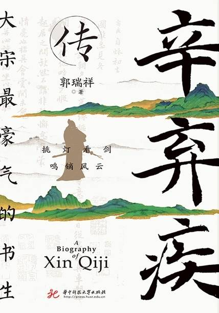

# 《辛弃疾传》

作者：郭瑞详

## 【文摘】

### 第一章 壮岁旌旗拥万夫

1126年，金人携带大兴安岭的疾风暴雪，一路狂飙南下，中原狼烟四起，哀鸿遍野。次年，北宋都城东京沦陷，宋徽宗、宋钦宗两位皇帝成为阶下囚，北宋灭亡。这一年是靖康二年，所以史称靖康之耻。

辛赞重新出仕时，北宋已灭亡十多年，但南宋朝廷尚在。他以汉人身份在金国做官，被汉族正统士人鄙视，被称为“虏官”。若干年后，辛赞的孙子辛弃疾南归宋室，一心报国，却仍然不能摆脱人们对其出身的诟病，被称为“归正人”，一直为其他官员猜忌和排斥，不被重用。

公元1140年5月28日，南宋高宗绍兴十年，金熙宗天眷三年，农历五月十一，一声洪亮的啼哭划破四风闸的夜空，辛赞做了爷爷，辛文郁做了父亲，辛家添丁进口，辛赞恢复中原的宏愿后继有人。

#### 受学

“坦夫”这个字伴随辛弃疾近二十年，直到他南渡归宋，改字“幼安”。“幼安”表明他决心抛弃年轻时的安稳生活，积极面对残酷的政治和惨烈的人生。

《金史》评党怀英“当时称为第一，学者宗之”。金朝著名文学家赵秉文评价他“文似欧阳公，不为尖新奇险之语；诗似陶、谢，奄有魏晋；篆籀入神，李阳冰之后一人而已”, “古人各一艺，公独兼之，可谓全矣”。说他的文章可比欧阳修，诗与陶渊明、谢灵运比肩，篆籀八分书书法与唐代李阳冰齐名。

#### 传奇

1141年，宋廷与金人签订“绍兴和议”：宋对金称臣，将东起淮河、西至大散关以北的土地全部划归金国，并每年贡奉银二十五万两，绢二十五万匹。

宋金和议，二十年相安无事。公元1161年，不料完颜亮突然发难南征，宋廷措手不及。后有金人内斗，前有“采石之战”大胜金军，南宋才得以继续偏安。

#### 归宋

### 第二章 众里寻他千百度

公元1163年，宋孝宗隆兴元年，四月，孝宗为防止主和派干预，绕过三省和枢密院，直接向张浚和军队下达诏令，开始北伐，史称“隆兴北伐”。

1165年，孝宗改年号为乾道。辛弃疾经过审慎的思考和整理，再向宋孝宗进言，上“万言平戎策”——《美芹十论》。

 “芹”指芹菜，先秦时期就有种植，属于吉祥珍贵之菜肴，常用于祭祀和重大的庆典。《吕氏春秋·本味》有“菜之美者，有云梦之芹”的记载。《诗经》中亦有歌咏。后来臣子向君主建言献策，称为“献芹”“芹献”“芹意”。唐代高适《自淇涉黄河途中作诗》:“尚有献芹心，无因见明主。”意思是想为朝廷做点贡献，却没有办法见到明主。

继《美芹十论》之后，他又写成姊妹篇《九议》，献给著名的主战派丞相虞允文。

####琴瑟

山公指山简。《世说新语》记载：山简是晋朝人，他都督荆州时，天下大乱，强盗出没，人心惶惶。但山简跟没事一样，经常到当地一家大户的池子旁陈设酒宴，大醉而归。他给这个池子取名“高阳池”。人们给他编了一首儿歌：“山公时一醉，径造高阳池。日暮倒载归，酩酊无所知。复能乘骏马，倒着白接篱。举鞭问葛强，何如并州儿。”

汉成帝宠幸赵飞燕、赵合德姐妹，称她们为温柔乡，说：“吾老是乡矣，不能效武皇帝求白云乡也。” 

#### 吊古
建康旧称金陵，东吴、东晋和宋、齐、梁、陈六个小朝廷在这里建都，所以称为“六朝古都”。旧传，金陵有帝王之气。诸葛亮称赞它“钟山龙盘，石城虎踞，真帝王之都也”。李白《永王东巡歌》:“龙盘虎踞帝王州，帝子金陵访古丘。”宋抗金名将李纲也形容它“江山雄壮，地势宽博”。

 谢安功高震主，受到皇帝的猜忌和疏远。一次宴会上，皇帝命擅长音乐的桓伊弹古筝，桓伊弹奏并演唱了一首曹植的《怨歌行》，为谢安鸣不平。谢安感伤得泪满衣襟。后人用“泪落哀筝曲”形容受到猜忌，不被重用。

“宝镜”亦是典。唐李浚《松窗杂录》中记载，秦淮河有渔人网到一面宝镜，能照见五脏六腑，渔人大惊，失手将宝镜落入水中，后来再也没有找到。

#### 召对

《青玉案》东风夜放花千树，更吹落、星如雨。宝马雕车香满路。凤箫声动，玉壶光转，一夜鱼龙舞。蛾儿雪柳黄金缕，笑语盈盈暗香去。众里寻他千百度，蓦然回首，那人却在，灯火阑珊处。

### 第三章 醉里挑灯看剑

延和殿召对之后，辛弃疾又写成军事著作《九议》。他的杰出的政治军事才干和卓越的文才，引起一个人的注意，这就是当朝宰相虞允文。

《醉翁亭记》开篇道：“环滁皆山也。”滁州四面尽山，地势险要，自古有“金陵锁钥、江淮保障”之称，地理位置十分重要。

#### 平寇

辛弃疾在滁州政绩突出，得到擢拔，乾道九年（1173年）冬，迁任江东安抚使参议官。江东是江南东路的简称，辖现在的浙江省、江苏省的长江以南地区，以及江西省东部地区，首府设在建康。

南宋官制最为复杂，各路设有四种长官：安抚使掌管军事政务，俗称“帅臣”“帅司”；转运使掌管财赋民政，俗称“漕臣”“漕司”；提点刑狱司掌管司法监察，俗称“刑官”“宪司”；此外，还有提举常平广惠仓，掌管粮食、矿业，俗称“仓台”“仓司”。四者合称“四司”，互不隶属，且均有按察官吏之权，可以相互制约。参议官是安抚使的幕僚。

《水龙吟》楚天千里清秋，水随天去秋无际。遥岑远目，献愁供恨，玉簪螺髻。落日楼头，断鸿声里，江南游子。把吴钩看了，阑干拍遍，无人会，登临意。休说鲈鱼堪脍，尽西风，季鹰归未？求田问舍，怕应羞见，刘郎才气。可惜流年，忧愁风雨，树犹如此！倩何人唤取，红巾翠袖，揾英雄泪！

#### 革弊

宋代兵制，有禁军、厢军和乡兵。禁军属中央军，直属中央领导。厢军属地方军，主要负责抵御外侵、镇压民众暴动、从事官方杂役劳动等。乡兵又称团练，不脱离生产，属民兵性质，乡社就是乡兵的一种。

#### 治荒

宋代官阶制度极为复杂，历朝历代绝无仅有。官员官职通常由三部分构成：官秩、贴官、实职。如辛弃疾这时候的职务，全称是：奉议郎、右文殿修撰、知隆兴府兼江南西路安抚使。其中，奉议郎为官秩，或称“正官”“本官”，表示级别，不履行职能；右文殿修撰，为“职名”，或省称“职”，为荣誉官，也不履行职能；知隆兴府兼江南西路安抚使，属“差遣官”“职事官”，就是实际履行的职能。

#### 罢免

宋代非常注重官员间的监督制衡，设立谏官、言官，直接向皇帝负责谏言。皇帝一般选择那些敢于直言的官员充任谏官、言官，他们的职责是向皇帝进谏，弹劾百官，他们的日常工作就是瞪大两眼，揪各级官员的毛病。

鸥鹭来去无心，自由翱翔，与鸥鹭同盟同住，意味着隐居，与官场割裂，与世事无争。李白表达自己归隐的意愿，写道：“明朝拂衣去，永与海鸥群。”黄庭坚则说：“万里归船弄长笛，此心吾与白鸥盟。”

### 第四章 剩水残山无态度

罢官前，辛弃疾就着手在带湖建造居所。他盖房屋百间，先在地势较高的地方建造两层阁楼，取名集山楼，后改名雪楼。又在雪楼前面盖起一排平房，平房对面就是澄碧如洗的带湖。

为明心志，他将临湖的一排平房取名“稼轩”，自号“稼轩居士”。“稼”指庄稼，亦指农业劳动，“轩”为屋舍。

#### 风物

《清平乐》茅檐低小，溪上青青草。醉里吴音相媚好，白发谁家翁媪？大儿锄豆溪东，中儿正织鸡笼。最喜小儿亡赖，溪头卧剥莲蓬。

《鹧鸪天》不向长安路上行，却教山寺厌逢迎。味无味处求吾乐，材不材间过此生。宁作我，岂其卿，人间走遍却归耕。一松一竹真朋友，山鸟山花好弟兄。

《老子》曰：“为无为，事无事，味无味。”在无味中寻找适合自己的味道，就能品尝出至味。《庄子》中有：弟子问于庄子曰：“昨日山中之木以不材得终其天年，今主人之雁以不材死，先生将何处？”庄子笑曰：“周将处乎材与不材之间。”

《西江月》明月别枝惊鹊，清风半夜鸣蝉。稻花香里说丰年，听取蛙声一片。七八个星天外，两三点雨山前。旧时茅店社林边，路转溪桥忽见。

#### 唱酬

《丑奴儿》少年不识愁滋味，爱上层楼，爱上层楼，为赋新词强说愁。而今识尽愁滋味，欲说还休，欲说还休，却道天凉好个秋。

韩元吉字无咎，颍川人。北宋时期，韩姓有两大显赫的支族，一个是相州韩氏，一个是真定韩氏。相州韩氏喜种梅花，称梅花韩氏；真定韩氏家里多种梧桐，因此被称为桐木韩氏。韩元吉属桐木韩氏。其祖上韩亿曾做过北宋的参知政事，为副丞相，四世祖韩维也是一代名臣。靖康之难时韩家迁徙福建，那一年韩元吉才十岁。

#### 知音

中国传统儒学，属于社会学，对人性关注不足。隋唐之后，道教、佛教兴起，对儒教形成挑战。北宋的儒学家们，借鉴道、佛两派学说，对儒学进行改造，形成新儒学。新儒学分为若干门派，如程颢程颐的理学、张载的关学、王安石的新学等。这些新儒学，尽管主张各异，但大都关注自身，关注心灵，关注物理、人性、天命。

1186年，陈亮上书激怒反对派，离开京师，回到家乡。辛弃疾听到这个消息，深为陈亮的壮举所感动。辛弃疾感佩、兴奋之余，写成一首《破阵子》，托人送予陈亮，表示对他的声援和鼓励。

《破阵子》醉里挑灯看剑，梦回吹角连营。八百里分麾下灸，五十弦翻塞外声。沙场点秋兵。马作的卢飞快，弓如霹雳弦惊。了却君王天下事，赢得生前身后名。可怜白发生。

**《左传》中说：“太上有立德，其次有立功，其次有立言，虽久不废，此之谓不朽。”此后，立德、立功、立言，成为士大夫毕生追求的事业。**

#### 帝师

宋代掀起改良儒学之风气，影响最大的有“理学”和“心学”，朱熹是理学的代表人物。

理学属哲学，复杂、抽象、玄妙，是门大功课，不是三言两语能够讲清楚的，朱熹也是用了一辈子才研究出那么点心得。粗浅一点讲，所谓“理”，就是一切规律、秩序和规范。而世间万物叫“气”。朱熹认为，先有“理”后有“气”, “气”生成于“理”，遵从于“理”，归结于“理”。

朱熹之后，理学成为儒学正宗，元、明、清三代成为官方哲学和执政的指导思想。朱熹终于完成了“立德”的愿望，成为孔子、孟子之后的又一位圣人。

### 第五章 而今识尽愁滋味

宋高宗赵构是中国历史上最长寿的皇帝之一，他五十六岁禅让皇位，禅位于养子赵昚，专心颐养天年。直到公元1187年才去世，终年八十一岁，做太上皇长达二十五年！因为杀岳飞、用秦桧，签署屈辱的“绍兴和议”，宋高宗被贴上“主和”“投降”标签。

孝宗没有理会主战派的热情，而是以为高宗守孝为名，将政事交付太子赵惇，两年后，即公元1189年，他干脆禅位赵惇，自己仿效高宗，做了太上皇。

赵惇即为宋光宗，以1190年为绍熙元年。

此时，辛弃疾在上饶已经整整隐居十年，其间被安排了一个荣誉职务，就是主管武夷山冲佑观。这冲佑观为唐玄宗天宝年间所修，是当时全国最重要的道教活动中心之一。宋代以赋闲的官员充当道观主管，为的是发放半职的薪水，解决生活困难。辛弃疾之前，朱熹曾主管过冲佑观；辛弃疾之后，陆游也被充任此职。

#### 帅闽

1194年七月，左司谏黄艾说他“残酷贪饕，奸赃狼藉”，朝廷将他罢官，免去他知福州和福建安抚使的职位，后来又将他的“集英殿修撰”降充为“秘阁修撰”。

同年，宋光宗逊位，其子宋宁宗即位。次年十月，言官们不依不饶，御史中丞何澹弹劾辛弃疾“酷虐裒敛，掩帑藏为私家之物，席卷福州，为之一空”，直指他将国库占为己有。朝廷又撤销了他的“秘阁修撰”贴职。

宋宁宗庆元二年（1196年），言官再次弹劾他“赃污恣横，唯嗜杀戮”，朝廷又免去他主管建宁府武夷山冲佑观的虚职。至此，辛弃疾成为一介布衣。

#### 三山

南朝宋武帝女儿寿阳公主，在梅花下熟睡，梅花落到公主脸上，怎么也拂不去。三日后，才用清水洗掉。宫女们见状，纷纷仿效，从此始有梅花妆。

#### 陶令

1191年春，瓢泉新居建成。不到一年，带湖的住宅不幸失火，一夜之间雪楼和稼轩化为灰烬。辛弃疾也不再重修，全家搬到瓢泉居住。

《贺新郎》甚矣吾衰矣。怅平生、交游零落，只今余几！白发空垂三千丈，一笑人间万事。问何物、能令公喜？我见青山多妩媚，料青山见我应如是。情与貌，略相似。一尊搔首东窗里。想渊明《停云》诗就，此时风味。江左沉酣求名者，岂识浊醪妙理。回首叫、云飞风起。不恨古人吾不见，恨古人不见吾狂耳。知我者，二三子。

#### 第六章 红巾翠袖，英雄泪

以知枢密院事赵汝愚、知阁门事韩侂胄为首，拥立光宗的儿子赵扩即皇帝位，尊光宗赵惇为太上皇，史称“绍熙内禅”。

赵扩就是宋宁宗，次年改元庆元。

宁宗在朝堂之上一般不发表意见，也不公开批阅奏章，而是将大臣的奏章拿到内廷中批示，称为“御笔”。

1195年六月，宁宗登基不足一年，韩侂胄一党上书宁宗，希望对道学“考核真伪，以辨邪正”，数日后，朝廷开始全面甄别真伪道学。

1196年二月，朝廷正式将理学定为“伪学”，士子儒生不得学习、传播。科举考试只要涉及理学内容，一律黜落。

1197年，党禁再次升级。当权派列出五十九人的黑名单，称为“伪学逆党籍”，包括赵汝愚、王蔺、周必大、朱熹、吕祖谦、叶适等人。宋宁宗的第一个年号是庆元，这次党禁被称为庆元党禁。

公元1203年，辛弃疾突然接到南宋朝廷的新任命，起用他知绍兴府兼两浙东路安抚使

两浙东路辖越、婺、衢、明、台、处、温、严八府，宪司治绍兴府。

绍兴府古名越州，又名会稽。传说大禹在这里大会诸侯，论功行赏，因此得名会稽。

东晋时，文人雅士三月三日在会稽山聚会。按古人的习俗，要在这一天临水洗濯，去除不祥。

#### 江湖

嘉泰三年，公元1203年，时陆游已七十九岁高龄。不久，辛弃疾到绍兴任职，二人得以有一场风云际会。

姜夔，字尧章，号白石道人。其一生未仕，转徙江湖。庆元之后，他依附张镃及其族弟张鉴，寓居杭州。大约在这期间，姜夔通过张氏兄弟认识了辛弃疾。

#### 备战

长江南岸，有北固山，横枕大江，山势险要。山上有亭，叫北固亭，又叫北固楼。登亭远眺，不仅江水浩渺，而且依稀可见江北风景，群山逶迤，草木葱郁，天地苍茫，仿佛中原。靖康之后，南渡官民思念家乡，常常登楼怀远，因此又将北固亭称为“北顾亭”。

《南乡子》何处望神州？满眼风光北固楼。千古兴亡多少事？悠悠，不尽长江滚滚流。年少万兜鍪，坐断东南战未休。天下英雄谁敌手？曹刘。生子当如孙仲谋。

#### 陨逝

《永遇乐》千古江山，英雄无觅，孙仲谋处。舞榭歌台，风流总被，雨打风吹去。斜阳草树，寻常巷陌，人道寄奴曾住。想当年，金戈铁马，气吞万里如虎。元嘉草草，封狼居胥，赢得仓皇北顾。四十三年，望中犹记，烽火扬州路。可堪回首，佛狸祠下，一片神鸦社鼓。凭谁问，廉颇老矣，尚能饭否？

公元1207年10月3日，南宋宁宗开禧三年九月初十，辛弃疾病逝铅山瓢泉新居，时年六十八岁。

宋理宗绍定六年，公元1233年，辛弃疾去世二十六年后，朝廷追赠他光禄大夫。

宋恭帝德祐元年，公元1275年，辛弃疾去世六十八年后，朝廷追赠其少师，谥“忠敏”。