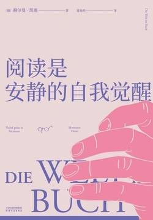

# 《阅读是安静的自我觉醒》

作者：[德]赫尔曼·黑塞

### 【文摘】
### 引言

世界上任何书籍都不能带给你好运，但它们能让你悄悄成为你自己。  

#### 关于阅读

“为读而读”是不明智的，而且有损身心健康——注意，我说的不是糟糕的书，而是糟糕的阅读。读书，应该像我们在人生中所走的每一步，进行的每一次呼吸那样，我们应该有所期盼，投入心力，并由此获得更加充盈的人生。“浑然忘我”本是为了更确切地找到自我。倘若读过的书卷并不能带来快乐、慰藉、力量或灵魂的平静，那么了解文学史又有何意义？思想缺席、精神涣散的阅读，就仿佛蒙住双眼走在美丽的风景中。我们阅读并非为了忘记日常生活，恰恰相反，阅读是为了活得更明白、更成熟，为了把握好自己的生活。不要像紧张的学生走向老师那样走向书本，也不要像流浪汉走向酒瓶那样走向书本，而是要像登山者走向阿尔卑斯山，斗士走向武器库那样走向书本。不要像逃避者那样遁入虚无，而是要像勇士一般走向自己的友人和帮手。如果人类能够以这种方式阅读，也许我们未来的读书总量只会是目前的十分之一，但我们却能比现在快乐十倍，丰富十倍。  
#### 阅读与教养

真正的教养并非为了某个具体目的而存在，教养的意义在于教养本身，就像人们追求身体的力量、灵巧与美丽并非为了一个什么终极目标，努力也未必能使我们变得更富有、更出名或更强大，但是它却增强了我们对生活的感知，提升了我们的自信，我们也在这个过程中，变得更快乐、更幸福，并由此获得更多的安全感和健康。同理，对“教养”的追寻，并非通往某个限制性目的的辛酸路，而是精神与灵魂的完善过程，可以强有力地拓宽我们的认知，丰富我们的人生，增添幸福的可能。因此，真正的教养是身体力行，是圆满与动机的合一，通往它的道路有千千万万条，学无止境。也许这不会提高我们的某个单项技能或成绩，却能为我们的人生赋予意义，让我们对过去释怀，并勇敢迎接未来。  

 读书这件事，必须走爱的道路，而非强迫的道路。不要因为某本书很出名就强迫自己去读它，也不要因为自己不认识或没读过某本名著就感到羞耻，羞耻才是谬误！每个人都应该从自己感到舒服自然的地方开始阅读，逐渐去理解，去热爱。  

#### 查拉图斯特拉的重临

绝望不是英雄主义，但绝望总好过小市民的无趣的懦弱，因为小市民只有在看到自己钱包受到威胁时才会诉诸英雄主义！  
 
#### 萨洛蒙·格斯纳

如今，我们一提到“18世纪”，就立刻会想起那些优美、俏皮而奢华的风雅物事。这些风雅掩盖了某种事实，即18世纪实际上是一个充满了战斗、衰落和新生的时代。从文学角度来看，这一时期是伏尔泰和歌德之间的时代，新的人性观念在发展，比如《威廉·麦斯特》的世界观就代表了18世纪的目标和成果。从这个角度看，整个18世纪也呈现出一种统一的思想面貌，一条清晰的脉络：人类和人类社会以一种新的方式、新的风格将自己与整个自然界分离开来，并在理性、社会文化和自决的基础上发展出一种新的生活态度。伏尔泰和狄德罗符合这一思路，中间的歌德、席勒也符合这一思路。就这些精神而言，这是确立新的人类理想的问题，是制定新的社区、社会、国家和社会性概念的问题，与此同时，从相反的一极还散发出一种同样活跃的倾向，那就是对大自然的新的感情，这种感情绝不是把人类看作脱离自然的孤儿，而是以泛神论的腔调把人类看作宇宙和自然的一个组成部分，并把人、宇宙和自然紧密地联系在一起。卢梭、克洛普斯托克和青年歌德的大部分思想和情怀都属于这一边。我们在任何地方都能观察到思想的两极在相互作用：一边是对基于理性的道德自觉之向往，一边是对混沌和原始世界的思乡之情；一边是对批判和理性道德的追求，一边是对情感自由、神圣迷狂和返璞归真的渴望。  

话说，中国艺术曾在欧洲掀起过收藏热，自从那个奇妙世界的讯息和艺术品传到巴黎，中国山水画的维度和结构就对法式洛可可风格产生了极为强烈的影响。  

无论我们如何努力，都不可能在精神上彻底回归到某个时代。  

每个时代都有其现实性，都有对日常生活的美化，每个时代都有对现实的逃避，每个时代都有对合理化和进步的追求，而每个时代也都有释放情感、挥洒人生的渴望。这些需求没有一个是对的，也没有一个是错的。  

#### 威廉·麦斯特的学习时代

18世纪是欧洲最后一个伟大的文化时代；虽然在美术方面，尤其在建筑方面所取得的成就不如之前那几个伟大时代，但它在文学方面的重要性却更高。  

在那个时代的所有见证中，包括讽刺作家和嘲弄者的见证中，都可以看到一种高尚、慷慨的人文主义，一种对人性的无条件的崇敬，一种对人类伟大文化及其未来的理想信念。人取代了神的位置，人性的尊严成为世界的王冠和一切信仰的基础。这种新兴的宗教革命起源于英国和法国，其中最深刻的先知是康德，其中最后的花朵是魏玛共和国，18世纪充满理想情怀的人文主义已成为当今文化极其丰厚的基础，它已经用变幻莫测的神奇魅力使我们这些后辈眼花缭乱。 